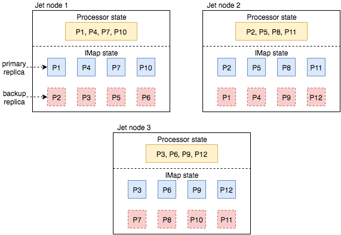
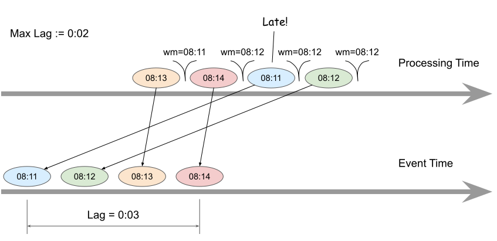

<div align="center">
<p>

</p>
<p>
<a href="https://slack.hazelcast.com"></a>
<a
href="https://lgtm.com/projects/g/hazelcast/hazelcast-jet/context:java"></a>
<a
href="https://img.shields.io/docker/pulls/hazelcast/hazelcast-jet"></a>
<a
href="https://img.shields.io/github/downloads/hazelcast/hazelcast-jet/total"></a>
<a
href="https://img.shields.io/github/contributors/hazelcast/hazelcast-jet"></a>
</p>
</div>

# What is Jet

[Jet](https://jet-start.sh/) is an open-source, in-memory, distributed
batch and stream processing engine. You can use it to process large
volumes of real-time events or huge batches of static datasets. To give
a sense of scale, a single node of Jet has been proven to [aggregate 10
million events per
second](https://jet-start.sh/blog/2020/08/05/gc-tuning-for-jet) with
latency under 10 milliseconds.

It provides a Java API to build stream and batch processing applications
through the use of a [dataflow programming
model](https://jet-start.sh/docs/concepts/dag). After you deploy your
application to a Jet cluster, Jet will automatically use all the
computational resources on the cluster to run your application.

If you add more nodes to the cluster while your application is running,
Jet automatically scales up your application to run on the new nodes. If
you remove nodes from the cluster, it scales it down seamlessly without
losing the current computational state, providing [exactly-once
processing](https://jet-start.sh/docs/architecture/fault-tolerance)
guarantees.

For example, you can represent the classical word count problem that
reads some local files and outputs the frequency of each word to console
using the following API:

```java
JetInstance jet = Jet.bootstrappedInstance();

Pipeline p = Pipeline.create();
p.readFrom(Sources.files("/path/to/text-files"))
 .flatMap(line -> traverseArray(line.toLowerCase().split("\\W+")))
 .filter(word -> !word.isEmpty())
 .groupingKey(word -> word)
 .aggregate(counting())
 .writeTo(Sinks.logger());

jet.newJob(p).join();
```

and then deploy the application to the cluster:

```bash
bin/jet submit word-count.jar
```

Another application which aggregates millions of sensor readings per
second with 10-millisecond resolution from Kafka looks like the
following:

```java
Pipeline p = Pipeline.create();

p.readFrom(KafkaSources.<String, Reading>kafka(kafkaProperties, "sensors"))
 .withTimestamps(event -> event.getValue().timestamp(), 10) // use event timestamp, allowed lag in ms
 .groupingKey(reading -> reading.sensorId())
 .window(sliding(1_000, 10)) // sliding window of 1s by 10ms
 .aggregate(averagingDouble(reading -> reading.temperature()))
 .writeTo(Sinks.logger());

jet.newJob(p).join();
```

Jet comes with out-of-the-box support for many kinds of [data sources
and sinks](https://jet-start.sh/docs/api/sources-sinks), including:

* Apache Kafka
* Local Files (Text, Avro, JSON)
* Apache Hadoop (Azure Data Lake, S3, GCS)
* Apache Pulsar
* Debezium
* Elasticsearch
* JDBC
* JMS
* InfluxDB
* Hazelcast
* Redis
* MongoDB
* Twitter

## When Should You Use Jet

Jet is a good fit when you need to process large amounts of data in a
distributed fashion. You can use it to build a variety of
data-processing applications, such as:

* Low-latency stateful stream processing. For example, detecting trends
  in 100 Hz sensor data from 100,000 devices and sending corrective
  feedback within 10 milliseconds.
* High-throughput, large-state stream processing. For example,
  tracking GPS locations of millions of users, inferring their velocity
  vectors.
* Batch processing of big data volumes, for example analyzing a
  day's worth of stock trading data to update the risk exposure of a
  given portfolio.

## Key Features

### Predictable Latency Under Load

Jet uses a unique execution model with [cooperative
multithreading](https://jet-start.sh/docs/architecture/execution-engine)
and can achieve [extremely low
latencies](https://jet-start.sh/blog/2020/08/05/gc-tuning-for-jet) while
processing millions of items per second on just a single node:


The engine is able to run anywhere from tens to thousands of jobs
concurrently on a fixed number of threads.

### Fault Tolerance With No Infrastructure

Jet stores computational state in a distributed, replicated [in-memory
store](https://jet-start.sh/docs/architecture/in-memory-storage) and
does not require the presence of a distributed file system nor
infrastructure like Zookeeper to provide high-availability and
fault-tolerance.

<p align="center">
    
</p>

Jet implements a version of the
[Chandy-Lamport](https://jet-start.sh/docs/architecture/fault-tolerance)
algorithm to provide _exactly-once_ processing under the face of
failures. When interfacing with external transactional systems like
databases, it can provide end-to-end processing guarantees using
[two-phase
commit](https://jet-start.sh/blog/2020/02/20/transactional-processors).

### Advanced Event Processing

Event data can often arrive [out of
order](https://jet-start.sh/docs/concepts/event-time) and Jet has
first-class support for dealing with this disorder. Jet implements a
technique called [_distributed
watermarks_](https://jet-start.sh/docs/architecture/event-time-processing)
to treat disordered events as if they were arriving in order.



## How Do I Get Started

Follow the [Get Started](https://jet-start.sh/docs/get-started/intro)
guide to start using Jet.

## Download

You can download Jet from
[https://jet-start.sh](https://jet-start.sh/download).

Alternatively, you can use the latest [docker
image](https://jet-start.sh/docs/operations/docker):

```java
docker run -p 5701:5701 hazelcast/hazelcast-jet
```

Use the following Maven coordinates to add Jet to your application:

```xml
<groupId>com.hazelcast.jet</groupId>
<artifactId>hazelcast-jet</artifactId>
<version>4.2</version>
```

## Tutorials

See the [tutorials](https://jet-start.sh/docs/tutorials/kafka) for
tutorials on using Jet. Some examples:

* [Process Events from Apache
  Kafka](https://jet-start.sh/docs/tutorials/kafka)
* [Windowed Aggregation](https://jet-start.sh/docs/tutorials/windowing)
* [Apply a Python Function](https://jet-start.sh/docs/tutorials/python)

## Reference

Jet supports a variety of transforms and operators. These include:

* [Stateless
  transforms](https://jet-start.sh/docs/api/stateless-transforms) such
  as mapping and filtering.
* [Stateful
  transforms](https://jet-start.sh/docs/api/stateful-transforms) such as
  aggregations and stateful mapping.

## Community

Hazelcast Jet team actively answers questions on [Stack
Overflow](https://stackoverflow.com/tags/hazelcast-jet) and
[Hazelcast Community Slack](https://slack.hazelcast.com).

You are also encouraged to join the [hazelcast-jet mailing
list](http://groups.google.com/group/hazelcast-jet) if you are
interested in community discussions

## How Can I Contribute

Thanks for your interest in contributing! The easiest way is to just
send a pull request. Have a look at the issues marked as [good first
issue](https://github.com/hazelcast/hazelcast-jet/issues?q=is%3Aopen+is%3Aissue+label%3A%22good+first+issue%22)
for some guidance.

### Building From Source

To build, use:

```bash
./mvnw clean package -DskipTests
```

### Use Latest Snapshot Release

You can always use the latest snapshot release if you want to try the
features currently under development.

Maven snippet:

```xml
<repositories>
    <repository>
        <id>snapshot-repository</id>
        <name>Maven2 Snapshot Repository</name>
        <url>https://oss.sonatype.org/content/repositories/snapshots</url>
        <snapshots>
            <enabled>true</enabled>
            <updatePolicy>daily</updatePolicy>
        </snapshots>
    </repository>
</repositories>
<dependencies>
    <dependency>
        <groupId>com.hazelcast.jet</groupId>
        <artifactId>hazelcast-jet</artifactId>
        <version>4.3-SNAPSHOT</version>
    </dependency>
</dependencies>
```

## Trigger Phrases in the Pull Request Conversation

When you create a pull request (PR), it must pass a build-and-test
procedure. Maintainers will be notified about your PR, and they can
trigger the build using special comments. These are the phrases you may
see used in the comments on your PR:

* `verify` - run the default PR builder, equivalent to `mvn clean
  install`
* `run-nightly-tests` - use the settings for the nightly build (`mvn
  clean install -Pnightly`). This includes slower tests in the run,
  which we don't normally run on every PR
* `run-windows` - run the tests on a Windows machine (HighFive is not
  supported here)
* `run-cdc-debezium-tests` - run all tests in the
  `extensions/cdc-debezium` module
* `run-cdc-mysql-tests` - run all tests in the `extensions/cdc-mysql`
  module
* `run-cdc-postgres-tests` - run all tests in the
  `extensions/cdc-postgres` module

Where not indicated, the builds run on a Linux machine with Oracle JDK
8.

## License

Source code in this repository is covered by one of two licenses:

 1. [Apache License 2.0](licenses/apache-v2-license.txt)
 2. [Hazelcast Community
    License](licenses/hazelcast-community-license.txt)

The default license throughout the repository is Apache License 2.0
unless the
header specifies another license. Please see the [Licensing
section](https://jet-start.sh/license) for more information.

## Credits

We owe (the good parts of) our CLI tool's user experience to
[picocli](https://picocli.info/).

## Copyright

Copyright (c) 2008-2020, Hazelcast, Inc. All Rights Reserved.

Visit [www.hazelcast.com](http://www.hazelcast.com/) for more info.
