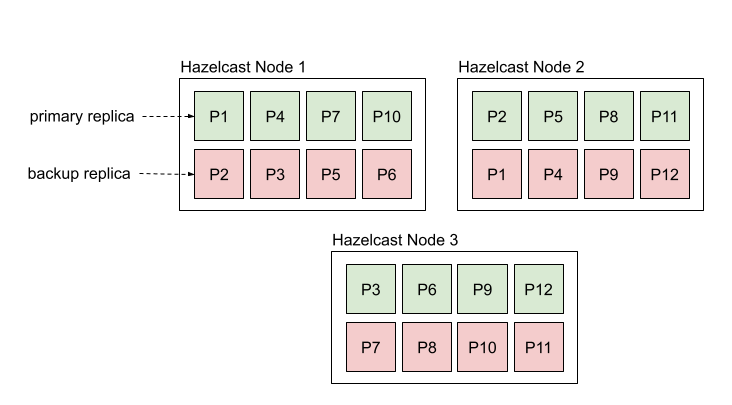
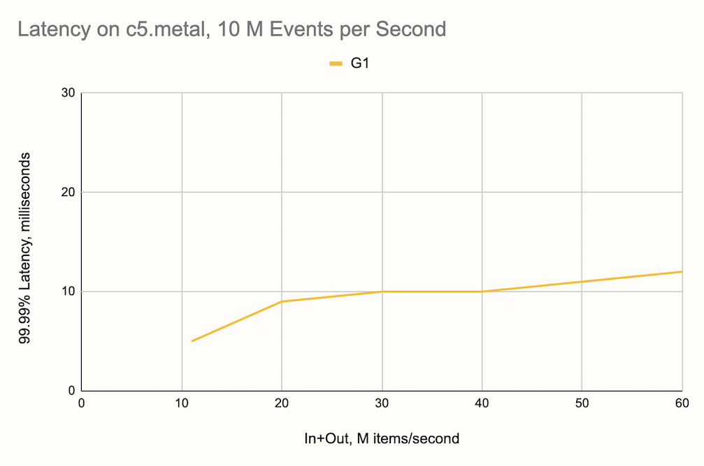

# Hazelcast

[](https://slack.hazelcast.com/) 
[](https://javadoc.io/doc/com.hazelcast/hazelcast/5.0)
[](https://img.shields.io/docker/pulls/hazelcast/hazelcast)
[](https://lgtm.com/projects/g/hazelcast/hazelcast/alerts)
[](https://lgtm.com/projects/g/hazelcast/hazelcast/context:java)
[](https://sonarcloud.io/dashboard?id=hz-os-master)

----

## What is Hazelcast

Hazelcast is a distributed computation and storage platform for consistently
low-latency querying, aggregation and stateful computation against event streams
and traditional data sources. It allows you to quickly build resource-efficient,
real-time applications. You can deploy it at any scale from small edge devices
to a large cluster of cloud instances. 

A cluster of Hazelcast nodes share both the data storage and computational load
which can dynamically scale up and down. When you add new nodes to the cluster,
the data is automatically rebalanced across the cluster and currently running
computational tasks (known as jobs) snapshot their state and scale with
processing guarantees.

## When to use Hazelcast

Hazelcast provides a platform that can handle multiple types of workloads for
building real-time applications.

* Stateful data processing over streaming data or data at rest
* Querying streaming and batch data sources directly using SQL
* Ingesting data through a library of connectors and serving it using
  low-latency SQL queries
* Pushing updates to applications on events
* Low-latency queue-based or pub-sub messaging  
* Fast access to contextual and transactional data via caching patterns such as
  read/write-through and write-behind
* Distributed coordination for microservices
* Replicating data from one region to another or between data centers in the
  same region

## Key Features

* Stateful and fault-tolerant data processing and querying over data streams
  and data at rest using SQL or dataflow API
* A comprehensive library of connectors such as Kafka, Hadoop, S3, RDBMS, JMS
  and many more
* Distributed messaging using pub-sub and queues
* Distributed, partitioned, queryable key-value store with event listeners,
  which can also be used to store contextual data for enriching event streams
  with low latency
* A production-ready Raft-implementation which allows lineralizable (CP)
  concurrency primitives such as distributed locks.
* Tight integration for deploying machine learning models with Python to a data
  processing pipeline
* Cloud-native, run everywhere architecture
* Zero-downtime operations with rolling upgrades
* At-least-once and exactly-once processing guarantees for stream processing
  pipelines
* Data replication between data centers and geographic regions using WAN 
* Microsecond performance for key-value point lookups and pub-sub
* Unique data processing architecture results in 99.99% latency of under 10ms
  for streaming queries with millions of events per second.
* Client libraries in [Java](https://github.com/hazelcast/hazelcast),
 [Python](https://github.com/hazelcast/hazelcast-python-client), [Node.js](https://github.com/hazelcast/hazelcast-nodejs-client), [.NET](https://github.com/hazelcast/hazelcast-csharp-client), [C++](https://github.com/hazelcast/hazelcast-cpp-client) and [Go](https://github.com/hazelcast/hazelcast-go-client)

### Operational Data Store

Hazelcast provides distributed in-memory data structures which are partitioned,
replicated and queryable. One of the main use cases for Hazelcast is for storing
a _working set_ of data for fast querying and access. 

The main data structure underlying Hazelcast, called `IMap` is a key-value store
which has a rich set of features, including:

* Integration with [data
  sources](https://docs.hazelcast.com/hazelcast/latest/pipelines/sources-sinks.htm)
  for one time or continuous ingestion
* [Read-through and
  write-through](https://docs.hazelcast.com/hazelcast/latest/data-structures/map.html#loading-and-storing-persistent-data)
  caching patterns
* Indexing and querying through
  [SQL](https://docs.hazelcast.com/hazelcast/latest/query/sql-overview.html)
* Processing entries in place for [atomic
  updates](https://docs.hazelcast.com/hazelcast/latest/computing/entry-processor.html)
* [Expiring
  items](https://docs.hazelcast.com/hazelcast/latest/data-structures/map.html#map-eviction)
  automatically based on certain criteria like TTL or last access time
* [Near
  cache](https://docs.hazelcast.com/hazelcast/latest/performance/near-cache.html)
  for caching entries on the client
* [Listeners](https://docs.hazelcast.com/hazelcast/latest/events/object-events.html)
  for pushing changes to clients
* [Data Replication](https://docs.hazelcast.com/hazelcast/latest/wan/wan.html)
  between datacenters (Enterprise version only)
* [Persistence](https://docs.hazelcast.com/hazelcast/latest/storage/persistence.html)
  of data on disk (Enterprise version only)

Hazelcast stores data in
[partitions](https://docs.hazelcast.com/hazelcast/latest/consistency-and-replication/replication-algorithm.html),
which are distributed to all the nodes. You can increase the storage capacity
by adding additional nodes, and if one of the nodes go down, the data is
restored automatically from the backup replicas.



You can interact with maps using SQL or a programming language client of your
choice. You can create and interact with a map as follows:

```sql
CREATE MAPPING myMap (name varchar EXTERNAL NAME "__key", age INT EXTERNAL NAME "this") 
TYPE IMap
OPTIONS ('keyFormat'='varchar','valueFormat'='int');
INSERT INTO myMap VALUES('Jake', 29);
SELECT * FROM myMap;
```

The same can be done programmatically as follows using one of the [supported
programming
languages](https://docs.hazelcast.com/hazelcast/latest/clients/hazelcast-clients.html).
Here are some exmaples in Java and Python:

```java
var hz = HazelcastClient.newHazelcastClient();
IMap<String, Integer> map = hz.getMap("myMap");
map.set(Alice, 25);
```

```python
import hazelcast

client = hazelcast.HazelcastClient()
my_map = client.get_map("myMap")
age = my_map.get("Alice").result()
```

Other programming languages supported are
[C#](https://docs.hazelcast.com/hazelcast/latest/clients/dotnet.html),
[C++](https://docs.hazelcast.com/hazelcast/latest/clients/cplusplus.html),
[Node.js](https://docs.hazelcast.com/hazelcast/latest/clients/nodejs.html) and
[Go](https://docs.hazelcast.com/hazelcast/latest/clients/go.html).

Alternatively, you can ingest data directly from the many [sources supported](https://docs.hazelcast.com/hazelcast/latest/pipelines/sources-sinks.html)
using SQL:

```sql
CREATE MAPPING csv_ages (name VARCHAR, age INT)
TYPE File
OPTIONS ('format'='csv',
    'path'='/data', 'glob'='data.csv');
SINK INTO myMap
SELECT name, age FROM csv_ages;
```

Hazelcast also provides additional data structures such as ReplicatedMap, Set,
MultiMap and List. For a full list, refer to the [distributed data
structures](https://docs.hazelcast.com/hazelcast/latest/data-structures/distributed-data-structures.html)
section of the docs.

### Stateful Data Processing

Hazelcast has a built-in data processing engine called
[Jet](https://arxiv.org/abs/2103.10169). Jet can be used to build both streaming
and batch data pipelines that are elastic. You can use it to process large
volumes of real-time events or huge batches of static datasets. To give a sense
of scale, a single node of Hazelcast has been proven to [aggregate 10 million
events per second](https://jet-start.sh/blog/2020/08/05/gc-tuning-for-jet) with
latency under 10 milliseconds. A cluster of Hazelcast nodes can process [billion
events per
second](https://hazelcast.com/blog/billion-events-per-second-with-millisecond-latency-streaming-analytics-at-giga-scale/).



An application which aggregates millions of sensor readings per
second with 10-millisecond resolution from Kafka looks like the
following:

```java
var hz = Hazelcast.bootstrappedInstance();

var p = Pipeline.create();

p.readFrom(KafkaSources.<String, Reading>kafka(kafkaProperties, "sensors"))
 .withTimestamps(event -> event.getValue().timestamp(), 10) // use event timestamp, allowed lag in ms
 .groupingKey(reading -> reading.sensorId())
 .window(sliding(1_000, 10)) // sliding window of 1s by 10ms
 .aggregate(averagingDouble(reading -> reading.temperature()))
 .writeTo(Sinks.logger());

hz.getJet().newJob(p).join();
```

Use the following command to deploy the application to the server:

```bash
bin/hazelcast submit analyze-sensors.jar
```

Jet supports advanced streaming features such as [exactly-once processing](https://docs.hazelcast.com/hazelcast/latest/fault-tolerance/fault-tolerance.html) and
[watermarks](https://docs.hazelcast.com/hazelcast/latest/architecture/event-time-processing.html).

#### Data Processing using SQL

Jet also powers the [SQL engine](https://docs.hazelcast.com/hazelcast/latest/query/sql-overview.html)
in Hazelcast which can execute both streaming and batch queries. Internally, all SQL queries
are converted to Jet jobs.

```sql
CREATE MAPPING trades (
    id BIGINT,
    ticker VARCHAR,
    price DECIMAL,
    amount BIGINT)
TYPE Kafka
OPTIONS (
    'valueFormat' = 'json',
    'bootstrap.servers' = 'kafka:9092'
);
SELECT ticker, ROUND(price * 100) AS price_cents, amount
  FROM trades
  WHERE price * amount > 100;
+------------+----------------------+-------------------+
|ticker      |           price_cents|             amount|
+------------+----------------------+-------------------+
|EFGH        |                  1400|                 20|
```

### Messaging

Hazelcast provides lightweight options for adding messaging to your application.
The two main constructs for messaging are topics and queues.

#### Topics

Topics provide a publish-subscribe pattern where each message is fanned out to
multiple subscribers. See the examples below in Java and Python:

```java
var hz = Hazelcast.bootstrappedInstance();
ITopic<String> topic = hz.getTopic("my_topic");
topic.addMessageListener(msg -> System.out.println(msg));
topic.publish("message");
```

```python
topic = client.get_topic("my_topic")

def handle_message(msg):
    print("Received message %s"  % msg.message)
topic.add_listener(on_message=handle_message)
topic.publish("my-message")
```

For examples in other languages, please refer to the [docs](https://docs.hazelcast.com/hazelcast/latest/data-structures/topic.html).

#### Queues

Queues provide FIFO-semantics and you can add items from one client and remove
from another. See the examples below in Java and Python:

```java
var client = Hazelcast.newHazelcastClient();
IQueue<String> queue = client.getQueue("my_queue");
queue.put("new-item")
```

```python
import hazelcast

client = hazelcast.HazelcastClient()
q = client.get_queue("my_queue")
my_item = q.take().result()
print("Received item %s" % my_item)
```

For examples in other languages, please refer to the [docs](https://docs.hazelcast.com/hazelcast/latest/data-structures/queue.html).

## Get Started

Follow the [Getting Started
Guide](https://docs.hazelcast.com/hazelcast/latest/getting-started/install-hazelcast)
to install and start using Hazelcast.

## Documentation

Read the [documentation](https://docs.hazelcast.com/) for
in-depth details about how to install Hazelcast and an overview of the features.

## Get Help

You can use the following channels for getting help with Hazelcast:

* [Hazelcast mailing list](http://groups.google.com/group/hazelcast)
* [Slack](https://slack.hazelcast.com/) for chatting with the
  development team and other Hazelcast users.
* [Stack Overflow](https://stackoverflow.com/tags/hazelcast)

## How to Contribute

Thanks for your interest in contributing! The easiest way is to just send a pull
request. Have a look at the
[issues](https://github.com/hazelcast/hazelcast-jet/issues?q=is%3Aopen+is%3Aissue+label%3A%22good+first+issue%22)
marked as good first issue for some guidance.

### Building From Source

Building Hazelcast requires minimum JDK 1.8. Pull the latest source from the
repository and use Maven install (or package) to build:

```bash
$ git pull origin master
$ mvn clean package -Dtests
```

Additionally, there is a `quick` build activated by setting the `-Dquick` system
property that skips tests, checkstyle validation, javadoc and source plugins and
does not build `extensions` and `distribution` modules.

### Testing

Take into account that the default build executes thousands of tests which may
take a considerable amount of time. Hazelcast has 3 testing profiles:

* Default: Type `mvn test` to run quick/integration tests (those can be run
  in parallel without using network).
* Slow Tests: Type `mvn test -P slow-test` to run tests that are either slow
  or cannot be run in parallel.
* All Tests: Type `mvn test -P all-tests` to run all tests serially using
  network.

Some tests require Docker to run. Set `-Dhazelcast.disable.docker.tests` system property to ignore them.

## Trigger Phrases in the Pull Request Conversation

When you create a pull request (PR), it must pass a build-and-test
procedure. Maintainers will be notified about your PR, and they can
trigger the build using special comments. These are the phrases you may
see used in the comments on your PR:

* `run-lab-run` - run the default PR builder
* `run-lts-compilers` - compiles the sources with JDK 11 and JDK 17 (without running tests)
* `run-ee-compile` - compile hazelcast-enterprise with this PR
* `run-ee-tests` - run tests from hazelcast-enterprise with this PR
* `run-windows` - run the tests on a Windows machine (HighFive is not supported here)
* `run-with-jdk17` - run the tests with JDK 17
* `run-with-ibm-jdk-8` - run the tests with IBM JDK 8
* `run-cdc-debezium-tests` - run all tests in the
  `extensions/cdc-debezium` module
* `run-cdc-mysql-tests` - run all tests in the `extensions/cdc-mysql`
  module
* `run-cdc-postgres-tests` - run all tests in the
  `extensions/cdc-postgres` module
* `run-s3-tests` - run all tests in the `extensions/s3` module

Where not indicated, the builds run on a Linux machine with Oracle JDK
8.

## License

Source code in this repository is covered by one of two licenses:

 1. [Apache License 2.0](https://docs.hazelcast.com/hazelcast/latest/index.html#licenses-and-support)
 2. [Hazelcast Community
    License](http://hazelcast.com/hazelcast-community-license)

The default license throughout the repository is Apache License 2.0 unless the
header specifies another license.

## Acknowledgments
[](http://www.yourkit.com/)

Thanks to [YourKit](http://www.yourkit.com/) for supporting open source software
by providing us a free license for their Java profiler.

We owe (the good parts of) our CLI tool's user experience to
[picocli](https://picocli.info/).

## Copyright

Copyright (c) 2008-2022, Hazelcast, Inc. All Rights Reserved.

Visit [www.hazelcast.com](http://www.hazelcast.com/) for more info.
