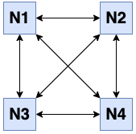
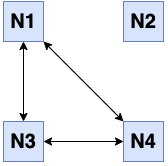
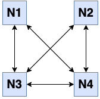
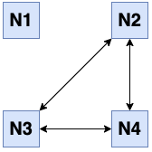
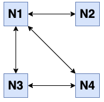

# Partial Member Disconnection Resolution

|ℹ️ Since: 4.1| 
|-------------|

## Background

In Hazelcast IMDG 3.9, we improved [the algorithms used in the cluster management
layer](01-clusterservice-consistency-improvements.md)
and resolved several problems. With that work, our member list
management logic procured a good set of consistency and safety
guarantees. In short, the master member (the first member in the cluster
member list) manages the cluster member list and publishes member list
updates with version numbers. Other members apply these updates in the
correct order by checking version numbers. In addition, each Hazelcast
member tracks the liveness of other members. The master member uses this
mechanism to detect failures of other members, and other members use
this mechanism to detect failure of the master member. This failure
detection mechanism also works during network partitions to help
Hazelcast clusters split into multiple sub-clusters and remain
available. Please refer to the [aforementioned
work](01-clusterservice-consistency-improvements.md)
to learn more about these parts.

  

Please see the following figures. In these figures, we have 4 Hazelcast
members in the cluster and N1 is the master members. The cluster is
fully connected (i.e., every member has a connection to all other
members). 

  


Figure 1


In the next figure, N2 fails or splits from the other members. All
members notice that N2 is gone. N1 kicks N2 from the cluster and
publishes a new member list:  N1, N3, N4.

  


Figure 2

  

However, it can also happen that N2 loses its connection to N1 because
of a network problem, just as in the next figure. 

  



Figure 3

  

Even though N3 and N4 still think that N2 is alive, N1 kicks N2 from the
cluster and publishes a new member list that excludes N2. After N3 or N4
gets this new member list update, they also drop their connections to N2
and N2 splits from the whole cluster and the final state becomes like
Figure 2.

  

Moreover, if the master member (N1) crashes, as in Figure 4 below, other
members notice this failure. N2 becomes the new master member and
publishes a new member list: "N2, N3, N4" to N3 and N4. 

  



Figure 4

  

However, there is a shortcoming in the current design. Since the master
member is the only authority to update the cluster member list, if there
are network problems between other members, the master member is not
aware of these problems and does not update the cluster member list
accordingly. Please see the following figure.

  



Figure 5

  

In this figure, N2 cannot communicate with N3 and N4 because of a
network problem. However, it can still talk to N1 just fine so the
cluster member list remains as \[N1, N2, N3, N4\]. However, invocations
and backup replications from N2 to N3 and N4, and vice-versa become
problematic. 

Here, the main limitation is, even though each member tracks the
liveliness of other members, they do not share their failure detections
with each other. Because of this limitation, the master member cannot
react to the network problems that occur between other members. Hence,
the solution is given in the problem itself. In this work, we just make
the master member aware of the network problems that occur between other
members.

### Terminology

<div class="table-wrap">

| Term              | Definition                                                                                                                                                                                                                                                                                                                                                      |
|-------------------|-----------------------------------------------------------------------------------------------------------------------------------------------------------------------------------------------------------------------------------------------------------------------------------------------------------------------------------------------------------------|
| Master member     | The first member in the cluster member list which is responsible for administrating the cluster.                                                                                                                                                                                                                                                                |
| Slave member      | Non-master members of the cluster.                                                                                                                                                                                                                                                                                                                              |
| Suspicion         | The situation in which a **slave member** thinks that **another member **(i.e., the master or another slave) of the cluster **may be** dead. It can occur because of a heartbeat timeout or a connection problem. Suspicions are done based on local information.                                                                                               |
| Heartbeat         | The message periodically sent **between all members** to sustain their presence.                                                                                                                                                                                                                                                                                |
| Heartbeat timeout | The duration of absence of heartbeat messages for a member to suspect failure of another member. If the suspecting member is the master member, it kicks the other member from the cluster. If the suspecting member is a slave member, it will keep this suspicion information locally. With the new design, it will also share the suspicion with the master. |

</div>

  

## Functional Design

### Summary of Functionality

There is no functional changes from users' point of view. We just make
an improvement on the membership management system. 

## User Interaction

### API design and/or Prototypes

Two new system properties will be added:

-   
```java
 /**
     * The master member, i.e, the first member in the cluster member list administrates the cluster
     * and kicks unreachable members with the heartbeat mechanism. It means that a non-master member (i.e,
     * any member other than the master) does not send heartbeats to the master for the "heartbeat timeout"
     * duration, it is kicked from the cluster. However, there can be heartbeat problems between non-master
     * members as well. Since the master member is the single authority to update the cluster member list,
     * non-master members report their heartbeat problems to the master so that the master can update 
     * the cluster member list. 
     * <p>
     * When the master receives a heartbeat problem report from another member, it first waits for a number
     * of heartbeat rounds to allow other members to report their problems if there is any. After that,
     * it takes all reports received so far and checks if it can update the cluster member in a way that 
     * the minimum number of members will be kicked from the cluster and there won't be any heartbeat problem
     * between the remaining members.
     * <p>
     * If this configuration option is set to 0, this functionality is disabled. It is recommended to be 
     * set to at least 3 or 5 so that the master will wait long enough to collect heartbeat problem reports.
     * Otherwise, the master member can make sub-optimal decisions. 
     */
    public static final HazelcastProperty PARTIAL_MEMBER_DISCONNECTION_RESOLUTION_HEARTBEAT_COUNT
            = new HazelcastProperty("hazelcast.partial.member.disconnection.resolution.heartbeat.count", 0);
```

-
```java
    /**
     * The partial member disconnection resolution mechanism uses a graph algorithm that finds a max-clique
     * in non-polynomial time. Since it could take a lot of time to find a max-clique in a large graph, i.e,
     * in a large cluster with lots of random network disconnections, we use a timeout mechanism to stop
     * execution of the algorithm.
     */
    public static final HazelcastProperty PARTIAL_MEMBER_DISCONNECTION_RESOLUTION_ALGORITHM_TIMEOUT_SECONDS
            = new HazelcastProperty("hazelcast.partial.member.disconnection.resolution.algorithm.timeout.seconds", 5);
```
          

## Technical Design

In the rest of this document, we use the terminology defined in [our
previous work](01-clusterservice-consistency-improvements.md).
In summary, the *master member* is the first member in the Hazelcast
cluster member list. Other members are called *slave members (we just
follow the terminology *¯\\\_(ツ)\_/¯*)*. Each member has a *local
failure detector*. When the master member detects failure of another
member, it kicks that member from the cluster and publishes a new member
list. When a slave member detects failure of another member, it creates
a local piece of information, which we call *suspicion*.  

The solution to this problem is two-fold. First, we make the master
member aware of network problems that occur between slave members. It is
sufficient for each slave member to propagate its local suspicions to
the master member. Second, thanks to the existing mechanisms and
consistency guarantees built around the decisions made by the master
member, the master member decides on a new fully-connected cluster
member list after it learns the network problems between other members.

  

### Propagating Suspicions to the Master Member

In the first part of the solution, we make slave members propagate their
suspicions to the master member. We use the existing heartbeat mechanism
for this purpose. Slave members piggyback their local suspicions to the
heartbeat messages. The master member collects these suspicions and
after some time it triggers the next step to decide on a new cluster
member list. 

There are a few subtleties here. First, it takes some time (i.e.,
heartbeat timeout) for a slave member to make a local suspicion. With
the default configuration, a member waits for 60 seconds before it
decides failure of an unresponsive member. When a member crashes or
splits away, we assume that other members detect its failure at close
times. Based on this assumption, when a master member learns a new
suspicion from a slave member, it expects some other members to send the
same suspicion information soon afterwards.

Based on this reasoning, the master member uses its own heartbeat
mechanism to act on the suspicions sent by the slaves. When a
configurable number of heartbeat ticks pass after the last received
suspicion information, the master member takes all suspicions received
so far and moves to the next step. 

For instance, the master member receives the following suspicions for
the scenario in Figure 5:

-   N2 suspects from N3 and N4,
-   N3 suspects from N2,
-   N4 suspects from N2.

  

### Deciding on a New Optimal Cluster Member List

In the second part, the master member is aware of all network problems
present between the slaves. Using this knowledge, it should decide on a
new member list such that all members in the new member list are
fully-connected, i.e., there is no connection problem between the
members in the new member list. In Figure 5, there are two options for a
new member list: \[N1, N2\] or \[N1, N3, N4\]. Assuming that there is no
*lite member* in the cluster, we prefer \[N1, N3, N4\] over \[N1, N2\]
because it contains more members and likely more data. 

This problem has the same solution with the [maximum clique
problem](https://en.wikipedia.org/wiki/Clique_(graph_theory)) in graph
theory. A clique in an undirected graph is a subset of vertices which
forms a complete graph, i.e, each vertex in the clique has an edge to
every other vertex. A maximum clique is the largest clique in a graph
that satisfies the given definition. The maximum clique problem is
NP-hard, i.e, there is no known polynomial time solution. ﾉಥ益ಥ）ﾉ ┻━┻

Thankfully, our problem is simpler than the maximum clique problem
because we expect simple disconnection patterns between Hazelcast
members. For instance, suppose that we have the following 6-member
cluster: \[A1, A2, B1, B2, C1, C2\] where each letter is a different
rack. If there is a network problem between racks B and C, then B1 and
B2 have a network problem with C1 and C2. Then the final member list
would be either \[A1, A2, B1, B2\] or \[A1, A2, C1, C2\]. It would be a
more complex problem if we get random disconnections, for instance, A1
cannot talk to B1, and B2 cannot talk to C1, which results in 4 options
for the final member list: \[A1, A2, B2, C2\], \[A1, A2, C1, C2\], \[A2,
B1, B2, C2\], \[A2, B1, C1, C2\]. Moreover, even if we have a one-way
disconnection in the cluster (A1 can talk to B1 but B1 cannot talk back
to A1), we consider it as a two-way disconnection and end up with a
simpler final state.

We use an implementation of the Bron–Kerbosch algorithm to find the
maximum clique in a Hazelcast cluster member list given a set of slave
member suspicions. This algorithm gives us the smallest set of Hazelcast
members to kick from the cluster so that the remaining members are
fully-connected to each other again. So the master member uses this
algorithm to make this decision.

## Testing Criteria

We tested the Bron–Kerbosch algorithm to find the maximum cliques for
different size of graphs and disconnections. We also tested the whole
implementation with our regular integration tests. 
