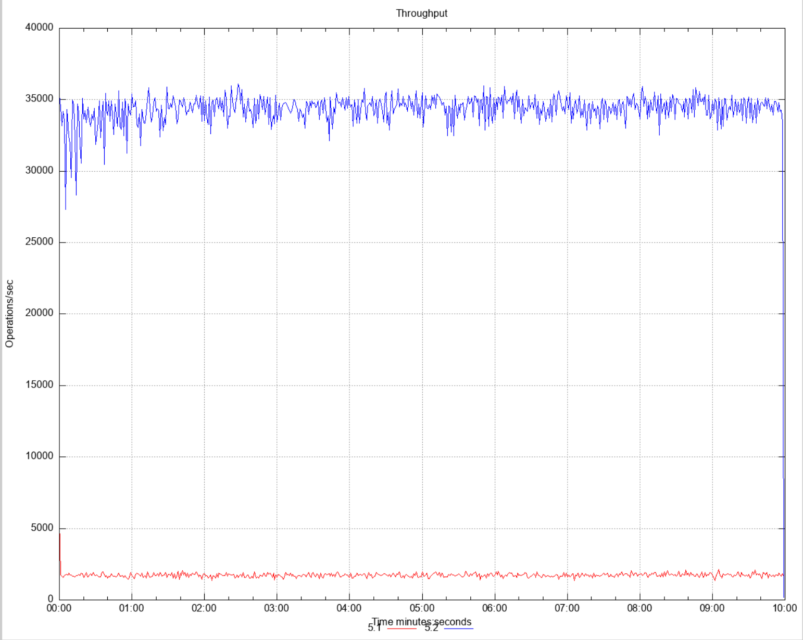
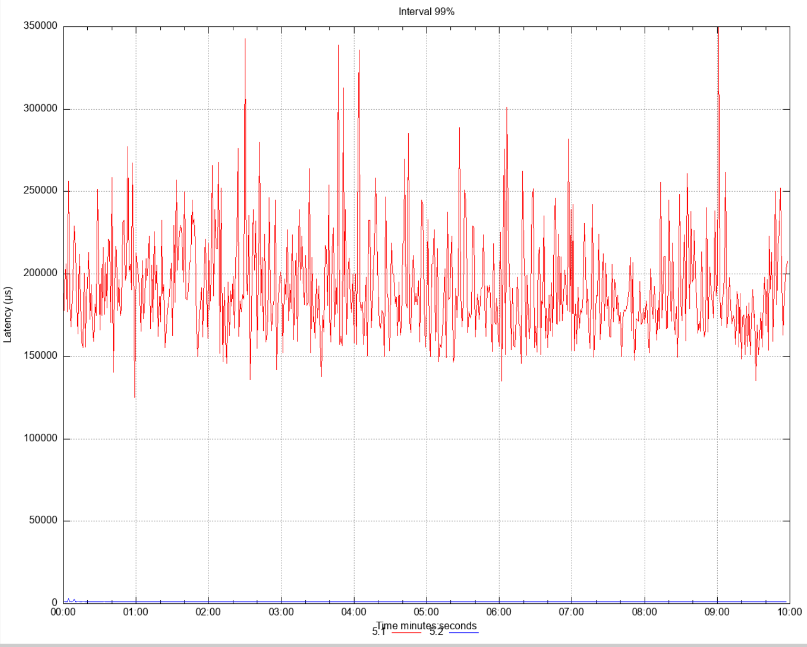
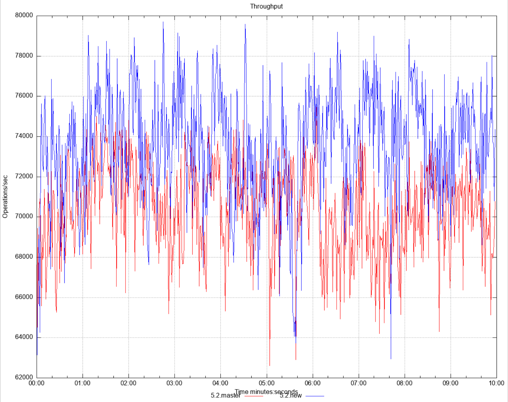
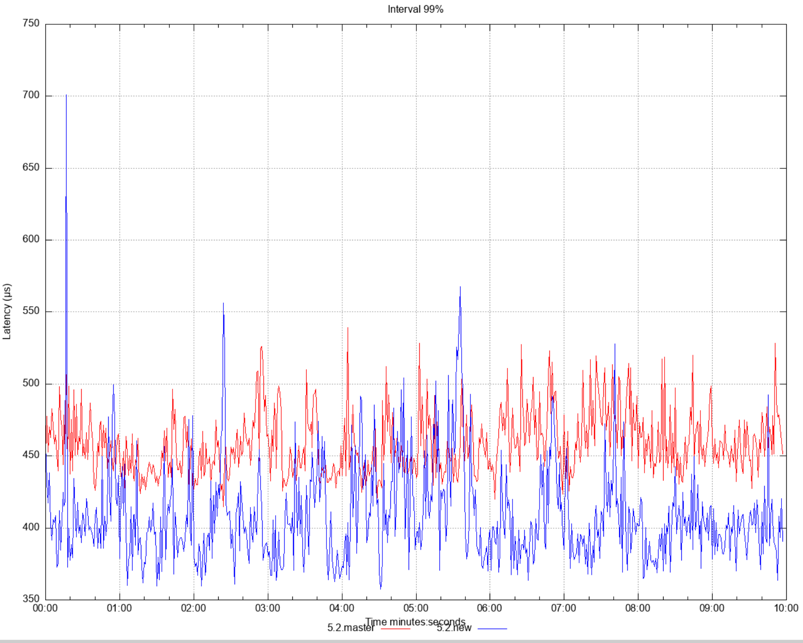

# Offloading MapStore MapLoader Operations

| ℹ️ Since: 5.2 |
|---------------|

## Summary
Blocked partition threads limits the throughput of cluster.
By implementing MapStore/MapLoader operation offloading,
next operations will not be blocked in a partition.

## Goals
- Having MapStore and MapLoader operations offloaded for IMap
- To make this offloading feature configurable per map basis.

## Non-Goals
- No offloading for `MapLoaderLifecycleSupport#init`, since it
  is a one time operation per node along the lifecycle of a map.  
- No offloading for tiered store operations
- No changes in cluster wide map bulk loading mechanism.
- JCache CacheLoader and CacheWriter are out of scope.

## Description
In its essence a [Head-of-line
blocking](https://en.wikipedia.org/wiki/Head-of-line_blocking)
issue we are trying to solve here. One MapStore operation can
block other operations from completing by blocking a partition
thread indefinitely. Since partition threads are one of the most
important shared resources in a cluster, an execution in these
threads must be fast so next executions can complete fast as well.

Some examples of problematic cases to be addressed here:
- After a cache miss, loading a value from MapStore  
- Bulk loading and storing with loadAll/storeAll methods
- When DB is down cluster is hanging

### Design

#### Overall View
When MapStore interaction is needed, interaction is executed
asynchronously and the partition thread is freed. Once
the interaction completes, the task/operation is rescheduled on
the original partition thread and completes. So all the other 
logic that updates the internals remains same.

#### Configuration
##### Configuring Offload Per Map 
`offload` field was added in `MapStoreConfig`. It's `true` by default.    
```java
MapStoreConfig#setOffload
```
```xml
<map-store enabled="true" initial-mode="LAZY">
    <offload>true</offload>
    <class-name>com.hazelcast.examples.DummyStore</class-name>
    <write-delay-seconds>60</write-delay-seconds>
    <write-batch-size>1000</write-batch-size>
    <write-coalescing>true</write-coalescing>
</map-store>
```
```yaml
map-store:
  enabled: true
  initial-mode: LAZY
  class-name: com.hazelcast.examples.DummyStore
  offload: true
  write-delay-seconds: 60
  write-batch-size: 1000
  write-coalescing: true
```
##### Configuring Offloadable Executor
`hz:map-store-offloadable` is the name of executor
which `Step`s are offloaded on. It can be configured
like regular Hazelcast executors via `ExecutorConfig`

#### Implementation
We divide MapStore interaction needed operations into parts which can be executed separately.
These self executable parts are called `Step`:
```java
interface Step {

    void runStep(State state);

    Step nextStep(State state);

    boolean isOffloadStep();
}
```
In its essence, a step is either an instance of a `PartitionSpecificRunnable` or a `Runnable`.

And we model an operation as a sequence of `Step`s.

Note that, this new `Step` approach is created based on existing
operation offloading mechanism. It can be thought as an enhancement
over it. `StepRunner` is an instance of `Offload` class. In existing
offloading mechanism, you cannot divide an operation into sub-executable
parts but with this new `Step` approach, it is possible. This is
the main difference and improvement when you compare.

#### Example Model for IMap#get
For instance, sequence of get operation steps are: `READ`,`LOAD`,`ON_LOAD`,`RESPONSE`,`AFTER_RUN`. 

`READ` step tries to read value in partition thread and if it finds no matching
value in memory, `LOAD` step starts value loading from MapStore in a separate offloaded thread. 
Upon `LOAD` finishes, execution is restarted in partition thread again from the step `ON_LOAD`.

If no loading from MapStore is required, all steps are
executed in partition thread and no offloading is done.

`State` is used to pass state between `Step`s.

#### Improvement for Ordering of Operations
In previous Hazelcast versions, all map operations wait end of
blocking MapStore operation than they progress. This provides an
order of execution between operations. Not to break this behavior,
in this new implementation, there are offloaded operation queues,
these queues are per map per partition queues(so a map has a separate
queue inside a partition) and all map operations that require MapStore
interaction waits in offloaded queue if there is an in-flight operation
for that specific map partition. Upon finish of the in-flight
operation, next operation is taken from the queue and starts to execute.

This change is an improvement since only a specific map's
operations will be waiting each other and partitions are
free for other processing. In previous versions, all maps are
waiting one single blocking map and partitions are blocked. 

#### Queued Offloaded Operations During Migration
Operations on source side of migration are retried on migration commit.


#### Flow in Partition Thread

                      ------------------------------
                      Operation starts its execution
                      ------------------------------
                                  |
                                  |
          ------------------------------------------------------
            Check if the operation needs mapstore interaction?  ---> If No --> Do regular execution
          ------------------------------------------------------               in partition thread
                                  | 
                                  | If Yes
                                  |   
          ------------------------------------------------------
                Add operations to offloaded operations.
          ------------------------------------------------------
                                  |
                                  |     
          -------------------------------------------------------
                        Create steps from operation 
          --------------------------------------------------------      
                                  |
          -------------------------------------------------------
                    Run step on partition thread.                 <-----+
          --------------------------------------------------------      |
                                  |                                     | 
                                  |                                     |
                                  |                                     |
          ----------------------------------------------------    If No |
                  Do we encounter offload needed Step?      ------------+
          ----------------------------------------------------
                                  | 
                                  | If Yes
                                  |
          -------------------------------------------------------
                  Offload next Step and free partition thread
          -------------------------------------------------------
                                  | 
                                  |
                          --------------------
                            End of execution
                          --------------------


#### Flow in Offloaded Thread
          -------------------------------------------------------
            Run offload needed Step of the operation here         <-----+
          --------------------------------------------------------      |
                                  |                                     | 
                                  |                                     |
          ----------------------------------------------------   If Yes |
                  Do we encounter offload needed Step?      ------------+
          ----------------------------------------------------
                                  | 
                                  | If No
                                  |
          -------------------------------------------------------
              Schedule next Step to run in partition thread
          -------------------------------------------------------
                                  | 
                                  |
                          --------------------
                            End of execution
                          --------------------

### Risks and Assumptions
All MapStore interacting operations are queued per map per
partition and next operations must wait end of head-operation
before execution, although this is an improvement when we
compare it with the current situation(which is all operations
of all maps in a partition waiting head-operation), it can
also be deemed as a limitation to preserve current behavior.

**NOTE**: IMap api calls like `getEntryView` will not be queued
even map has a map-store, since it only returns in memory
view of an entry, and it has no map-store interaction, it is ok
to run this kind of api calls without waiting previously offloaded operations.
What this means is can be seen as in below example:

Executions happen in single thread.

```java
map.put --> sync call, current thread waits end of it.
map.getEntryView --> next call always sees result of map.put
                     since first call finished.
```

```java
// this execution happens in single thread
map.putAsync -> async call, current thread does not wait end of it.
                Operation can be offloaded to a different thread than partition thread. 
map.getEntryView --> maybe sees result of map.putAsync,
                    since we offloaded `putAsync` and partition thread 
                    is free to execute `getEntryView`, `getEntryView` 
                    execution may not see the result of `putAsync` 
```


### Metrics
With metric
`map.store.offloaded.operations.waitingToBeProcessedCount`,
number of queued offloaded operations can be monitored.

### Performance Test Results

#### Test-1
- Comparison of 5.1 and 5.2-with-the-implementation-here.
- Goal is to see the behavior of unblocked partition threads
- 2 maps, do get and put
- One map has slow MapStore(variant latency between 1-100 millis) and only does put
- Second map is default map without a MapStore
- **Result: Slow map store does not block partitions hence we see more throughput**

|               Throughput                |               Latency                |
|:---------------------------------------:|:------------------------------------:|
|  |  ||

#### Test-2
- Comparison of 5.2.master and 5.2.new(which is the implementation here).
- Goal is to see map#get performance when all entries in memory
- Do get on no-map-store-configured map vs do get on map-store-configured map
- no-map-store-configured map uses existing operation run mechanism other map uses new step approach
- **Result: When all entries in memory latency is identical.**

|               Throughput                |               Latency                |
|:---------------------------------------:|:------------------------------------:|
|  |  ||

 


