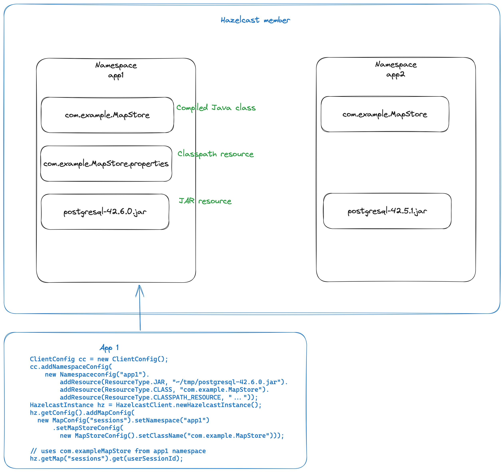
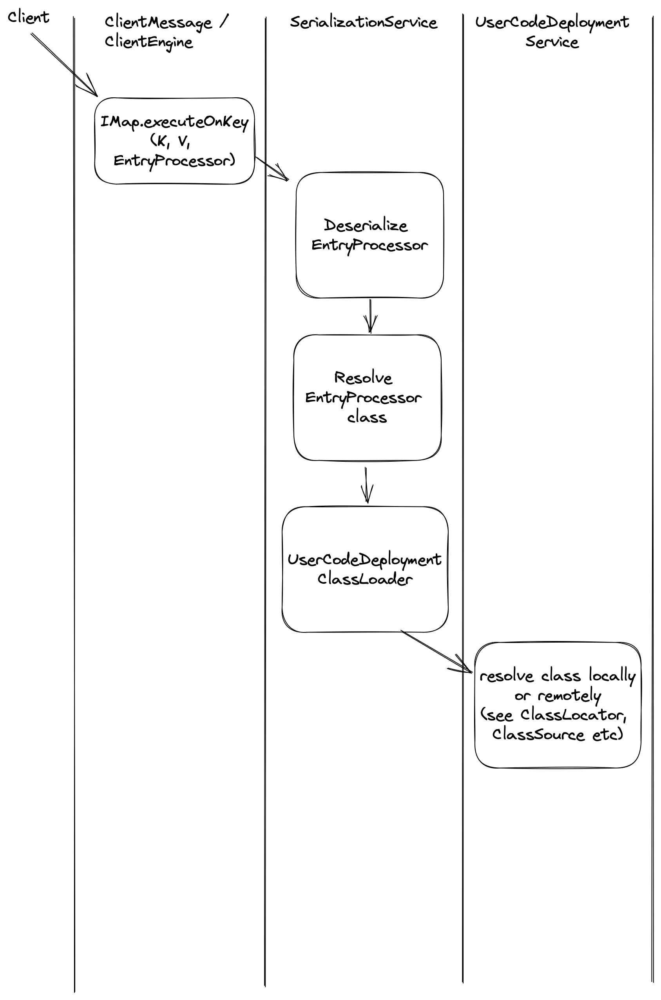
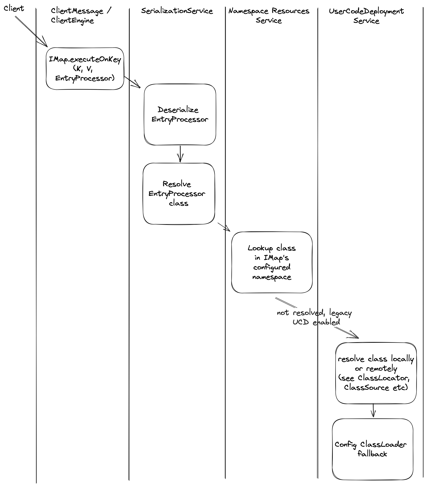
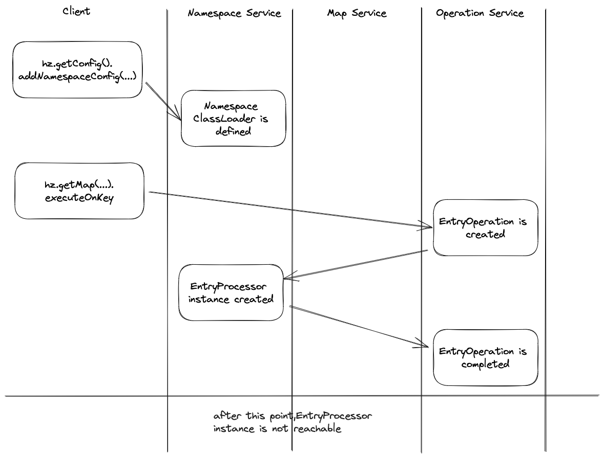
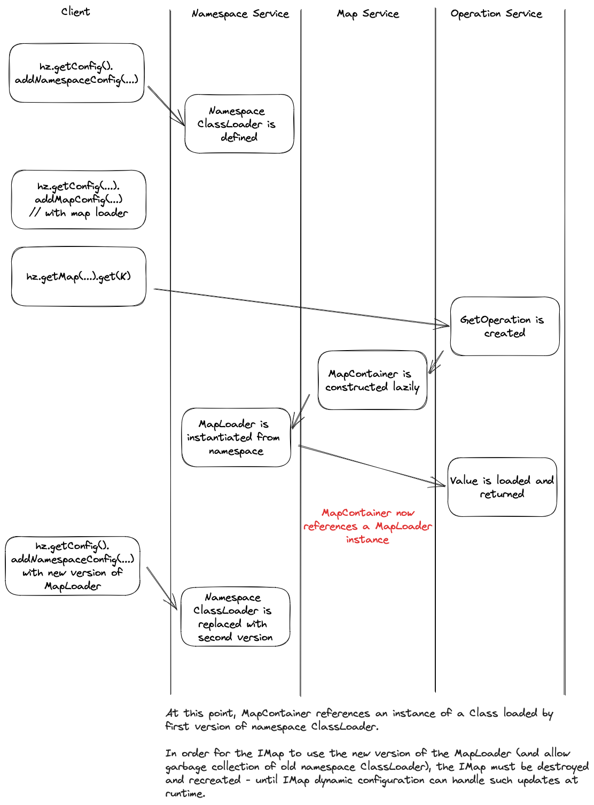

# Namespaces & resources config API

### Table of Contents

+ [Background](#background)
    - [Description](#description)
    - [Terminology](#terminology)
    - [Actors and Scenarios](#actors-and-scenarios)
+ [Functional Design](#functional-design)
    * [Summary of Functionality](#summary-of-functionality)
    * [Additional Functional Design Topics](#additional-functional-design-topics)
        + [Notes/Questions/Issues](#notesquestionsissues)
+ [User Interaction](#user-interaction)
    - [API design and/or Prototypes](#api-design-andor-prototypes)
+ [Client Related Changes](#client-related-changes)
+ [Technical Design](#technical-design)
    - [Static Configuration API](#static-configuration-api)
    - [Classloading backend implementation](#classloading-backend-implementation)
    - [Classloading namespace context setup](#classloading-namespace-context-setup)
    - [Namespace cleanup](#namespace-cleanup)
    - [Security](#security)
    - [Migration path](#migration-path)
+ [Testing Criteria](#testing-criteria)
+ [Other Artifacts](#other-artifacts)


||                                                                                                                                                                         |
|---|-------------------------------------------------------------------------------------------------------------------------------------------------------------------------|
|Related Jira| https://hazelcast.atlassian.net/browse/HZ-2576                                                                                                                          |
|Related Github issues| https://github.com/hazelcast/hazelcast/issues/15193 <br/> https://github.com/hazelcast/hazelcast/issues/17023 <br/> https://github.com/hazelcast/hazelcast/issues/18996 |
|Document Status / Completeness| DRAFT                                                                                                                                                                   |
|Requirement owner| Nandan Kidambi, Georgi Donev                                                                                                                                            |
|Developer(s)| Vassilis Bekiaris, James Holgate, Jack Green                                                                                                                            |
|Quality Engineer| _Quality Engineer_                                                                                                                                                      |
|Support Engineer| _Support Engineer_                                                                                                                                                      |
|Technical Reviewers| Josef Cacek, Frantisek Hartman                                                                                                                                          |
|Simulator or Soak Test PR(s) | _Link to Simulator or Soak test PR_                                                                                                                                     |

### Background
#### Motivation

The existing User Code Deployment feature was introduced in Hazelcast IMDG 3.8 for members and 3.9 for deploying user code from the client-side to the cluster. Its shortcomings are well documented in [community](https://github.com/hazelcast/hazelcast/issues/15193) [github](https://github.com/hazelcast/hazelcast/issues/17023) [issues](https://github.com/hazelcast/hazelcast/issues/18996) and customer requests. The main pain points are:

- Inability to update already deployed classes without having to perform a cluster restart.
- Inability to properly resolve class graphs beyond simple class hierarchies, especially when involving late binding (e.g. JDBC drivers).

In addition to those issues, since the merge of Hazelcast IMDG and Jet in Hazelcast Platform 5.0, user code can be also deployed on the cluster in the context of executing a Jet job. This means maintaining different codebases to support similar features, a larger surface area for security to cover and new issues:

- Jet jobs don't allow separation of the "dynamic code deploy" and "execute" steps. When a code required by a Jet job is not on the classpath, it has to be submitted (deployed) together with the job. The `JobPermission` allows the logical separation of checks - deploy (action "add-resources") and execute (action "submit"), but without having support for "code deploy without execution" the untangling of actions is not possible.
- Given that Jet jobs commonly interface with external systems, it is quite common to require existence of JDBC drivers, Kafka client etc on the cluster. The same applies for certain kinds of user customizations like `MapStore` implementation. If all those drivers exist on the members classpath, it is impossible to isolate classes and interfacing with systems requiring different versions of the same driver is challenging. Therefore, deploying user code along with its dependencies as a single unit and properly isolating across deployment units becomes a requirement. Isolation is already implemented for Jet jobs, however it is not implemented for other user code such as `MapStore` implementations.
- Distributed computing facilities in Hazelcast IMDG that make use of user code can be also implemented in terms of Jet jobs. This should be further investigated.

#### Description

This technical design document describes work to enhance User Code Deployment in Hazelcast Platform 5.4.0.

Proposed changes:

- A new API to manage user-deployed resources on Hazelcast Platform, where resources refers to user code and other accompanying artifacts (e.g. properties files). Resources are organized in namespaces: all resources in a namespace are deployed and undeployed as a single unit. Namespaces also maintain isolation of user-deployed resources, so resources in different namespaces are not accessible.
- When users use custom user code, a namespace where to look for the custom user code must be supplied.
    - about not namespace-aware APIs (e.g. `HazelcastInstance#addDistributedObjectsListener`): a "default" namespace could be a solution
- Introduce a new permission for the ability to manage namespaces & resources.
- Deprecate existing user code deployment configuration, to be removed in the next major version.
- Define a migration path for customers using the old user code deployment configuration to the new API.
- (stretch) Introduce the ability to execute a Jet job in the context of a specific namespace, so it can use the Java code deployed in that namespace, with a new, more limited permission that only allows job execution. This is key in the ability to separate code deployment from job execution permissions.
- (stretch) Consider Predicates, ExecutorService and other user customizations with a view to how they might be implemented with jet jobs
- (stretch) Consider overlaps with dynamic configuration and namespace / data-structure lifecycle (eg. IMap + user-code-deployed MapStore)

#### Terminology

|Term|Definition|
|---|---|
|User customization|Any user defined code that is executed on a Hazelcast cluster and executes user's business logic. Examples: a `MapStore` backing an `IMap`, a `SplitBrainProtectionListener` for split-brain events, a `Runnable` to be executed by `ExecutorService` etc.|
|Resource|A single resource that can be located via `URL` (e.g. `file:///opt/hz/lib/calc.jar`, `classpath:///com/acme/myEp.class`...)  on the member or client where it is constructed. It can be a compiled Java class, a JAR file, a ZIP of JAR files, a file etc|
|Namespace|A unit of deployment that contains several resources such as compiled Java classes, JAR files on the classpath, other resources such as properties files etc|


#### Actors and Scenarios

- "Operator": in a production deployment of Hazelcast, this is the person who is responsible for the health of the Hazelcast cluster. They setup user roles and permissions and monitor the operation of the cluster.
- "Developer":
    - iteratively develops user customizations in dev environment: deploy a version of their user customization, test, fix issues, undeploy old version, deploy new version, repeat.
    - their code executes Jet jobs, `Runnable`s, `EntryProcessor`s etc on the cluster, but they are not responsible for actually deploying the code on production machines.

### Functional Design
#### Summary of Functionality

Users will be able to:

- add (add-or-replace) a namespace config and its associated resources to a static Hazelcast `Config` object or a declarative XML/YAML file configuration
- remove a namespace config from a static Hazelcast `Config` object
- using dynamic configuration API, add (with add-or-replace semantics) or remove a namespace config from a running cluster's configuration.
- configure permissions that control principals who are allowed to *manage* namespace configuration.
- use new API to execute Jet jobs by invoking code previously deployed in a specific namespace.
- optionally disallow Jet job execution with the old deploy-code-and-execute API (e.g. `Jet#submit(Pipeline)` API).

#### Additional Functional Design Topics

Integration points with other Hazelcast functionality:
- Configuration Persistence: when enabled, added namespace configuration and uploaded resources must be made reflected to the persistent XML/YAML declarative configuration file
- Persistence: when persistence is enabled, should namespaces & resources be also persisted along with `IMap`/`ICache` data?

##### Notes/Questions/Issues

<h5>Enterprise or Open Source?</h5>

The feature will be part of Hazelcast open source. Integrations with security, persistence and other enterprise features will be delivered with Hazelcast Enterprise.

### User Interaction
#### API design and/or Prototypes

##### Member-side configuration API
In the proposed configuration API, namespaces are referenced by name, similarly to WAN replication configuration. Namespaces configuration is a top-level Hazelcast `Config` item. Example in XML declarative configuration:

```xml
<hazelcast>
  ...
  <namespaces enabled="true">
    <namespace name="employees">
      <resources>
        <!-- modelled after JobConfig's ResourceConfig -->
        <resource id="com.acme.SalaryIncreaseEP" type="CLASS">
          <url>file:///opt/code/com/acme/SalaryIncreaseEP.class</url>
        </resource>
        <resource id="advanced-calculus-1.0.0.jar" type="JAR">
          <url>file:///opt/code/jars/advanced-calculus-1.0.0.jar</url>
        </resource>
        <!-- alternative: use resource-type specific tags -->
        <jar>
            <url>file:///home/vb/tmp/ChildParent.jar</url> <!-- or file/path -->
        </jar>  
        <jars-in-zip>
            <path>/home/vb/tmp/mapstore-bundle.zip</path>
        </jars-in-zip>
      </resources>
    </namespace>
  </namespaces>
  </hazelcast>
```

Data structures whose user customizations must resolve user code from a particular namespace should be configured with a reference to that namespace like this:

```xml
<hazelcast>
  <map name="employees">
    <!-- reference the namespace from which custom code resources will be resolved -->
    <namespace>employees</namespace>
    ...
  </map>
</hazelcast>
```

This scheme allows several data structures to reference the same namespace. Statically configured namespaces & resources are available to use immediately after `HazelcastInstance` startup. At runtime, using programmatic configuration API in the established way of using `HazelcastInstance.getConfig()` for dynamic configuration, allows to manage the configured namespaces:

```java
public class Config {

  ...
     public Config addNamespaceConfig(NamespaceConfig namespaceConfig) {
         namespaceConfigs.put(namespaceConfig.getName(), namespaceConfig);
         return this;
     }

     public Config removeNamespaceConfig(String namespaceName) {
         namespaceConfigs.remove(namespaceName);
         return this;
     }
}

public class NamespaceConfig implements NamedConfig {

     private String name;

     private final Set<ResourceConfig> resourceConfigs = Collections.newSetFromMap(new ConcurrentHashMap<>());

     @Override
     public NamedConfig setName(String name) {
         this.name = name;
         return this;
     }

     @Override
     public String getName() {
         return name;
     }

     public NamespaceConfig addJar(URL jar) {
         ...
         return this;
     }
    
     public NamespaceConfig addJarsInZip(URL zip) {
         ...
         return this;
     }
    
}
```

###### (Alternative - considered but not doing) Embedding resources within data structure config

A more succinct format could be to embed `<resources>` in a specific data structure like this:

```xml
<hazelcast>

  <!-- alternative configuration style: no separate namespace/resources config, all resources come embedded with the data structure -->
  <map name="employees2">
    <resources>
      <resource id="com.acme.SalaryIncreaseEP" type="CLASS">
        <url>file:///opt/code/com/acme/SalaryIncreaseEP.class</url>
      </resource>
      <resource id="advanced-calculus-1.0.0.jar" type="JAR">
        <url>file:///opt/code/jars/advanced-calculus-1.0.0.jar</url>
      </resource>
    </resources>
  </map>
</hazelcast>
```

This saves users the pain of having to specify a separate namespace and reference that. However it disallows sharing namespace resources across data structures. Other than duplication of resources, assuming that in the backend implementation each namespace's resources are loaded by a separate `ClassLoader`, this means that an `IMap` and an `IQueue` cannot share the same domain class, since those are loaded by different `ClassLoader`s.

##### Using namespaces & resources from a Hazelcast client

Clients will use the dynamic configuration API to update and remove namespaces on the cluster. Deploying resources from the client to a cluster will look like this:

```java
HazelcastInstance client = HazelcastClient.newHazelcastClient();
NamespaceConfig newNamespace = new NamespaceConfig("new-app");
newNamespace.addJar(new File("/home/vb/tmp/ChildParent.jar"));
// deploy the namespace to the cluster with add-or-replace semantics
client.getConfig().addNamespace(newNamespace);
```

#### Relevance for Viridian

- Quicker user code deployment, since there is no need to do a rolling cluster restart to deploy user classes on the cluster classpath.
- Ability to isolate user code and its dependencies from member's classpath. So, if user code relies on a particular version of Kafka client or JDBC driver and another version is on the classpath, then the correct version that's deployed by the user in the namespace's resources will be picked up.

### Technical Design

Let's consider the typical class loading behaviour of a webapp server like Apache Tomcat. The web server exposes certain core API libraries (eg `servlet-api`) to all web applications. Aside that, each web application has its own classpath that's isolated from the classpath of other webapps.

The `ClassLoader` [javadoc](https://docs.oracle.com/en/java/javase/11/docs/api/java.base/java/lang/ClassLoader.html) describes a parent classloader delegation model, according to which each classloader needs to first query its parent classloader for the definition of a `Class`, then proceed with looking that class up in its own resources.

Webapp server classloaders work in the opposite way: they first lookup classes & resources in the webapp classpath, then, if not found, proceed to query the parent classloader that is aware of the server-wide classes & libraries.

Namespaces are envisioned to operate in a similar way to webapp classloaders: whenever a user customization is looked up, first the configured namespace's resources will be searched to resolve the required classpath resources. If a resource is not found in the namespace, then the legacy user code deployment service, if enabled, will be looked up. The final fallback will be to delegate to the config `ClassLoader` of the Hazelcast member, which can be either configured explicitly by the user or is the class loader that loaded Hazelcast classes.



With legacy user code deployment enabled, class lookup flow for an `EntryProcessor` would look like the following diagram:



The new implementation of namespace resources will act as a new classloader delegation step before delegating to the legacy UCD classloader (if enabled) or the config classloader, as shown in the diagram below:



#### Static configuration API

New configuration API will be provided to configure namespaces and their resources. Considerations:

- API surface: do not expose every option possible in all kinds of combinations. Do not expose collections like we previously did. Reasoning: avoid API bloat, ideally expose as public API only methods that can be also supported by dynamic configuration API.
- Resource configuration like file paths and classpath URLs are meant to be interpreted on the local `HazelcastInstance` (member or client). So, if a client configures a namespace with "classpath:org/acme/kafka.properties", then that file should be read on the client instance and its bytes transferred to the member side (similarly to existing `ClientUserCodeDeploymentConfig`).
- Consult the [config checklist](https://github.com/hazelcast/hazelcast/wiki/Checklist-for-Hazelcast-config-changes).

#### Classloading backend implementation

Currently, in Hazelcast codebase there are a few different `ClassLoader` implementations. These implement some parts of the functionality required for namespace-aware classloading.

- The `ChildFirstClassLoader` is a `URLClassLoader` subclass that implements child-first class lookup strategy.
- `JetClassLoader`: a `ClassLoader` that implements standard parent-first hierarchical lookup. It looks up classes & classpath resources in an `IMap<String, byte[]>`.

The namespace-aware classloading scheme requires both child-first classloader delegation pattern and a way to resolve resources dynamically sent to cluster members.

##### Resource storage

The draft prototype uses plain `Map<String, byte[]>` as in-memory storage. It is easy to develop for prototyping and can be exchanged easily for an `IMap<String, byte[]>`, should we decide to use `IMap` as storage. Below we discuss the alternatives considered:

1. **Use `IMap<String, byte[]>`**

This is how the `JetClassLoader` currently resolves classes & resources.

Advantages of this approach:
- the `IMap` can be configured with persistence enabled, so we can get persistence (and other features like storage off-heap) "for free".
- the `JetClassLoader` already uses this resource resolution scheme.

Disadvantages:
- first-time lookup of class/resource bytes can be a remote partition operation to another member. This can be prone to deadlocks such as [Deadlock with Jet job with classes and Compact GenericRecords](https://hazelcast.atlassian.net/browse/HZ-3065)
- the namespace-aware classloader must be initialized after the map service is available and shutdown before the map service. This can be a critical issue if classes within a namespace need be resolved to allow for `MapService` initialization. So this storage type requires more research. (consider recovery from persistence, eager map population from `MapLoader`).

2. **Use plain `Map<String, byte[]>` in-memory storage on each member**

Advantages:
- simple in-memory storage available on each member, no need for remote partition operations, no risk of deadlocks due to partition operations.
- `Map` being a super-interface of `IMap` allows for reuse of `JetClassLoader` implementation

Disadvantages:
- all classes & resources will occupy some heap on each member, with no option to easily move that storage off-heap or to disk
- will require some custom integration with persistence, to support persisting & recovering classes & resources to/from disk when persistence is enabled.

3. **On disk storage** (not considered for implementation)

Developing a custom storage solution as primary storage for namespace resources is not considered for implementation. Reasoning:

- on-disk storage should not be a requirement for in-memory use cases.
- deployments in docker/kubernetes will require access to persistent volumes, therefore additional configuration.
- yet another storage solution to configure and implement in Hazelcast is not desired from a maintenance or usability point of view.

#### Classloading namespace context setup

`ClassLoader` API is mandated by the JDK. Additional context information cannot be delivered via method arguments, therefore a side-channel needs to be used. Typically, this can be a thread local variable that conveys the required information and must be cleaned up after it is used.

Thread-local namespace context setup & cleanup needs to happen around deserialization of user supplied objects:
- for `ClientMessage`s, that means thread local context setup around deserialization of custom user objects which are transferred as opaque `Data`.
- for member-to-member `IdentifiedDataSerializable`s there are two alternative solutions discussed below.

##### Namespace context setup for member-to-member communication

*Alternative 1 (not doing)*

A solution similar to `Versioned` operations and serialization of cluster version information in the IDS object header:
- mark operations which require namespace information as `NamespaceAware` (with eg marker interface)
- on sending side, set a bit flag in the IDS header to indicate presence of a namespace field and include the namespace in the serialized form of the object
- on deserializing side, check bit flag and if namespace exists, read it and setup thread-local context around `readData` execution.

Serializing the full namespace name in IDS member-to-member messages will require more space in the serialized form of namespace-aware operations. Taking into account that namespace names are user-supplied, sending them over the network will introduce arbitrary overhead. Options to consider:

* maintain a central namespace-to-integer-ID registry, use the integer ID for serde. In this case the serialization overhead is limited to an integer (or long) field. Introducing a central ID assigning authority can be a scalability bottleneck and a risk for data corruption under split-brain scenarios.
* alternative: can the integer/long ID be deterministically generated based on e.g. a hash of the namespace name locally on each member? This way all members which are aware of the namespace will be able to resolve the ID to an actual namespace.
* validation rules for namespace names should apply in any case, regardless of whether namespace names are serialized as strings or not in namespace-aware operations serde. e.g.
    * only allow latin-1 characters
    * limit length to a sensible maximum (eg 15 characters)


*Alternative 2*

Since we expect that data structures are configured with a namespace, we could wrap specific relevant parts of object's deserialization implementation within namespace context setup/cleanup code. Typically, the data structure name is deserialized as one of the first fields of data structure operations (most probably in a superclass). Therefore, by the time namespace-aware deserialization is required, the data structure config can be queried and if a namespace is configured, namespace context can be setup before user objects are deserialized (and cleaned up afterwards).

The benefit of this alternative is that it does not add overhead to serialized form of operations, since it relies on configuration information that's already known to the local member.

#### Namespace cleanup

A namespace definition can be replaced at runtime by a new one. This means that the `ClassLoader` that loaded classes & resources defined by the old namespace definition should be cleaned up. Otherwise, accumulation of stale `Class` objects and `ClassLoader`s will result in memory leak.

For a `ClassLoader` to be garbage collected, it is required that all `Class` objects that reference the classloader are no longer in use, so no instances of those `Class`es must be reachable from GC roots. This is trivially achieved for ephemeral user customizations: an `EntryProcessor` instance is no longer reachable after the `EntryOperation` that performed its processing is completed.



However, other user customizations follow the lifecycle of data structures, such as a `MapLoader`: a reference to the `MapLoader` is kept in the `MapContainer` as long as the `MapContainer` exists. In this case, even though the old `ClassLoader` is no longer used to resolve `Class`es for new instance creation, it cannot be garbage collected and the `MapLoader` in use by the specific `IMap` will still be an instance of an old object.



From the perspective of managing user code, new user customization instance creation must be tracked in `ClassLoaderUtil#newInstance`, so those instances can be notified about a namespace definition going stale, if required. However, this problem is at the intersection of managing user code, dynamic configuration and proxy lifecycle management, therefore instance tracking should be implemented along with dynamic configuration.

#### Security

Existing user code deployment requires the `UserCodeDeploymentPermssion` with `DEPLOY` action. Similarly, for the actions of adding/replacing & removing a namespace a new client `NamespacePermission extends InstancePermission` will be required with name the namespace name and respective actions `CREATE` (for `addNamespaceConfig`) or `DESTROY` (for `removeNamespaceConfig`).

Instantiation and registration of user customizations that lookup code in namespaces will require a separate `NamespacePermission` with the `USE` action. Examples:

- `hz.getConfig().addNamespaceConfig(new NamespaceConfig("ns1").addJar(...))` will require `NamespacePermission(name = "ns1", action = "CREATE")`
- `map.addInterceptor(new GetInterceptor(...))` will require both `MapPermission(name="map-name", action="INTERCEPT")` and `NamespacePermission(name = "configured-map-namespace", action = "USE")`
- `map.get(K)` will not require any namespace permission, regardless whether user code is executed (e.g. if an interceptor is registered).

Audit log events will be written whenever namespace configuration changes.

#### Migration path

Namespaces should be able to operate along with the existing member- and client-side user code deployment implementation. The existing user code deployment features should be deprecated in favor of the namespaces API, since the Namespaces configuration API supersedes and is applicable to many more use cases than the User Code Deployment feature.

#### Other feature integrations

##### Configuration persistence, reload & update

When configuration persistence is enabled, it is expected that dynamically changed configuration will be also persisted so that whenever a member restarts, it will consider the latest configuration that was available at runtime. In order to support configuration persistence, binaries for resources must be also persisted along with the configuration in `EnterpriseClusterWideConfigurationService.persist(Object)`, so they can be recovered on startup.

Additionally, configuration reload/update via REST API (see `EnterpriseHttpPostCommandProcessor` methods `handleConfigReload` & `handleConfigUpdate`) must be extended to handle namespace configuration changes via REST API.

##### Persistence

To be defined.

#### Notes

- For now, no modular java or multi-release modular JARs support.

#### Operator API

#### Metrics

### Testing Criteria

Describe testing approach to developed functionality
- Soak testing for memory leaks and stable performance?
- Security related tests?
- Negative tests?
- Stress tests?
- Tests related to deployment on AWS or Kubernetes? See [Hazelcast Guides](https://guides.hazelcast.org/home/) for examples on deployments, [Connect To Hazelcast Running on Kubernetes from Outside](https://guides.hazelcast.org/kubernetes-external-client/) and [GH workflow](https://github.com/hazelcast-guides/kubernetes-external-client/blob/main/.github/workflows/integrational-tests.yml) for example of automated tests and [Create automated tests in Kubernetes/OpenShift for enterprise features](https://hazelcast.atlassian.net/browse/CN-150) for JIRA task on automated testing of EE features. For more information about testing in kubernetes please see [here](https://guides.hazelcast.org/kubernetes/) and [here](https://docs.hazelcast.com/hazelcast/latest/deploy/deploying-in-kubernetes), for testing in AWS, GCP and Azure please see [here](https://guides.hazelcast.org/terraform-quickstarts/).

Provide references to Testlink or Testing artifacts.

### Other Artifacts / links

- Design document: [User code deployment (member-side) introduced as beta in 3.8](https://hazelcast.atlassian.net/wiki/spaces/IMDG/pages/104136749/User+Code+Deployment+Design)
- Design document: [User code deployment - client support in 3.9](https://hazelcast.atlassian.net/wiki/spaces/IMDG/pages/130370683/User+Code+Deployment+-+Client+Support+Technical+Design)
- Design document: [Code redeployment (not implemented)](https://hazelcast.atlassian.net/wiki/spaces/IMDG/pages/2020409612/Code+Redeployment+via+Member+Client+User+Code+Deployment+Technical+Design)
- [Cloud serverless & code deployment](https://hazelcast.atlassian.net/wiki/spaces/MS/pages/3963453453/Custom+Classes+in+the+Hazelcast+Cloud+Serverless)
- Apache Flink's [Debugging Classloading](https://nightlies.apache.org/flink/flink-docs-release-1.17/docs/ops/debugging/debugging_classloading/)
