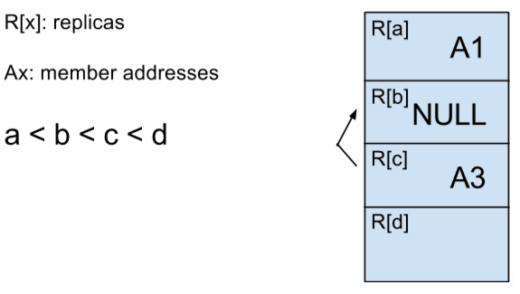

# Avoid Data Loss on Migration

|ℹ️ Since: 3.7|
|-------------|

## Background

### Description

Hazelcast divides user data into partitions and shares these partitions
among nodes to provide high availability and fault tolerance. There are
at most 7 nodes, which are called *replicas*, and are numbered from 0
to 6, which keep the data for a partition. The node that is assigned to
the 0<sup>th</sup> replica of a partition is called the *partition
owner* and others are called the *backups*. The Master node maintains
partition replica ownership information in a special data structure
called the *partition table*. If a cluster member crashes or a new node
joins the cluster, the Master re-distributes partitions by performing
*repartitioning* and changes the replica ownership to maintain a
balanced partition distribution. Once an owner of a partition is changed
during repartitioning, partition data is migrated from the old owner to
the new owner. This operation is called *migration* and is administrated
by the Master. Once the Master learns that data has moved to a new
owner, it commits the migration by applying the replica ownership change
to the partition table and publishing the updated partition table.
Backup ownership changes are handled differently. Currently, the Master
initiates migrations only for partition owner changes. A backup owner
change is directly applied to the partition table. Once a cluster member
learns that it is not a partition backup anymore, it clears its data.
Similarly, once a cluster member learns that it has turned into a backup
for a partition, it initiates a data synchronization operation from
partition owner. 


### Problems

We have a few problematic cases in the design summarized above. We can
discuss these problems under two main items:

**Safety of changes in partition table (= safety of cluster metadata):**

It is the master's responsibility to maintain partition table and
publish it to other members periodically. Nevertheless, there are some
cases in which local updates are done to partition table in non-master
members. For instance, when a member leaves the cluster, each member
updates its own partition table by removing the leaving node from
partition replicas and shifting up existing replica ownerships
automatically. This approach may lead to problems when a 1<sup>st</sup>
backup (=1<sup>st</sup> replica) removes the partition owner from its
local replica list and shifts up itself to become the partition owner,
then receiving a partition table from master which says that it is still
the 1<sup>st</sup> backup. Then it learns that it is 1st backup of the
partition, so it clears its data and tries to synchronise partition data
from partition owner. It causes data loss if the removed node actually
left the cluster but Master notices it later than the 1st backup. 

Another issue is the lack of guarantee about when all members receive
the most recent updates on partition table done by master. This
situation can lead to problems when a master makes an update on
partition table and crashes before notifying all members about the last
update. If the new master has not received the updated partition table
and some of other members has acted upon the updated partition table
they receive from the crashed master, data loss may occur since they
will apply the stale partition table sent from the new master. Another
issue related to the lack of guarantee occurs during committing
migrations. Currently, migration participants apply migration result
(commit / rollback) on their own, independently from other side of the
migration. This can lead to data loss or taking conflicting actions (one
participant may rollback while the other participant commits). 


**Safety of data while doing changes in partition table (= safety of
actual user data):**
We provide safety of user data by copying the data to multiple members
based on the user's backup configuration. When cluster is running in
normal state (no cluster membership changes), user data is safe as
promised. As described above, member list changes trigger repartitioning
mechanism, and Hazelcast performs migrations and backup synchronisations
to maintain a balanced partition distribution and data safety. Current
migration system has a weakness here. Hazelcast performs migrations only
for partition owners. When backup of a partition changes, old backup
owner just clears its data without checking if the new backup owner has
received the backup data or not which means that available data copy
count is being decreased during migrations. This approach increases
possibility of data loss when there are node crashes during migrations.
This problem is reported in our infamous github
issue [hazelcast/issues/5444](https://github.com/hazelcast/hazelcast/issues/5444) .
  

### Solutions

We introduce changes in the administration of the partition table and
the migration process to handle the problems described above. Our
solution is basically 3-fold:

1.  We strengthen consistency of the partition table by decreasing the
    number of points where the partition table is updated and
    guaranteeing consistency during master crashes. 

2.  We improve the migration commit phase by guaranteeing that the old
    partition / backup owner removes its data *only* when we ensure that
    the new owner receives the data. 

3.  We extend the migration system to handle backup migrations and
    develop a new migration scheduling algorithm that will schedule
    partition owner / backup migrations with the guarantee of
    maintaining current degree of availability of user data.


The outcome of this work will be to provide great benefit to any work on
consistency of user data as it is decreasing the possibility of
inconsistency on cluster metadata. 

The rest of the document discusses each one of these items extensively.


### Terminology

| Term                      | Definition                                                                                                                                   |
|---------------------------|----------------------------------------------------------------------------------------------------------------------------------------------|
| Migration Source          | Current owner of the partition replica. It may be the partition owner (owner of primary replica) or a backup (an owner of backup replica)    |
| Migration Destination     | New owner of the partition replica which is determined by the repartitioning algorithm                                                       |
| Partition Table Version   | A monotonic integer value incremented by master when a change occurs in partition table                                                      |
| Active Migration State    | State about the ongoing migration which is maintained by a migration participant, namely migration source or destination                     |
| Completed Migrations List | List of the completed migrations which all cluster members have not been notified about their completion.                                    |
| Hotter Replica            | A partition replica which is closer to the partition owner compared to another replica. For example, 1st replica is hotter than 2nd replica  |
| Colder Replica            | A partition replica which is farther to the partition owner compared to another replica. For example, 2nd replica is colder than 1st replica |

## User Interaction

### API design and/or Prototypes

There is no user API change but there are SPI changes. 

`PartitionMigrationEvent` will have two additional
fields; `currentReplicaIndex` and `newReplicaIndex`. Implementations
of `MigrationAwareService` are expected to handle these new attributes
to react migration requests correctly.

-   `currentReplicaIndex`: Denotes the index of the partition replica
    that current member owns currently, before migration starts. This
    index will be in range of `[0,6]` if current member owns a replica
    of the partition. Otherwise it will be `-1`.

-   `newReplicaIndex`: Denotes the index of the partition replica that
    current member will own after migration is committed. This index
    will be `-1` if partition replica will be removed from current
    member completely.


##### **PartitionMigrationEvent**

``` java
public class PartitionMigrationEvent extends EventObject {

    private final MigrationEndpoint migrationEndpoint;

    private final int partitionId;

    private final int currentReplicaIndex; // <---- new field

    private final int newReplicaIndex;  // <---- new field

....
}
```

In the simplest form, `MigrationAwareService`s should
implement `commitMigration` and `rollbackMigration` methods as:

``` java
@Override
public void commitMigration(PartitionMigrationEvent event) {
    if (event.getMigrationEndpoint() == MigrationEndpoint.SOURCE) {
        if (event.getNewReplicaIndex() == -1 || event.getNewReplicaIndex() > configuredBackupCount) {
            // remove data...
        }
    }
    ...
}

@Override
public void rollbackMigration(PartitionMigrationEvent event) {
    if (event.getMigrationEndpoint() == MigrationEndpoint.DESTINATION) {
        if (event.getCurrentReplicaIndex() == -1 || event.getCurrentReplicaIndex() > configuredBackupCount) {
            // remove data...
        }
    }
}
```


## Technical Design

### 1. Simplified Management of Partition Table

#### 1.1 Reducing Places Where The Partition Table Is Updated

In our new design, the partition table is updated only by the Master and
published to other members. After initial partition assignments, the
Master node updates the partition table in three cases:

-   When it commits a migration,

-   When it temporarily assigns NULL to a backup replica index of a
    partition when the corresponding node in that index has left the
    cluster,

-   When It assigns a new owner to a partition when all of its replica
    owners (partition owner and all present backups) have left the
    cluster.

After performing any of these 3 steps, the Master node increments its
partition table version. Other cluster members update their partition
version only when they receive a partition table from master node which
has a version bigger than their local version value.  

When a member leaves the cluster, only the Master updates the partition
table and publishes it to the whole cluster. If a node is the first
backup of a partition which belongs to the left node, it promotes itself
as the partition owner only when it receives the updated partition table
from master. This approach eliminates the probability of data loss when
the master and the first backup node of a partition notices the left
node in different times.


#### 1.2 Searching For The Most Recent Partition Table During Master Change

We guarantee safety of partition table updates during master change as
follows:

When the master makes an update on the partition table but crashes
before publishing it to all cluster members, it means that some of the
cluster members have the most recent partition table while the others
still have the old partition table. If the new master does not have the
up-to-date version, it may cause data loss problems. Therefore, whenever
a master change happens, the new master looks for the most recent
partition table in the cluster. It doesn't publish the partition table
to other members before it decides on the most recent partition table.
During this process, it fetches every other member's local partition
table. Before the Master decides on the final partition table, every
other member must return its local partition table or leave the cluster.
After new master decides on the final partition table, it publishes it
to all members to ensure that all cluster members receive the most
recent partition table. After this point, new master can trigger regular
repartitioning and migration mechanisms. 

With these two improvements, our main goal is to
prevent diversifications on the partition table. Only the Master is
allowed to perform an update on the partition table and all other
members only follow the master's updates. When a master change occurs,
the new Master looks for the most recent partition table so that it can
continue from where the previous master has left. 


### 2. Improving Migration Commit Phase

#### 2.1 Safe Migration Commit

In the current migration implementation, master updates the partition
table after it learns that new partition owner has received the
partition data from the old owner. After this point, it publishes it to
notify the other cluster members. Migration participants perform their
own finalisation steps when they receive the updated partition table. We
lose data if old partition owner commits the migration and clears its
data, and the new partition owner crashes. As another problem, migration
participants can take conflicting actions, which can lead to data leak
or data loss, if the master crashes during migration finalisation. For
instance, if the master manages to publish the updated partition table
to migration destination and crashes before publishing it to next master
and migration source, migration destination commits the migration while
migration source rollbacks it **(=data leak)**. The reverse can also
happen such that migration destination rollbacks while migration source
commits **(=data loss)**.

To eliminate these problems, **<span class="underline">we commit a
migration on MASTER only when we make sure that MIGRATION DESTINATION
has received the updated partition table and committed the migration,
and we commit a migration on MIGRATION SOURCE only when it is committed
in MASTER.</span>** During migration commit, either migration
destination should acknowledge the MASTER about it has received the
commit operation, or it should leave the cluster.

New migration commit mechanism works as follows:

1\) MASTER creates a copy of its partition table, partition table
version and completed migrations list. Then, it applies the migration
operation to copied partition table, increases the partition table
version by 1, marks the migration as SUCCESSFUL and adds it to completed
migrations list. At this point, MASTER has not changed its internal
state, it only prepared an updated partition table copy for MIGRATION
DESTINATION.

2\) MASTER sends the updated partition table copy to MIGRATION
DESTINATION with `MigrationCommitOperation` synchronously. This
operation should either succeed or MIGRATION DESTINATION should leave
the cluster to let MASTER reach to final decision. 

3\) If `MigrationCommitOperation` returns successfully, MASTER performs
the corresponding updates on its own partition table, partition table
version and completed migration list. Then, it publishes the updated
partition table to everyone. When MIGRATION SOURCE receives the updated
partition table, it also notices that the ongoing active migration has
committed successfully, so it can also commit the migration and clear
the data safely.

4\) If `MigrationCommitOperation` completes with failure, it means that
the MIGRATION DESTINATION has crashed or split from the cluster. For
this case, MASTER does not update its partition table but it increments
its partition table by 2 to maintain the partition table safety against
a possible network split. If MIGRATION DESTINATION leaves the cluster
during commit and returns back afterwards, it should accept MASTER's
partition table. 

Related to this, all completed migrations are put into a local list in
master: `completedMigrations`. Once a migration is finalised (commit /
rollback), it is added into this list. MIGRATION DESTINATION and other
cluster members learn result of a migration via completed migrations
list which is also published by the master along with the updated
partition table. After a while, completed migrations list gets larger as
migrations are completed and it needs eviction. Eviction must be safe
because migration participants finalise their internal migration state
only when they discover the migration result in the completed migrations
list. To eliminate this problem, master evicts the completed migrations
only when all of the cluster members acknowledge that they have received
the most recent partition table. When a non-master member receive a
partition table publish, it retains in its local completed
migrations list only the completed migrations it has received in
partition table message. 

In addition to the described algorithm, we also protect migration commit
by rejecting migrations while there is active migration state of which
the final decision has not been received yet or the local partition
table is not up-to-date. Migrations contain the partition table version
that trigger them so if a node misses a partition table publish and
receives a migration request, it fails the migration. Similarly, If a
node, particularly the previous MIGRATION SOURCE, receives a new
migration request while it has an active migration state of which it has
not learnt the final decision yet, it rejects the new migration request
until it finalises its currently active migration.


#### 2.2 Recovering Master Crashes During Migration

As described in the previous sub-section, cluster members reject
migrations if there is any active migration state they do not know the
result of. Therefore, ongoing migrations must be correctly finalised in
any case, including master crashes during migration. When the current
Master crashes, a new Master collects all completed migrations and
active migration states of members along with their partition tables. If
Master crashes before committing the migration to MIGRATION DESTINATION,
it means that both MIGRATION SOURCE and MIGRATION DESTINATION have
active migration state. In this case, the new Master rollbacks the
migration. If the Master crashes after committing to MIGRATION
DESTINATION but before publishing the result to MIGRATION SOURCE, it
means that the migration resides in completed migrations list of
MIGRATION DESTINATION, and active migration state of MIGRATION SOURCE.
In this case, the new Master finds out that the migration has already
committed in MIGRATION DESTINATION, so it successfully commits it in
MIGRATION SOURCE as well.


### 3. Backup Migration

Current migration system relies on anti-entropy system to re-populate
backups if changes happen on backup ownerships. Since it breaks
available data backup guarantee and may cause data loss, we designed a
more powerful migration system that can handle back up migrations just
as partition owner migrations. In the new migration system, backups
migrations are also put into the migration queue in master. Since master
node performs all migration operations one by one, new migration system
will take longer time to complete all migrations as backup migrations
will follow the standard procedure. It is a trade-off for safety. Its
another advantage is it introduces less amount of load to the system
during migrations as anti-entropy system is likely to put more load to
the system because of multiple backup synchronisations concurrently by
default. 


Backup migration has some significant differences compared to the
partition owner migrations. In partition owner migrations, there are 2
participants: old partition owner as migration source and new partition
owner as migration destination. In backup migrations, number of
participants can be 3 as: partition owner, old backup owner, new backup
owner. Additionally, some migration types may require multiple actions
to be performed atomically. For instance, we do have a new migration
type, which migrates ownership of a partition from one node to another
and turns the old partition owner into a backup atomically. Lastly, we
need a migration ordering mechanism that will schedule migrations in an
order such that available replica count of a partition is not decreased
while performing the migrations. For instance, in *Case 1 of Shift Up
Migration* below, there is already a missing backup in the middle of the
partition replicas. migrating A4 to A3's replica index before migrating
A3 to R\[b\] decreases available replica count and increases possibility
of data loss. Therefore, we should shift up A3 to R\[b\] first, then we
can shift up A4 to R\[c\] safely.


In the following sections, we elaborate how different migration types
are performed and how we should order them to maintain data safety. 


#### 3.1 New Migration Types for Different Migration Cases

##### 3.1.1 MOVE


This is the standard migration type which can be applied to both
partition owner and backup migrations. In the figure above, lets say A1
is in the 0<sup>th</sup> replica index (=partition owner). A migration
initiated for transferring ownership of R\[b\] to A4 from A2. **The key
point of the MOVE migration is new backup owner is not present in the
current partition replica owners. **

##### 3.1.2 COPY


This is lighter version of partition MOVE migration. In this scenario, a
backup of a partition is lost it will be re-populated with a new node
which is not present in the current partition replica addresses.

##### 3.1.3 SHIFT DOWN

In this scenario, ownership of an existing replica is given to a new
node, and the old replica owner is shifted down in the replica indices.
Lets consider the 2 cases below where A1 is owner of a partition
initially and gives ownership of the partition to another node and
becomes a backup. 

###### 3.1.3.1 SHIFT DOWN CASE 1


As described above, A1 is the owner of the partition initially. Then, a
migration is scheduled which moves ownership of partition to A4 and
shifts A1 down to 2nd backup. **This migration type attempts to increase
the available replica count** so it must be done atomically to prevent
data loss and break partition replica assignments on failure. For
instance, if we perform this migration as 2 non-atomic steps as: first,
move ownership of partition from A1 to A4, then perform copy migration
for A1 to 1. replica index (=1st backup), we can lose data if A4 crashes
just after it becomes owner of the partition and before A2 copy-migrates
to 1st backup. Therefore, SHIFT DOWN migration needs to be performed
**atomically**. 

###### 3.1.3.2 SHIFT DOWN CASE 2


Again, A1 is the owner of the partition initially. Then, A1
moves ownership of partition to A4 and shifts down to 1st backup. In
this case, 1st backup is already owned by A2 so partition data is
already safe and the transition does not change the available replica
count. So we can actually perform this SHIFT DOWN migration with 2 MOVE
migrations as MOVE 0. index from A1 to A4 and then MOVE 1. index from A2
to A1. This is a simplification of the original SHIFT DOWN migration
which handles this case atomically but has a more complex implementation
with same data safety guarantees. 


##### 3.1.4 SHIFT UP

This is the last type of migration in which an existing partition
replica gets closer to the partition owner. We have 2 cases where we can
shift up a colder replica owner to an hotter index, as shown below. 


###### 3.1.4.1 SHIFT UP CASE 1



In the first case, a replica owner A3 is shifted up to R\[b\] and its
old replica index R\[c\] is set to NULL. If the migration is
successfully committed, A3 owns more data compared to its old replica
index. If the migration is rolled back after copying data from partition
owner, it should clear all extra data it received for the upper replica
index and retain only its original data. Relatedly, if the shifted up
index has another owner before the migration, it should clear its data
once it notices that the migration has committed. 

###### 3.1.4.2 SHIFT UP CASE 2


In this case, a replica owner A3 is shifted up and its old replica index
is also migrated to another node A4. Although this migration scenario
seems like a SHIFT UP migration, we can handle it by performing 2 MOVE
migrations to maintain available replica count. Firstly, R\[c\] is
move-migrated from A3 to A4. After this step is successful, then A3 is
not a replica of the partition anymore, therefore we can perform the
second move-migration for R\[b\] from A2 to A3. 

#### 3.2 Performing Migrations With Maintaining Data Safety

New migration system obeys the following principles to guarantee data
safety:

-   Never decrease available replica count of a partition during
    migration. 

-   Provide availability of the replicas in the order from partition
    owner (0th replica) to latest backup (6th replica) (= hotter
    replicas will be available earlier than colder replicas)

-   Do not break current replica ownerships of a partition if a new node
    fails during becoming a replica of the partition


Based on these principles, we decide the **types and order of
migrations** that will be performed after a membership change. 

When a membership change happens in the cluster, master node performs
the following steps:

1.  Check if there is a master change in the cluster. If so, new master
    must find the most recent partition table published by the previous
    master.

2.  Repair the partition table by removing left nodes from the partition
    table.

3.  Run regular repartitioning algorithm.

4.  Eliminate cyclic migrations from the new partition table after
    repartitioning.

5.  Decide type and ordering of the migrations that will move the system
    from current partition table state to the re-partitioned partition
    table, and schedule decided migrations into the migration queue. 

This is a completely stateless algorithm. When a new node joins or a
node leaves the cluster while the algorithm is running, or any migration
fails during the process, the remaining work is cancelled and the
algorithm is immediately restarted. 


##### 3.2.1 Cycle Detection

Repartitioning algorithm may generate a new partition table that will
require cyclic migrations. The example below shows a cyclic migration
where R\[a\] is migrated from A1 to A3, R\[b\] is migrated from A2 to
A1, and R\[c\] is migrated from A3 to A2. Cyclic migrations are a
problem for us because we can not perform them without decreasing the
available replica count. To perform these migrations, we need to clear
one of these replicas first.

For the given example below, we need the following migration steps:

1.  Clear R\[c\] so R\[c\] becomes null. This step decreases the
    available replica count.

2.  Shift down A2 from R\[b\] to R\[c\]

3.  Shift down A1 from R\[a\] to R\[b\] and give ownership of R\[a\] to
    A3.


Since this approach contradicts with one of our design principles, we
cancel out cyclic migrations and leave the corresponding replica
ownerships as they are before repartitioning.


##### 3.2.2 Ordering Migrations

After the repartitioning algorithm runs, we determine types and order of
migrations that will move the current partition table state to the
targeted partition table state.

Migrations are determined for each partition separately as follows:

##### **Migration ordering algorithm**

```text
C := current partition replicas
T := targeted partition replicas

for each replica index of the partition, denoted by i

    if C[i] exists but T[i] is null

        clear the replica # since it is not owned by any node anymore


    else if C[i] is null # there is no current owner for the replica index. owner of the replica index i has left the cluster

        if C[j], where j > i, contains the address that is assigned to T[i] # it means a node is shifted up in the replica indices

            schedule a SHIFT UP migration from C[j] to C[i]

        else # New owner of the replica is a new node for the partition so we can safely perform a copy migration

            schedule a COPY migration for C[i]


    else if C[i] and T[i] are same # there is no change, just skip this replica index

        skip the replica index


    else if T[i] is a new node for the partition and C[i] is not a replica owner of the partition anymore

        schedule a MOVE migration for replica index i # it is the standard migration type in which ownership a replica index is transferred to another node


    else if T[i] is a new node for the partition but C[i] turns into owner of a colder replica index j > i

        schedule a SHIFT DOWN down migration for replica indices i and j


    else # it means that we can not perform a migration at the current index without decreasing the available replica count. Therefore, we will perform another migration at a colder index to overcome this situation.

        look for a SHIFT UP or a MOVE migration at a colder index j > i that will enable the necessary migration at the current index i without decreasing the available replica count, and perform it before this index
```


You can check the examples to understand how the algorithm works:

```text
Replica indices : 0, 1, 2
CURRENT         : A, B, C
TARGET          : D, B, C
 
PLANNED MIGRATIONS:
MOVE migrate index 0 from A to D  
```


```text
Replica indices : 0, 1   , 2
CURRENT         : A, NULL, C
TARGET          : A, D   , C


PLANNED MIGRATIONS:
COPY migrate D to index 1
```


```text
Replica indices : 0, 1   , 2
CURRENT         : A, NULL, C
TARGET          : D, A   , C


PLANNED MIGRATIONS:
SHIFT DOWN migrate index 0 from A to D and index 1 to A
```


```text
Replica indices : 0, 1   , 2, 3
CURRENT         : A, NULL, B, C
TARGET          : A, B   , C, NULL

Since there is already missing replicas in the middle, we can break data availability on colder replicas to satisfy data availability on hotter replicas.

PLANNED MIGRATIONS:
SHIFT UP migrate B from 2 to 1 
SHIFT UP migrate C from 3 to 2
```


```text
Replica indices : 0, 1, 2, 3
CURRENT         : A, B, C, D
TARGET          : A, C, D, E

We can not migrate index 1 from B to C without decreasing available replica count. 
If we perform a shift up, the immediate partition replica state will be: A, C, NULL, D which decreases available replica count and therefore not allowed by the algorithm.

PLANNED MIGRATIONS:
MOVE migrate index 3 from D to E
MOVE migrate index 2 from C to D
MOVE migrate index 1 from B to C

Intermediate partition replica states after each of these migrations maintain available replica count.
```


```text
Replica indices : 0, 1, 2, 3
CURRENT         : A, B, C, D
TARGET          : B, D, C, NULL

Although the targeted replicas already decrease available replica count, shift up migration for B from index 1 to 0 breaks availability of a hotter replica when compared to the targeted replicas. 
Therefore we prefer to perform another migration which will break availability of a colder replica.

PLANNED MIGRATIONS:
SHIFT UP migrate D from 3 to 1
MOVE migrate index 0 from A to B
```

##### 3.2.3 Prioritization of COPY and SHIFT UP Migrations

As an improvement, we prefer to prioritize COPY and SHIFT UP migrations
against:

-   a non-conflicting MOVE migration on a hotter replica index,
-   a non-conflicting SHIFT DOWN migration to a colder index.

Non-conflicting migrations have no common participant. Otherwise, order
of the migrations should not be changed. The motivation here is COPY and
SHIFT UP migrations increase the available replica count of a partition
while a MOVE migration doesn't have an effect on it. 

After migrations are planned by the migration planner algorithm,
prioritization algorithm is triggered so that COPY and SHIFT UP
migrations are executed before MOVE and SHIFT DOWN migrations.
