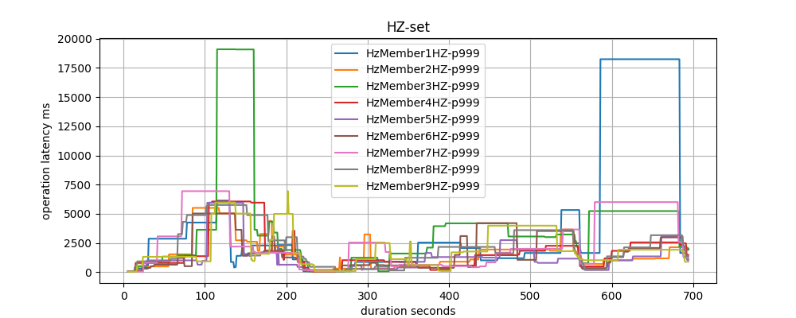

# Parallel Independent Migrations

|ℹ️ Since: 4.1| 
|-------------|

## Background

The partition table is an eventually consistent and monotonic data structure. It’s only updated by the master member 
and published to the cluster. Some members may lag behind the master’s version at any time but for those members to be 
able to participate in a migration, they have to get the latest partition table from master. To provide the monotonic 
order, the partition table has a global version. And because of this global order, we have to migrate partitions 
one-by-one. Once the master member changes, it fetches the partition tables and the list of completed & active migrations 
from the cluster and determines the most recent version of the partition table and then publishes it back. 

Right now this is a very strict guarantee, because there were data loss issues during shutdown and migrations 
a few years back and we wanted all partition updates and migrations to be more consistent.

The good thing is, in practice, we don’t need this global partition table update order. Because, partitions are not 
dependent on each other. Instead of a global partition table version, we can have a version per partition. And we can 
update partitions independently. So, after each partition migration, we can just publish that partition info only, 
not the whole partition table. Also we can migrate different partitions concurrently. For example, assume there are 10 
members, we can execute 5 migrations between 5 member pairs in parallel. With these two optimizations 
(removal of global update order and parallel migrations), repartitioning can become significantly faster than current.

### Previous Work

Previous works related to partitioning system and migration mechanism: 

| Version | Design |
| :-----: | :----- |
| 3.7 | [Avoid Data Loss on Migration](01-avoid-data-loss-on-migration.md) |
| 3.7 | [Graceful Shutdown Improvements](02-graceful-shutdown-improvements.md) |
| 3.9 | [Fine-Grained Anti Entropy Mechanism](03-fine-grained-anti-entropy-mechanism.md) |
| 3.9 | [Gigantic Cache Migration Enhancements](04-gigantic-cache-migration-enhancements.md) |
| 3.12 | [Speed-Up Partition Migrations](05-speed-up-partition-migrations.md) |
| 4.0 | [Refactor MigrationListener API](06-refactor-migrationlistener-api.md) |

_Being familiar with these will help to understand the new changes._
 
## Design

### 1 - Global Version to Partition Level

First of the major changes is the removal of the global partition table update ordering. Instead we will version each 
partition individually. 

#### 1.1 - Current Versioning Mechanism

Currently, master member increments global version on each partition update. When the partition table update is received 
from the master, members decide whether to apply or to ignore the update comparing their local version to received 
version. If local version is less than received version then partition table is applied, otherwise it's ignored. 

Similarly, `MigrationInfo` contains the partition table versions before and after 
the migration. When a migration operation is received, members execute the operation only and only if local version is 
equal to the version before migration. Otherwise, migration is rejected. A migration operation also contains the most 
recently completed `MigrationInfo` list. This was  introduced in 
[Speed-Up Partition Migrations](05-speed-up-partition-migrations.md) 
work. Before executing the migration operation, members apply these completed migrations in case they haven't seen them yet.

While committing promotions, promoted member rejects the commit if its local version is greater than the version in operation.
This is similar to applying partition table updates.  

#### 1.2 - New Versioning Mechanism

With the proposed change, partition table version will be removed and master will update specific partition's version 
on partition updates. On partition table broadcast, receiving members will do version comparisons for individual 
partitions. So, they can partially apply, partially ignore the received partition table.

During migrations, migration operations will still carry the most recent completed migrations, but only for the partition
that migration is belongs to. After applying completed migrations of that partition, migration operation will check 
the local version against the version in `MigrationInfo`. If they are equal operation will be executed, otherwise it will
be rejected.

#### 1.3 - Partition Table Stamp

For some cases, we need to check if the whole partition table has changed or not, with a simple comparison. Comparing each 
partition version one-by-one is not simple and requires keeping all partition versions locally. For those cases, instead 
of global partition table version, _hash/stamp_ of the partition table will be used. This stamp will be cached locally
and updated on each partition modification and also will be easily calculated with a pure hash function. We will use
a `64-bit MurmurHash3` to calculate the stamp.

```java
public static long calculateStamp(InternalPartition[] partitions) {
    byte[] bb = new byte[Integer.BYTES * partitions.length];
    for (InternalPartition partition : partitions) {
        Bits.writeIntB(bb, partition.getPartitionId() * Integer.BYTES, partition.version());
    }
    return HashUtil.MurmurHash3_x64_64(bb, 0, bb.length);
}
```  

During promotion commit, partition table stamp will be used the check whether local partition table is the same with 
the one received with promotion. If yes, promotion commit will be ignored. Otherwise, we'll compare versions of individual
partitions and skip promotions of partitions which have greater version locally.    
   
_Other usages of partition table stamp will be explained in [Other Changes](#3---other-changes) section._   
  

### 2 - Parallel Migrations

#### 2.1 - Current Migration Mechanism

When a new member joins or an existing member leaves the cluster, eventually a `RedoPartitioningTask` is scheduled on 
migration thread. `RedoPartitioningTask` prepares the new partition table and schedules the individual `MigrationTask`s
to reach the target partition table. These `MigrationTask`s are executed serially by migration thread and they submit 
migration operations to the migration participants. After each migration completion, migration is committed to the 
destination, and partition table is updated. All of these steps are executed serially.

 
#### 2.2 - Parallel Migrations Mechanism

With parallel migrations, most the mechanism remains the same. `RedoPartitioningTask` prepares the migration plan using 
the target partition table. Instead of individual `MigrationTask`s, a single `MigrationPlanTask` will be scheduled. 
`MigrationPlanTask` will submit parallel migration tasks and keep track of started/completed tasks. 

Migrations belonging to the same partition must be executed in order serially. This is required to provide consistency 
and safety guarantees while migrating/replicating partition data. For instance, a migration can depend on an earlier one
in the plan. Or replication to a missing backup replica is more important than a migration that is just to rebalance the load.
_For more info please see [Avoid Data Loss on Migration](01-avoid-data-loss-on-migration.md)._   

To achieve this, `RedoPartitioningTask` creates migration plan with a consistent order. And `MigrationPlanTask` will 
parallelize only migrations belonging to different partitions. Migrations belonging to the same partition will still be 
executed serially. That's the upper limit of migration parallelization. But still we may want to limit parallel 
migrations to keep heap memory usage under control and to avoid overload of network resources.

A new `ClusterProperty`, `hazelcast.partition.max.parallel.migrations`, will be introduced, with a default value of `10`. 
This property defines the maximum number of partition migrations to be executed on a member. That member can be either source 
or destination of the migration. _Value of `10` is selected as a heuristic after benchmarking on EC2. You can find the 
benchmark results below._ There may be consequences of using too much or too less parallelization:

* Having too much parallelization can increase the heap memory usage and overload the network during partition rebalance.
* Having less parallelization can increase the total migration completion time.
       

### 3 - Other Changes

#### 3.1 - Cluster State Management Changes

Cluster state & version changes are performed via transactional process and one of the prerequisites was partition table
version of the transaction originator must be equal to the version of the each transaction participant. Since partition
table version is now removed in favor of per-partition versions, we will use _partition table stamp_ instead.     

#### 3.2 - Hot Restart Changes

There will be a few small changes. First one is partition table persistence format. Format will be decided due to cluster 
version while restoring/persisting partition table. When cluster version is upgraded, partition table will be persisted 
with the new format once. 

Current format is:

```
+-+-+-+-+-+-+-+-+-+-+-+-+-+-+-+
| Partition Table Version     |
+-----------------------------+
| Partition Table Length      |
+-----------------------------+
| Replicas (Address + UUID)   |
+-----------------------------+
| Partition-0 Replica Indexes |
+-----------------------------+
| Partition-1 Replica Indexes |
+-----------------------------+
| ........................... |
+-----------------------------+
| Partition-N Replica Indexes |
+-+-+-+-+-+-+-+-+-+-+-+-+-+-+-+     
```                                 

New format will be:

```
+-+-+-+-+-+-+-+-+-+-+-+-+-+-+-+
| Partition Table Length      |
+-----------------------------+
| Replicas (Address + UUID)   |
+-----------------------------+
| Partition-0 Version         |
+-----------------------------+
| Partition-0 Replica Indexes |
+-----------------------------+
| Partition-1 Version         |
+-----------------------------+
| Partition-1 Replica Indexes |
+-----------------------------+
| ........................... |
+-----------------------------+
| Partition-N Version         |
+-----------------------------+
| Partition-N Replica Indexes |
+-+-+-+-+-+-+-+-+-+-+-+-+-+-+-+     
```          

Second change is in the partition table restore process. While restoring partition table, if a replica address change is
detected, we replace the old address of the replica with the new one in the partition table. In current mechanism, 
global partition version is incremented by the number of updates, as if partition table is updated in the runtime.
With the new versioning, only updated partitions' versions will be incremented.

Third change is in the partial restart decision process. During partial restart, we decide which members to perform the 
restart, which members to be excluded and delete their data. To select member groups having the same partition table,
we use the partition table version. Members with the same partition table are grouped together. Also to find the most 
recent partition table, we pick the partition table with the greatest version. If the policy is `PARTIAL_RECOVERY_MOST_RECENT`,
we pick the group with the greatest partition table version. If it's `PARTIAL_RECOVERY_MOST_COMPLETE`, then we pick 
the largest group. In other places we will use _partition table stamp_ instead of removed partition table version. But in
this case, we cannot use _partition table stamp_. Because stamp is only valid for equality comparison, it cannot be used
to compare order of the partition tables. Instead we will use the sum of per-partition versions to compare the order. 
_This works because Hot Restart does not support arbitrary server crashes. Only proper server shutdowns are supported._
Otherwise, resolving conflicts on partition level, determining the most recent versions of each partition, composing
a new partition table with these partitions and adapting Hot Restart to restore data based on this new partition table
requires a large rework and time. And supporting rolling upgrade scenarios makes this more complicated.            


#### 3.3 - Rolling Upgrade

- To support rolling upgrade, we will have two distinct paths for most the migration scheduling and execution logic. 

- While updating partition table and applying completed migrations, there'll be separate paths too.

- Once the cluster is upgraded to `4.1`, all partition versions will be set to the latest partition table version.

- Cluster state change transaction mechanism will use either partition table version or stamp according to the cluster version.

- Similarly Hot Restart partition restoration and persistence mechanism will use different logic according to 
the version. There will be `LegacyPartitionTableReader/Writer` classes to support old format.  


## Benchmarks

We compared `parallel-migrations` branch with `master` branch and measured stabilization times of shutting down single
member, adding a new member and crash of a single member scenarios. 

### Setup

- Tested on EC2 with `hzCmd` tool.
- Used `r5.16xlarge` (64 vCPU, 512 GiB memory, 20 Gbps network bandwidth) instance type.
- Member JVM heap memory settings was `-Xms6G -Xmx6G`.
- Partition count was `20k`.
- Configured native memory size was 500GB. 
- Inserted total of `135 million` entries to either a single map or `10` different maps (`13.5 million` per-map) with single backup.
- Value size was `16K` bytes.
- There were continuous `IMap.get/set` operations by 20 threads per-member.

#### Server configuration:
```xml
<hazelcast>
    <properties>
        <property name="hazelcast.phone.home.enabled">false</property>
        <property name="hazelcast.hidensity.check.freememory">false</property>
        <property name="hazelcast.health.monitoring.level">NOISY</property>
        <property name="hazelcast.health.monitoring.delay.seconds">15</property>
        <property name="hazelcast.diagnostics.enabled">true</property>
        <property name="hazelcast.diagnostics.metrics.period.seconds">10</property>   
        <property name="hazelcast.graceful.shutdown.max.wait">7200</property>   
        <property name="hazelcast.partition.count">20000</property>
        <property name="hazelcast.partition.max.parallel.migrations">20</property>
    </properties>

    ...

    <native-memory allocator-type="POOLED" enabled="true">
        <size unit="GIGABYTES" value="500"/>
        <!-- disabled schema validation via hazelcast.internal.override.version system property. -->
        <metadata-space-percentage>1</metadata-space-percentage>
    </native-memory>

    <map name="default">
        <in-memory-format>NATIVE</in-memory-format>
    </map>
</hazelcast>
```

#### Memory usage:

**Native memory usage with 10 members:**
```
native.memory.used=414.3G, 
native.memory.free=80.7G, 
native.memory.total=414.4G, 
native.memory.max=495.0G, 
native.meta.memory.used=1011.8M, 
native.meta.memory.free=4.0G
```

**Native memory usage with 9 members:**
```
native.memory.used=460.4G, 
native.memory.free=34.6G, 
native.memory.total=460.7G, 
native.memory.max=495.0G, 
native.meta.memory.used=1.1G, 
native.meta.memory.free=3.9G
```

This was total of `~4.1 TB` data (including the backup) in the whole cluster.

### Test Flow

```shell script
# Initially started 10 members
hz cluster -size M10 -v 4.1-SNAPSHOT -ee -boxes a.box -user ec2-user

# Load initial data into map
hz run ops/load     
# Validate map size
hz run ops/mapSize
               
# Start get/set ops at the background
hz run ops/get &
hz run ops/set &
       
# Scale-down 
# Shutdown Member10
hz driver Member10
hz run ops/shutDown            
# Verify cluster-size=9 and wait until migrations complete
hz run ops/untilClusterSize9 ops/untilClusterSafe        

# Scale-up
# Start Member10 back
hz boot Member10
# Verify cluster-size=10 and wait until migrations complete
hz run ops/untilClusterSize10 ops/untilClusterSafe

# Member failure
# Kill Member10
hz kill Member10
# Verify cluster-size=9 and wait until migrations complete
hz run ops/untilClusterSize9 ops/untilClusterSafe9
```

### Single Map Benchmark

Used a single HD `IMap` and inserted `135 million` entries with `~16k` values. 

#### Master Branch

- *Scale down from 10 to 9 members*: `14000` migrations were completed in **35 minutes and 34 seconds**. 
Member shutdown in **2145 seconds**.

- *Scale up from 9 to 10 members*: `14000` migrations were completed in **34 minutes and 16 seconds**.

- *Crash single member*: Around `~26150` migrations were completed in **33 minutes and 38 seconds**.

| GET p99 Latency  | GET p99.9 Latency |
|:-------------:|:-------------:|
|  |  |
| GET p99 Min-Max  | GET p99.9 Min-Max |
|  |  |


| SET p99 Latency  | SET p99.9 Latency |
|:-------------:|:-------------:|
|  |  |
| SET p99 Min-Max  | SET p99.9 Min-Max |
|  |  |


**Heap Usage and GC Pauses**


| GC Summary  | |
|:-------------|-------------:|
| Full collections |	36 |
| Mean garbage collection pause (ms) |	89.4 |
| Mean interval between collections (ms) |	180394 |
| Proportion of time spent in garbage collection pauses (%) |	3.39 |
| Proportion of time spent unpaused (%) |	96.61 |


---

#### Parallel Migrations - 5x

5x parallelization was used: `hazelcast.partition.max.parallel.migrations=5`.

- *Scale down from 10 to 9 members*: `14000` migrations were completed in **4 minutes and 45 seconds**. 
Member shutdown in **299 seconds**. 

- *Scale up from 9 to 10 members*: `14000` migrations were completed in **7 minutes and 19 seconds**.

- *Crash single member*: Around `~26150` migrations were completed in **2 minutes and 17 seconds**.

| GET p99 Latency  | GET p99.9 Latency |
|:-------------:|:-------------:|
|  |  |
| GET p99 Min-Max  | GET p99.9 Min-Max |
|  |  |


| SET p99 Latency  | SET p99.9 Latency |
|:-------------:|:-------------:|
|  |  |
| SET p99 Min-Max  | SET p99.9 Min-Max |
|  |  |


**Heap Usage and GC Pauses**


| GC Summary  | |
|:-------------|-------------:|
| Full collections	| 26
| Mean garbage collection pause (ms)	| 104
| Mean interval between collections (ms)	| 56512
| Proportion of time spent in garbage collection pauses (%)	| 4.27
| Proportion of time spent unpaused (%)	| 95.73

---

#### Parallel Migrations - 20x

20x parallelization was used: `hazelcast.partition.max.parallel.migrations=20`.

- *Scale down from 10 to 9 members*: `14000` migrations were completed in **3 minutes and 22 seconds**. 
Member shutdown in **215 seconds**.

- *Scale up from 9 to 10 members*: `14000` migrations were completed in **5 minutes and 24 seconds**.

- *Crash single member*: Around `~26150` migrations were completed in **1 minute and 37 seconds**.


| GET p99 Latency  | GET p99.9 Latency |
|:-------------:|:-------------:|
|  |  |
| GET p99 Min-Max  | GET p99.9 Min-Max |
|  |  |


| SET p99 Latency  | SET p99.9 Latency |
|:-------------:|:-------------:|
|  |  |
| SET p99 Min-Max  | SET p99.9 Min-Max |
|  |  |


**Heap Usage and GC Pauses**


| GC Summary  | |
|:-------------|-------------:|
| Full collections	| 74
| Mean garbage collection pause (ms)	| 123
| Mean interval between collections (ms)	| 14921
| Proportion of time spent in garbage collection pauses (%)	| 4.79
| Proportion of time spent unpaused (%)	| 95.21


---


### 10 Maps Benchmark

Used `10` HD `IMap`s and inserted `13.5 million` entries with `~16k` values to each `IMap`.


#### Master Branch

- *Scale down from 10 to 9 members*: `14000` migrations were completed in **40 minutes and 50 seconds**. 
Member shutdown in **2456 seconds**.

- *Scale up from 9 to 10 members*: `14000` migrations were completed in **38 minutes and 21 seconds**.

- *Crash single member*: Around `~26150` migrations were completed in **39 minutes and 35 seconds**.


| GET p99 Latency  | GET p99.9 Latency |
|:-------------:|:-------------:|
|  |  |
| GET p99 Min-Max  | GET p99.9 Min-Max |
|  |  |


| SET p99 Latency  | SET p99.9 Latency |
|:-------------:|:-------------:|
|  |  |
| SET p99 Min-Max  | SET p99.9 Min-Max |
|  |  |


**Heap Usage and GC Pauses**


| GC Summary  | |
|:-------------|-------------:|
| Full collections	| 7
| Mean garbage collection pause (ms)	| 151
| Mean interval between collections (ms)	| 991102
| Proportion of time spent in garbage collection pauses (%)	| 3.14
| Proportion of time spent unpaused (%)	| 96.86

---

#### Parallel Migrations

20x parallelization was used: `hazelcast.partition.max.parallel.migrations=20`.

- *Scale down from 10 to 9 members*: `14000` migrations were completed in **1 minute and 47 seconds**. 
Member shutdown in **215 seconds**.

- *Scale up from 9 to 10 members*: `14000` migrations were completed in **4 minutes and 4 seconds**.

- *Crash single member*: Around `~26150` migrations were completed in **51 seconds**.
    

| GET p99 Latency  | GET p99.9 Latency |
|:-------------:|:-------------:|
|  |  |
| GET p99 Min-Max  | GET p99.9 Min-Max |
|  |  |


| SET p99 Latency  | SET p99.9 Latency |
|:-------------:|:-------------:|
|  |  |
| SET p99 Min-Max  | SET p99.9 Min-Max |
|  |  |

    
    
**Heap Usage and GC Pauses**
    


| GC Summary  | |
|:-------------|-------------:|    
| Full collections	| 2
| Mean garbage collection pause (ms)	| 128
| Mean interval between collections (ms)	| 199157
| Proportion of time spent in garbage collection pauses (%)	| 3.04
| Proportion of time spent unpaused (%)	| 96.96

     
