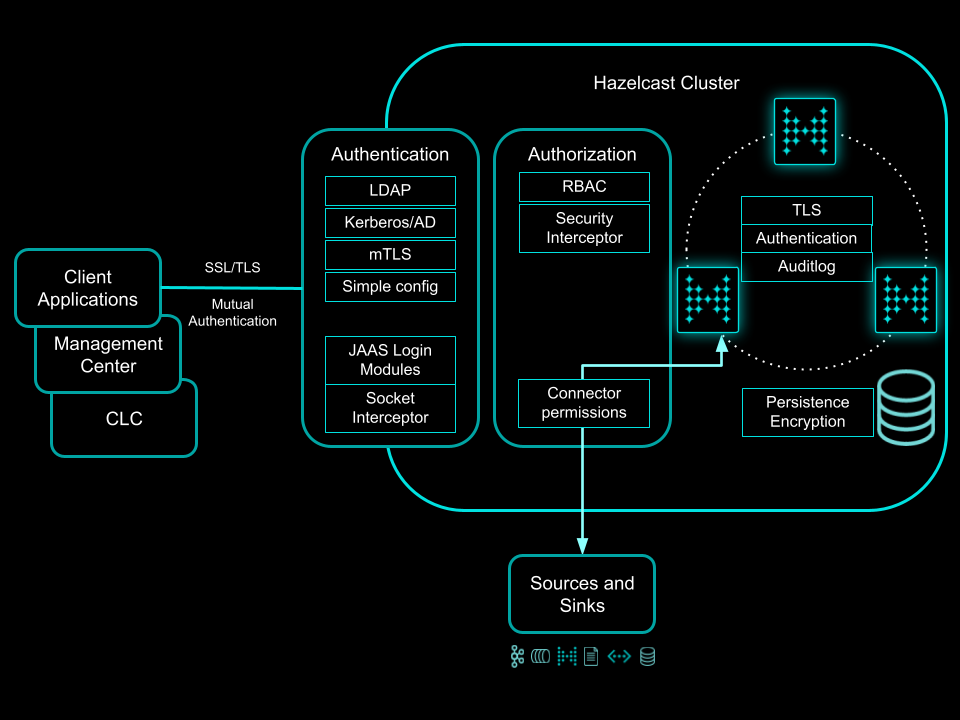

= Hazelcast Security Overview
:lang: en
:toc:

[[intro]]
== Intro

=== Enterprise Security

Hazelcast Security is a set of features in Hazelcast Enterprise with configuration in several places:

* **security** - most of the security configuration (identity, authentication, authorization)
* **network** / **advanced-network** - TLS configuration for data in-transfer encryption
* **persistence** - data-at-rest encryption
* **auditlog** - configuration of how auditable events will be logged

=== Other security-related areas

Hazelcast also has other security-related areas available to open-source users too:

* network and advanced-network configuration allows specifying bind interfaces
* advanced-network allows separating configuration for different protocols footnote:[Members are recommended to run in a trusted environment.]
* secure defaults are used across the configuration (Jet, SQL, Scripting in Management Center, User code deployments) footnote:[The secure defaults differ depending on the distribution packaging used.]
* management operations can be limited to specific IP addresses where Management Center is allowed to run
* untrusted deserialization protection allows control of which types are allowed in Java native deserialization
* security-hardened example configuration files are included in the distributions

==== Secure defaults in Hazelcast distributions

The table shows which security hardening features are used by default in the given distribution type.

[options="header",cols="6,^1,^1,^1,^1"]
|=====================================================================================================
| Feature                             | Zip/Tgz     | Rpm/Deb /Brew  | Maven       | Docker           
| Bind to localhost only              | ✅          | ✅             | ❌          | ❌               
| Multicast discovery method disabled | ✅          | ✅             | ❌          | ❌               
| Advanced networking enabled         | ❌          | ❌             | ❌          | ❌               
| Jet (and SQL) disabled              | ❌          | ❌             | ✅          | ❌               
| Jet resource upload disabled        | ❌          | ❌             | ✅          | ❌               
| User code deployment disabled       | ✅          | ✅             | ✅          | ✅               
| REST health-check disabled          | ❌          | ❌             | ✅          | ❌               
| MC scripting disallowed             | ✅          | ✅             | ✅          | ✅               
| MC access to ConsoleApp disabled    | ✅          | ✅             | ✅          | ✅               
| MC access from a specific IP only   | ❌          | ❌             | ❌          | ❌               
|=====================================================================================================

=== Main concepts

* Identity - how members and clients will present/prove themselves to others
* Authentication - identity verification of incoming connections on members
* Authorization - member's verification if a client is allowed to execute given action; clients have roles assigned during authentication
and access decisions are made based on permissions granted to client's roles
* Auditlog - allows gathering cluster events and storing them in an external system (file, syslog, …)
* Confidentiality - sensitive data protection on the communication level (TLS) and storage level (persistence encryption)

=== Security architecture

== Encryption

Encryption is used to protect sensitive information and maintain privacy,
ensuring that data remains confidential and secure during transmission or storage.
By making data unreadable to unauthorized users, encryption helps prevent
data breaches, identity theft, cyberattacks, and unauthorized access
to personal or corporate information.

=== TLS

Transport Layer Security (TLS) is a cryptographic protocol that provides
secure communication over the internet. It is the successor to the
Secure Sockets Layer (SSL) protocol.
TLS and SSL are similar in many ways, but TLS has some
improvements over SSL, and it is now the standard protocol used for
secure communication over the internet. The TLS configuration in
Hazelcast is still named `ssl` for backward compatibility reasons.

[source,yaml]
----
hazelcast:
  network:
    ssl:
      enabled: true
      properties:
        # keystore contains a members identity
        # (a private key and related certificate)
        keyStoreType: PKCS12
        keyStore: /opt/hazelcast-keystore.p12
        keyStorePassword: YourSecretGoesHere
        # truststore contains set of trusted certificates with public keys
        trustStoreType: PKCS12
        trustStore: /opt/hazelcast-truststore.p12
        trustStorePassword: ACorrectPasswordGoesHere
----

Example how to generate the keystore and truststore for the TLS communication:

[source,bash]
----
# Generate a keystore with a key pair (including a self-signed certificate)
keytool -genkeypair -keystore hazelcast-keystore.p12 -storetype PKCS12 \
  -storepass YourSecretGoesHere -keypass YourSecretGoesHere \
  -validity 7300 -keyalg EC -keysize 521 -sigalg SHA512withECDSA \
  -alias member -dname "cn=member"

# Export the self-signed certificate
keytool -export -alias member -keystore hazelcast-keystore.p12 \
  -storepass YourSecretGoesHere -file hazelcast.crt

# Import the self-signed certificate to a new keystore/truststore
keytool -import -keystore hazelcast-truststore.p12 -storetype PKCS12 \
  -noprompt -alias member -storepass ACorrectPasswordGoesHere \
  -file hazelcast.crt
----

=== Persistence encryption

Hazelcast Persistence feature supports data encryption. It safeguards
sensitive data stored on disk by encrypting it using industry-standard
encryption algorithms. This feature helps protect persisted data from
unauthorized access and enhances overall data security within the
Hazelcast cluster.

[source,yaml]
----
hazelcast:
  map:
    test-map:
      data-persistence:
        enabled: true
  persistence:
    enabled: true
    base-dir: /mnt/persistence
    backup-dir: /mnt/persistence-backup
    encryption-at-rest:
      enabled: true
      algorithm: AES/CBC/PKCS5Padding
      salt: NewYorkThymes
      secure-store:
        keystore:
          path: /path/to/keystore.p12
          type: PKCS12
          password: YourSecretGoesHere
----

Example how to generate the keystore for the `encryption-at-rest`:

[source,bash]
----
# Generate a keystore with a secret key
keytool -genseckey -alias masterkey -storetype PKCS12 \
  -keyalg AES -keysize 128 \
  -storepass YourSecretGoesHere -keypass YourSecretGoesHere \
  -keystore keystore.p12
----

== Authentication and authorization

Hazelcast supports authentication on Member protocol, Client protocol,
and a subset of REST endpoints.

Users can choose from a set of authentication mechanisms:

* https://docs.hazelcast.com/hazelcast/latest/security/default-authentication[Default] - compares credentials against preconfigured member identity
* https://docs.hazelcast.com/hazelcast/latest/security/simple-authentication[Simple] - users and roles configured directly in the member
configuration
* https://docs.hazelcast.com/hazelcast/latest/security/security-realms#tls-authentication-type[TLS] - available when mutual authentication is enabled
* https://docs.hazelcast.com/hazelcast/latest/security/security-realms#ldap-authentication-type[LDAP]
* https://docs.hazelcast.com/hazelcast/latest/security/security-realms#kerberos-authentication[Kerberos]
* https://docs.hazelcast.com/hazelcast/latest/security/jaas-authentication[JAAS]

Authorization is supported by Client protocol. During the authentication,
clients get roles assigned. Access is then controlled by
permissions assigned to the roles.

[[member-to-member-authn]]
=== Member-to-Member authentication

In this sample configuration, we use the **default** authentication between
cluster members. All members share the same identity in this case. We
don't need to add the `authentication` section within the security
`realm` configuration. The default authentication compares the incoming
username and password to the member's `identity` configuration.

[source,yaml]
----
hazelcast:
  security:
    enabled: true
    realms:
      - name: passwordRealm-members
        identity:
          username-password:
             username: aUserNameOfYourChoice
             password: PutAPasswordHere
    # map the member protocol authentication to the defined realm
    member-authentication:
      realm: passwordRealm-members
----

[[client-to-member-authn]]
=== Client-to-member authentication

We can use a **simple** authentication method for clients. It allows
fine-grained control over the role assignment. As this realm only verifies
incoming client requests, there is no need to specify the member’s identity
in the realm configuration.

[source,yaml]
----
hazelcast:
  security:
    enabled: true
    realms:
      - name: simpleRealm-clients
        authentication:
          simple:
            users:
              - username: root
                password: 7931verySecret
                roles:
                  - admin
              - username: readonly
                password: anotherSecret654
                roles:
                  - monitor
    # map the client protocol authentication to the defined realms
    client-authentication:
      realm: simpleRealm-clients
    client-permissions:
      all:
        principal: admin
----

==== Sample Java client configuration

Security configuration on clients depends on the client type.

For instance, Java clients can use the following `YAML` configuration to connect
with `admin` role rights to the cluster with the above configuration.

[source,yaml]
----
hazelcast-client:
  security:
    username-password:
      username: root
      password: 7931verySecret
----

== Client Permissions

You have to grant permissions to named roles to allow clients
to execute actions on a member.

NOTE: Operations executed directly on members (in embedded mode) or the ones executed
within member-to-member communication are without permission checks.

[source,yaml]
----
hazelcast:
  security:
    enabled: true
    client-permissions:
      # local clients with "admin" role assigned have full access to all operations
      all:
        principal: admin
        endpoints:
          - 127.0.0.1
      map:
        # every authenticated client can work with a map named "playground"
        - name: playground
          actions:
            - all
        # clients with role "monitor" can read from a map named "accounts"
        - name: accounts
          principal: monitor
          actions:
            - read
        # clients with role "application" can work with the "accounts" 
        # map if they come from given network segments
        - name: accounts
          principal: application
          endpoints:
            - 192.168.1.*
            - 192.168.2.*
          actions:
            - create
            - destroy
            - put
            - read
            - remove
            - lock
----

==== Permission objects

Permission has:

* type (e.g. `map permission`)
* name - usually the data structure name (e.g. `employees`)
* actions - operations allowed (e.g. `read`, `write`)
* endpoints - remote client IP addresses to which the permission is
granted (e.g. `192.168.\*.*`)

Wildcards (`*`) are supported in names and endpoint definitions.

The `name` and `actions` values depend on the permission `type`. Some types
have these fields hardcoded. Then users don't specify them
in the permission configuration - for instance, in the `all`
permission type in the above configuration example.

=== Security realms

The security realm is a named security configuration. It's intended mainly
for member configuration. Java clients may need to use security realms
when configuring Kerberos authentication.
Security realms in Hazelcast allow defining identity, and authentication
configurations.

== Advanced security topics

=== Auditlog

Hazelcast Auditlog is a security feature that records and logs
security-related events and operations within the Hazelcast cluster,
providing increased visibility and traceability for monitoring and
compliance purposes.

The default Auditlog implementation uses Hazelcast logging configuration
and writes the events as log entries with the category name
`"hazelcast.auditlog"`.

Enabling Auditlog:

[source,yaml]
----
hazelcast:
  auditlog:
    enabled: true
----

[[secret-strength-policy]]
=== Validating Secrets Using Strength Policy

Hazelcast's configurable secrets strength policy allows users to
customize the security level of sensitive data, like passwords and
encryption keys, based on their requirements. This policy enables users
to define these secrets' minimum length, character sets, and complexity,
ensuring a higher level of protection against unauthorized
access. By offering this flexibility, Hazelcast empowers organizations
balance security and usability according to their unique needs.

[source,bash]
----
java -Dhazelcast.security.secret.policy.min.length=10
    -Dhazelcast.security.dictionary.policy.wordlist.path=/opt/wordlist.txt ...
----

=== FIPS 140-2

Hazelcast is tested in FIPS 140-2 enabled environments to ensure it works
appropriately using cryptographic modules complying
with the U.S. Federal Information Processing Standard.

=== Security debugging

Use standard Java system properties:

[source,bash]
----
java -Djava.security.debug=all \
     -Djavax.net.debug=all ...
----

Increase the log level for`com.hazelcast.security`. Sample in Log4J2
config:

[source,xml]
----
<Configuration>
    <Loggers>
        <Logger name="com.hazelcast.security" level="ALL"/>
    </Loggers>
</Configuration>
----

== Customizing security by code

Hazelcast supports several extension points in the security area. Users
may provide their own Java implementation of Hazelcast SPIs to cover
their security needs fully.

[[jaas-authn]]
=== JAAS authentication

Users can provide their login modules to be executed during
authentication. The simplest way is to extend `ClusterLoginModule` base
class in Hazelcast.

Hazelcast uses three custom `Principal` types. They should be added to JAAS
Subject during the authentication in login modules:

* `ClusterIdentityPrincipal` - authenticated name
* `ClusterRolePrincipal` - assigned role name
* `ClusterEndpointPrincipal` - remote IP address

Usually, a username and password are used for authentication.
Hazelcast also supports token-based authentication - see
https://github.com/hazelcast/hazelcast-code-samples/tree/master/enterprise/client-token-credentials[the code sample].

Custom login modules can use
https://docs.hazelcast.com/hazelcast/latest/security/jaas-authentication#callbacks-supported-in-login-modules[JAAS callbacks]
to access authenticated credentials or member configuration data.

=== AuditLog SPI

Auditlog SPI allows users to provide their `AuditlogService` interface
implementation. Such a custom implementation can trigger additional
events or write to external systems like a Syslog server.

A sample implementation of the SPI is in the code samples:
https://github.com/hazelcast/hazelcast-code-samples/tree/master/enterprise/auditlog

Configuration can then look like this:

[source,yaml]
----
hazelcast:
  auditlog:
    enabled: true
    factory-class-name: auditlog.JsonAuditlogFactory
    properties:
      outputFile: auditlog-json.log
----

=== Security interceptor

Hazelcast's `SecurityInterceptor` enables custom security checks for
operations and events, allowing users to implement fine-grained access
control and enhance the overall security of their distributed data
structures.

[source,java]
----

import java.security.AccessControlException;

import com.hazelcast.security.Credentials;
import com.hazelcast.security.Parameters;
import com.hazelcast.security.SecurityInterceptor;

public class CustomSecurityInterceptor implements SecurityInterceptor {

    @Override
    public void before(Credentials credentials, String objectType, String objectName, String methodName,
                       Parameters parameters) throws AccessControlException {
        if ("put".equals(methodName)) {
            throw new AccessControlException("Calling the 'put' method is not allowed in this interceptor!");
        }
    }

    @Override
    public void after(Credentials credentials, String objectType, String objectName, String methodName,
                      Parameters parameters) {
    }
}
----

Configuration can then look like this:

[source,yaml]
----
hazelcast:
  security:
    enabled: true
    security-interceptors:
      - com.acme.CustomSecurityInterceptor
----

=== Socket interceptor

Hazelcast's `SocketInterceptor` allows users to define custom hooks to
intercept socket connections between members and clients, enabling
additional security measures, monitoring, or modification of the
communication process.

[source,java]
----
package com.acme;

import static java.nio.charset.StandardCharsets.UTF_8;

import java.io.IOException;
import java.io.InputStream;
import java.io.OutputStream;
import java.net.Socket;
import java.util.Properties;

import com.hazelcast.nio.MemberSocketInterceptor;

public class CustomSocketInterceptor implements MemberSocketInterceptor {

    private String secret;

    @Override
    public void init(Properties properties) {
        secret = properties.getProperty("secret");
    }

    @Override
    public void onAccept(Socket acceptedSocket) throws IOException {
        InputStream inputStream = acceptedSocket.getInputStream();
        int length = inputStream.read();
        byte[] bytes = new byte[length];
        int read = inputStream.read(bytes);
        if (read != length) {
            throw new IOException("insufficient data");
        }
        String fromClient = new String(bytes, UTF_8);
        if (!secret.equals(fromClient)) {
            throw new IOException("Given secret is wrong");
        }

    }

    @Override
    public void onConnect(Socket connectedSocket) throws IOException {
        byte[] bytes = secret.getBytes(UTF_8);
        OutputStream outputStream = connectedSocket.getOutputStream();
        outputStream.write(bytes.length);
        outputStream.write(bytes);
    }
}
----

Configuration can then look like this:

[source,yaml]
----
hazelcast:
  network:
    socket-interceptor:
      enabled: true
      class-name: com.acme.CustomSocketInterceptor
      properties:
        secret: veryHardToGuess987
----

[[custom-secrets-policy]]
=== Custom Secret Strength Policy

Enterprise users can provide their `SecretStrengthPolicy` implementation.

[source,java]
----
package com.acme;

import com.hazelcast.security.SecretStrengthPolicy;
import com.hazelcast.security.WeakSecretException;

public class CustomSecretStrengthPolicy implements SecretStrengthPolicy {

    @Override
    public void validate(String label, CharSequence secret) throws WeakSecretException {

        if ("123456".equals(secret)) {
            throw new WeakSecretException(label + " doesn't meet policy requirements.");
        }
    }
}
----

Use a system property to configure the custom policy class:

[source,bash]
----
java -Dhazelcast.security.secret.strength.default.policy.class=com.acme.CustomSecretStrengthPolicy ...
----

=== Customizing TLS

The TLS configuration (`ssl`) in Hazelcast allows providing custom
`SSLContext` (or even using a custom `SSLEngine` implementation when
necessary).

=== IPermissionPolicy

The `IPermissionPolicy` is used to determine any Subject's permissions
to perform a security sensitive Hazelcast operation.

[[ldaps-custom-sslsocketfactory]]
=== Relaxing TLS in LDAPs connections

Providing a custom `SSLSocketFactory` implementation in LDAP
authentication configuration allows Hazelcast users to customize the LDAPS
connection behavior. This way, users can relax some TLS checks in
the default Java implementation.
