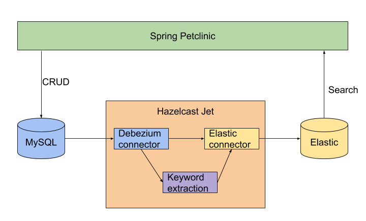
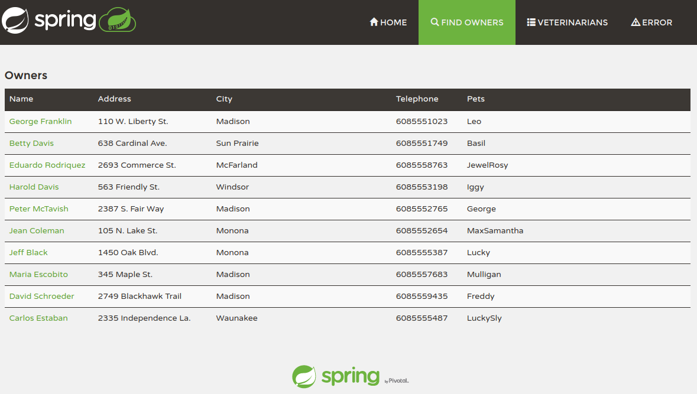
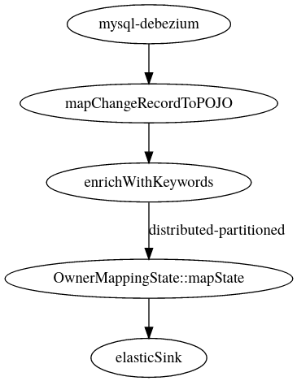
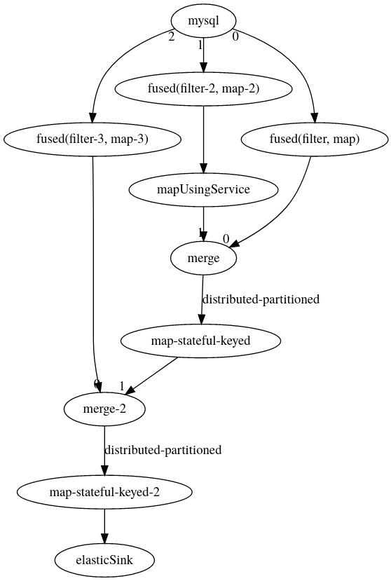
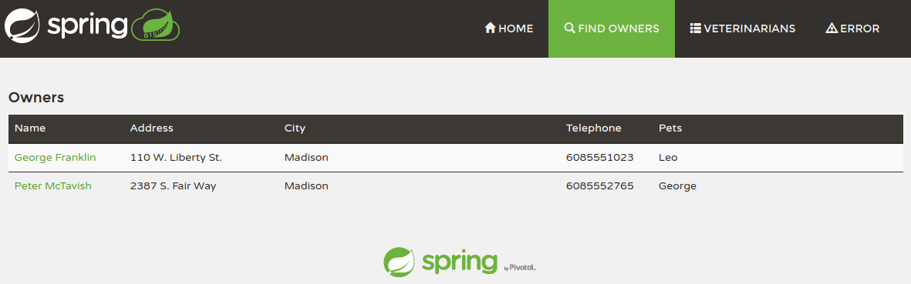
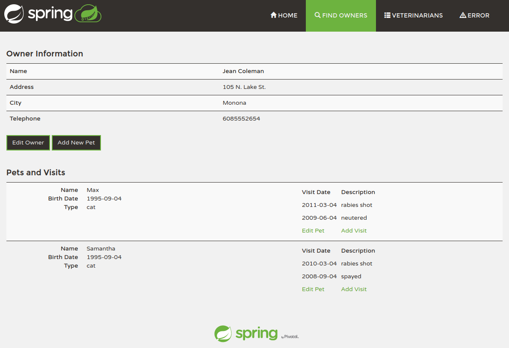

In this post, we will take a legacy application and improve its search
functionality. We will do this with only a few changes to the
application itself. Using a technique called change data capture (CDC)
we will listen for changes in a database and react to these
changes&nbsp;- write to a search index case. Before writing to the
search index, we will also enrich the data with a natural language
processing (NLP) step that extracts keywords from a text description.

We might want to use an external search index for various reasons,
especially:

* to provide more feature-rich functionality than full-text search in a
relational database;

* to scale the search independently of the database;

* to add more functionality (keyword extraction) to the application
 without
modifying it - making changes to a legacy application is sometimes
risky, or time-consuming, so taking this approach might be faster,
therefore cheaper.  

In this tutorial we will do the following:

* Use Hazelcast Jet - an open-source stream processing system - and its CDC
module to read changes made to the application database for further
processing in a Jet pipeline.

* In the Jet pipeline, we will enrich the data with an NLP mapping step.

* Write the results to an Elasticsearch index, using an Elasticsearch
connector, [released in Jet 4.2](/blog/2020/07/14/jet-42-is-released).



## The Application

We chose the [Spring
PetClinic](https://github.com/spring-projects/spring-petclinic)
application. It is relatively well-known to many Java developers and is
rather similar to a typical enterprise application.

The application provides a management tool for managing pets, their
owners, and visits to vets. It allows searching for owners, but only
using the owner’s last name. We will make the search more feature-rich,
allowing us to search on first name, last name, pet names and keywords
extracted from descriptions of the visits.

First, let’s start a vanilla version of the application. Run the
following command to start MySQL database inside a Docker container, we
use the official MySQL image, which allows us to create a database for
the pet clinic application easily:

```bash
docker run --name petclinic-mysql -it \
  -e MYSQL_DATABASE=petclinic \
  -e MYSQL_USER=petclinic \
  -e MYSQL_PASSWORD=petclinic \
  -e MYSQL_ROOT_PASSWORD=mysql \
  -p 3306:3306 mysql
```

Clone the pet clinic application source code from
[Github](https://github.com/hazelcast-demos/spring-petclinic) (this is a
fork of the official [Spring PetClinic
repository](https://github.com/spring-projects/spring-petclinic) with a
branch containing the changes we will make later for your convenience).

```bash
git clone https://github.com/hazelcast-demos/spring-petclinic.git
```

Start the pet clinic application from the command line by running the
following command:

```bash
cd spring-petclinic
./mvnw spring-boot:run -Dspring-boot.run.profiles=mysql
```

And wait for the following log message:

```text
2020-09-30 16:17:04.113  INFO 24847 --- [  restartedMain] o.s.s.petclinic.PetClinicApplication     : Started PetClinicApplication in 3.177 seconds (JVM running for 3.5)
```

Navigate to [http://localhost:8080/](http://localhost:8080/)

-> Click Find Owners in top-level menu

-> Click Find Owner button to list all data

and you should see a screen similar to the following:



## Prepare for Change Data Capture

In order to stream the changes from the MySQL database we need to modify
certain settings and grant more permissions to the `petclinic` user.

Run the following command to start MySQL client, enter the `mysql`
password for the root user:

```bash
docker run -it --rm --link petclinic-mysql:petclinic-mysql mysql mysql -hpetclinic-mysql -uroot -p
```

Run the following to grant privileges to the `petclinic` user to allow
listening to the database changes:

```sql
ALTER USER petclinic IDENTIFIED WITH mysql_native_password BY 'petclinic';
GRANT RELOAD ON *.* TO 'petclinic';
GRANT REPLICATION CLIENT ON *.* TO 'petclinic';
GRANT REPLICATION SLAVE ON *.* TO 'petclinic';
```

The `ALTER USER` command changes the default authentication method to
one supported by the Jet CDC connector. The `GRANT` commands allow the
petclinic user to stream changes from the database in the same way as
during master-slave replication.

## Start Elasticsearch

We want to enable full-text search across multiple fields, but not all
fields. With Elasticseach we need to create an index mapping that
copies fields into a single field, the field is then used for searching.

Run the following command to start Elasticsearch inside a docker
container:

```bash
docker run --name petclinic-elastic \
  -e discovery.type=single-node \
  -e cluster.routing.allocation.disk.threshold_enabled=false \
  -p9200:9200 elasticsearch:7.9.2
```

Create an Elasticsearch index mapping by running the following command:

```bash
curl -XPUT -H "Content-type: application/json" -d '
{
  "mappings": {
    "properties": {
      "first_name": {
        "type": "text",
        "copy_to": "search"
      },
      "last_name": {
        "type": "text",
        "copy_to": "search"
      },
      "pets.name": {
        "type": "text",
        "copy_to": "search"
      },
      "pets.visits.keywords": {
        "type": "text",
        "copy_to": "search"
      },
      "search": {
        "type": "text"
      }
    }
  }
}' http://localhost:9200/petclinic-index
```

The default setting of Elasticsearch analyzer is suitable for us. For
more elaborate configuration of the text analysis, you should look into
the Elasticsearch documentation or some other source.

## Hazelcast Jet Job

Now that we have the Petclinic and Elastic set-up and working, we can
start the data pump - a Jet job reading change events from MySQL
database and writing into the Elastic index.

A Jet job is a pipeline of steps that read, modify, aggregate or store
data items. The job definition is written in Java and packaged as a jar
file. The jar file is deployed to a Jet cluster, which takes care of the
execution, scaling, fail-over and other operational aspects.

The job consists of 4 main parts:

* CDC Source connecting to MySQL database

* A mapping step running the keyword extraction

* A joining step reconstructing the document from change records from
* different tables

* Elasticsearch sink

### CDC Source

The configuration of the source is straightforward, just set the required
parameters:

```java
StreamSource<ChangeRecord> source = MySqlCdcSources
    .mysql("mysql")
    .setDatabaseAddress(databaseAddress)
    .setDatabasePort(databasePort)
    .setDatabaseUser(databaseUser)
    .setDatabasePassword(databasePassword)
    .setClusterName(clusterName)
    .setDatabaseWhitelist("petclinic")
    .setTableWhitelist("petclinic.owners", "petclinic.pets", "petclinic.visits")
    .build();
```

Use the source to read change events from MySQL into the pipeline:

```java
Pipeline p = Pipeline.create();
StreamStage<ChangeRecord> allRecords = p.readFrom(mysqlSource)
                                        .withoutTimestamps();
```

### Keyword extraction

The next step in the pipeline is to extract the keywords from the visit
description. We will use Rapid Automatic Keyword Extraction (RAKE)
algorithm, the implementation we use was originally published on
[Github](https://github.com/Linguistic/rake). The implementation is not
important for the demonstration, you could use any other Java library,
call a 3rd party service, e.g. via [grpc](/docs/how-tos/grpc) or use our
[python integration](/docs/tutorials/python).

```java
// Create factory for keyword service
ServiceFactory<?, Rake> keywordService = ServiceFactories.sharedService((context) -> new Rake("en"));

p.readFrom(mysqlSource)
 .withoutTimestamps()
 .mapUsingService(keywordService, PetClinicIndexJob::enrichWithKeywords)
```

The method `enrichWithKeywords` simply passes the description field from
the change record to the keyword extraction service and sets the results
into the keywords field of the Visit instance.

It is a common pattern to enrich an item in a pipeline with more
information.  Hazelcast Jet works with POJOs in the pipeline, so you
need to somehow compose the original item and the enriching information.
One option is to use tuples.  This works for a small number of fields.
Another option would be to use a domain-specific object holding all the
information - e.g. the `keywords` field.  If you are on Java 14 or
newer, you might want to give the [Records preview
feature](https://openjdk.java.net/jeps/359) a try.

### Joining

Change data capture sends changes to the database as individual records
(represented by
[ChangeRecord](https://jet-start.sh/javadoc/4.2/com/hazelcast/jet/cdc/ChangeRecord.html)).
Each record represents a changed row in a database table. If a single
row is all that you need, you are good to go. You can see such example
in our [Evergreen Cache blog
post](/blog/2020/07/16/designing-evergreen-cache-cdc).  But having a
single row to work with is not always the case - often you need to
aggregate either multiple records from the same table or join records
from different tables into a single aggregate record.

In our case, we need to join 3 tables into a single document, which we
then index into Elasticsearch. To perform the joining we will use
`mapStateful` step. This can be performed either globally or partitioned
on a grouping key. If all your records share a common key it is always a
good idea to do the grouping by the key, because the mapping state is
then evenly distributed across all nodes and the mapping operation
parallelized.

Our visit record contains the pet ID but not the owner ID, in such case,
so we don’t have a single grouping key for all records. There are two
options:

* perform the stateful mapping globally, which has the advantage of
having a single state - the joining logic is simpler and the pipeline
more straightforward. The obvious disadvantage is that such a solution
is not scalable because the state may not fit onto a single member and
must be performed by a single thread;

* create two separate mapping steps - one grouped on the owner ID and
the other on the pet ID. This is a trade-off between simplicity and
scalability.

There are several observations which hold for both implementations:

* the mapping state must cover all data from the beginning, unless there
is a domain-specific rule that would allow eviction of old items;

* the records might arrive in any order, even if there is a foreign key
between the records in the database, the order is not guaranteed, this
is a property of CDC.

* once the object is emitted from the join step, it must not be
modified, otherwise the later stages might see it in inconsistent
state, causing issues which are hard to debug. We make defensive copies
to avoid this.

Go to
[Github](https://github.com/hazelcast-demos/pet-clinic-index-job/blob/master/src/main/java/org/example/jet/petclinic/JoiningState.java#L11)
to see the full source code.

### Deleting changes

The `ChangeRecord#operation()` method provides information about what
kind of operation was performed on the record. If you need to handle
deletions, you should use it. The Petclinic application doesn’t allow
delete operations, so we don’t handle those.

### Elastic sink

The fourth key part of the pipeline is the Elastic sink. It takes a
document and writes it to Elasticsearch. You as the developer need to
provide information where the Elastic instance is running, what index to
write to and how to convert the `Document` into one of `IndexRequest`,
`UpdateRequest` or `DeleteRequest`. The Sink then takes care of batching
the requests and parallelizing for higher performance, retries in case
of network issues.

### The Pipeline

The final pipeline composes all the individual steps in a
straightforward way:

```java
Pipeline p = Pipeline.create();
p.readFrom(mysqlSource)
 .withoutTimestamps()
 .map(PetClinicIndexJob::mapChangeRecordToPOJO).setName("mapChangeRecordToPOJO")
 .mapUsingService(keywordService, PetClinicIndexJob::enrichWithKeywords).setName("enrichWithKeywords")
 .mapStateful(JoiningState::new, JoiningState::join).setName("JoiningState::join")
 .writeTo(elasticSink);
```

Or visualized as a graph:



For the pipeline with the two-step join see [the source
code](https://github.com/hazelcast-demos/pet-clinic-index-job/blob/two-joins/src/main/java/org/example/jet/petclinic/PetClinicIndexJob.java#L87)
on Github. This is the graph visualisation of the pipeline:



## Testing the job

In order to test the job, we need to create a test database identical to
the Petclinic database.

We have the following options:

* Start the pet clinic application inside the same JVM - the Petclinic
is a Spring Boot application, running it in-process would be
relatively easy, but it represents a legacy application, which is
usually quite difficult to run in such way. Also, there is a high
probability of dependency clashes, which would make this difficult.

* Start the pet clinic application in a Docker container - it is likely
that the application is not containerized, we would need to create
such an image only for the tests.

* Create the database and data using SQL directly - reusing the SQL
scripts from the Petclinic application and running inserts via JDBC
seems the easiest way to do this so we will continue with this approach.

Go to
[Github](https://github.com/hazelcast-demos/pet-clinic-index-job/blob/master/src/main/java/org/example/jet/petclinic/PetClinicIndexJob.java#L121)
to see the full source code.

## Running the Job

In order to run the indexing job, first checkout the
[pet-clinic-indexing-job](https://github.com/hazelcast-demos/pet-clinic-index-job/)
repository

```bash
git clone https://github.com/hazelcast-demos/pet-clinic-index-job.git
```

Then build the JAR containing to job

```bash
cd pet-clinic-indexing-job
mvn package
```

And finally submit the job by running the following command:

```bash
bin/jet submit \
path/to/pet-clinic-index-job/target/pet-clinic-index-job-1.0-SNAPSHOT-jar-with-dependencies.jar\
   --database-address localhost \
   --database-port 3306 \
   --database-user petclinic \
   --database-password petclinic \
   --elastic-host localhost:9200 \
   --elastic-index petclinic-index
```

## Petclinic application update

Now that we have the data in Elasticsearch index, we can update the
Petclinic application to use it for search.

There are several changes in the application, but the most important
changes are:

* created a search service to search for the data;

* update the search endpoint to use the new search service.

The following snippet shows the search method in the SearchService. It
uses the Elasticsearch client directly, but one could use Spring Data
Elasticsearch as well.

```java
public Collection<Integer> search(String query) {
  SearchRequest searchRequest = new SearchRequest(index);
  searchRequest.source().fetchSource(true).query(QueryBuilders.wildcardQuery(searchField, query + "*"));

  try {
     SearchResponse response = client.search(searchRequest, RequestOptions.DEFAULT);

     SearchHits hits = response.getHits();
     return Arrays.stream(hits.getHits()).map(hit -> (Integer) hit.getSourceAsMap().get("ownerId"))
           .collect(toList());
  }
  catch (IOException e) {
     throw new RuntimeException(e);
  }
}
```

The search endpoint will use the SearchService to search for the data.
After retrieving the results the Owner entities need to be loaded from
the database. This is not an issue as only a small subset of
best-matching documents is returned from Elastic and loaded by ID from
the database.

```java
Collection<Integer> ownerIds = searchService.search(searchForm.getQuery());
// find owners by last name
Collection<Owner> results = this.owners.findByIds(ownerIds);
```

There are some more minor changes to the view and the controller, you
can see all the changes in [this
commit](https://github.com/spring-projects/hazelcast-demos/compare/main...elasticsearch).

Checkout the `elasticsearch` branch with the changes and restart the
application by running the Maven command again:

```bash
./mvnw spring-boot:run -Dspring-boot.run.profiles=mysql
```

We can verify that searching for “George” returns 2 results, one found
in the first name, other in the name of a pet:



Entering “rabies” should bring up a single result (the detail screen is
shown in that case) matching a keyword extracted from the description:



## Summary

We have shown how to stream changes using CDC, enrich the data,
correlate (join) the records with other records and finally store the
data into an Elasticsearch index, so an application can provide better
search functionality to the user.

This is mostly done independently of the original application and its
database, reducing the impact it has on the original legacy system.

If you would like to discuss this topic with us, drop by at [our
Community Slack channel](https://hazelcastcommunity.slack.com/).

## Sources

[Spring Petclinic](https://github.com/hazelcast-demos/spring-petclinic)
-&nbsp;fork with modifications for this post.

[Petclinic Indexing Job](https://github.com/hazelcast-demos/pet-clinic-index-job)

[Rake - rapid keyword extraction algorithm](https://github.com/Linguistic/rake)

_If you enjoyed reading this post, check out Jet at
[GitHub](https://github.com/hazelcast/hazelcast-jet) and give us a
star!_
