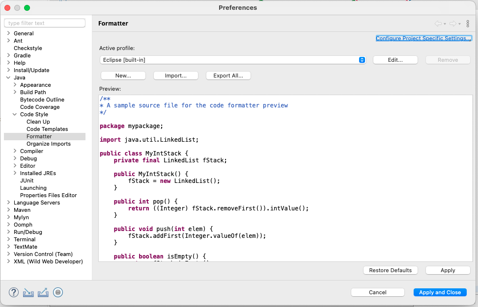
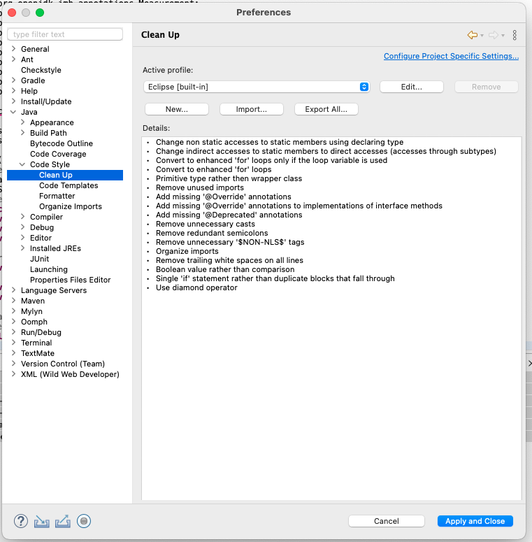
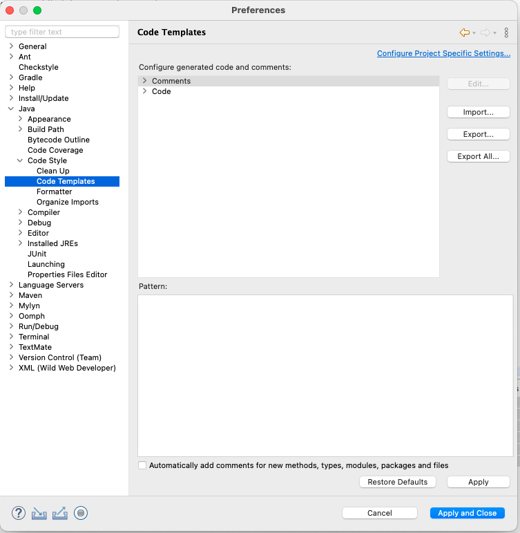

Eclipse is a trademark of the Eclipse Foundation, Inc

# Eclipse IDE Configurations

## Code Formatting

Import [`hz-formatter.xml`](hz-formatter.xml) under `Settings` -> `Java` -> `Code Style` -> `Formatter` -> `Import`

## Clean Up

Import [`hz-formatter.xml`](hz-formatter.xml) under `Settings` -> `Java` -> `Code Style` -> `Clean Up` -> `Import`

## Templates

Import [`hz-templates.xml`](hz-formatter.xml) under `Settings` -> `Java` -> `Code Style` -> `Code Templates` -> `Import`

