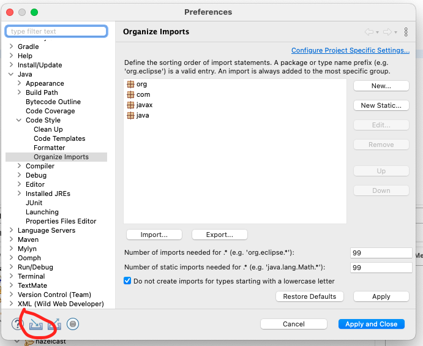
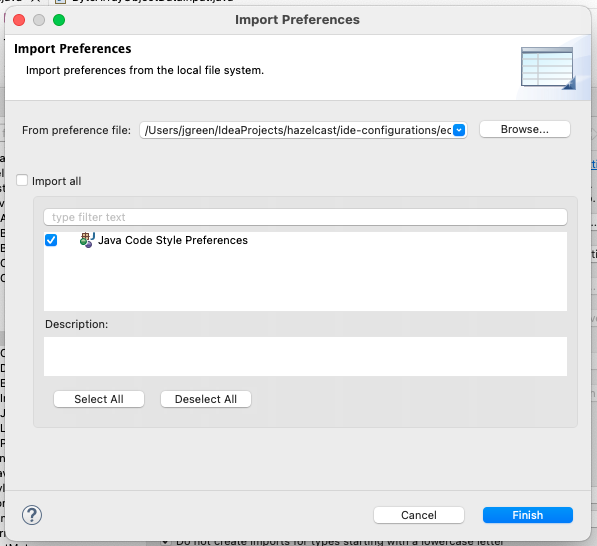

Eclipse is a trademark of the Eclipse Foundation, Inc

# Eclipse IDE Configurations

[`Hazelcast-Eclipse.pref.epf`](Hazelcast-Eclipse.pref.epf) is a minimal set of preferences that sets the preferences of
the formatter, clean up & templates functionality to match the project style.

## To import

`Settings` -> `Import Preferences` ->
Select [`Hazelcast-Eclipse.pref.epf`](Hazelcast-Eclipse.pref.epf) -> `Select All` -> `Finish`

