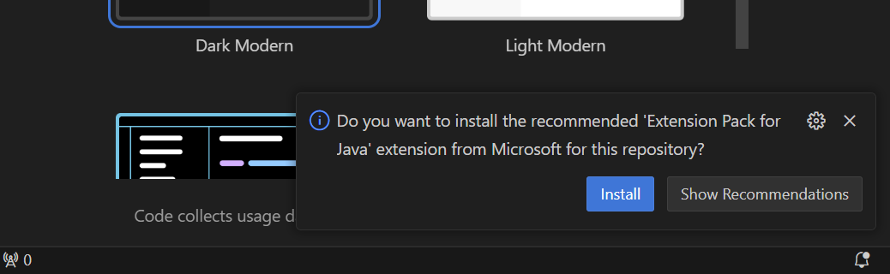

[](https://code.visualstudio.com/)

# VS Code IDE Configurations

## Extensions
Repository includes [workplace recommended extensions](https://code.visualstudio.com/docs/editor/extension-marketplace#_workspace-recommended-extensions), which are recommended automatically when opened for the first time:



Or can be reviewed from the extension window:


## `.vscode/settings.json`
```
{
  "java.configuration.maven.userSettingsFile": "${workspaceFolder}/.mvn/wrapper/maven-wrapper.properties",
  "java.jdt.ls.vmargs": "-XX:+UseParallelGC -XX:GCTimeRatio=4 -XX:AdaptiveSizePolicyWeight=90 -Dsun.zip.disableMemoryMapping=true -Xlog:disable",
  "java.compile.nullAnalysis.mode": "automatic",
  "java.debug.settings.vmArgs": "-ea"
}
```
