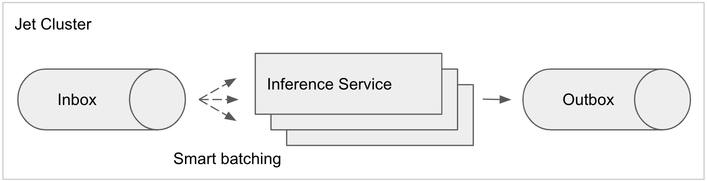
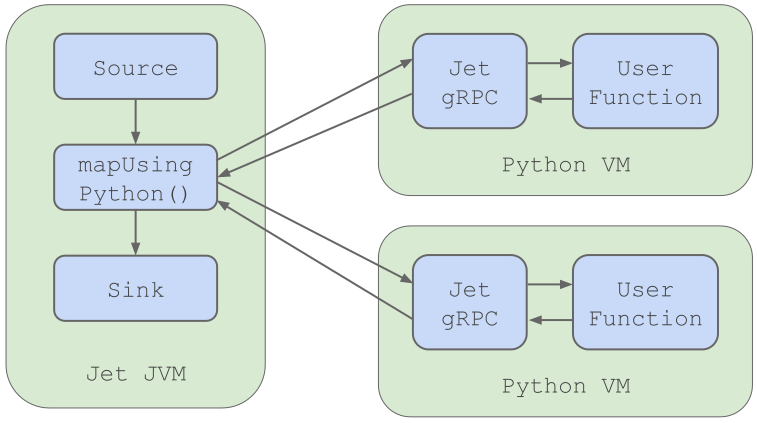

Machine learning projects can be split into two phases:

- Training
- Inference

During the training phase, data science teams have to obtain, analyze
and understand available data and generalize it into a mathematical
model. The model uses the features of the sample data to reason about
data it has never seen. Although it can be completely custom code, it is
usually based on proven machine learning algorithms, such as Naïve
Bayes, K Means, Linear Regression, Deep Learning, Random Forests or
Decision Trees. The act of building the model from the sample (training)
data is referred to as training.

The inference phase refers to using the model to predict an unknown
property of the input data. This requires deploying the model into a
production environment and operating it.

## Operating Machine Learning

The most straightforward way to deploy the model is to wrap it in a REST
web service and let other applications remotely invoke the inference
service. Many machine learning frameworks provide such a service
out-of-the-box to support simple deployments that don’t deal with much
data.

What Hazelcast Jet adds to this story is a simple way to deploy the
model so that it is automatically parallelized and scaled out across a
cluster of machines.

Jet uses its parallel, distributed and resilient execution engine to
turn the model into a high-performance inference service. To use all
available CPU cores, Jet spins up multiple parallel instances of the
model and spreads the inference requests among them. The Jet cluster is
elastic; to scale with the workload, add or remove cluster members on
the fly with no downtime.

Another trick is using a *pipelined* design instead of a request-reply
pattern. It allows Jet to batch inference requests together and reduce
fixed overheads of serving each request individually. This improves the
overall throughput of the model significantly! The pipelined design
requires a change in the client’s workflow. Instead of calling the
inference service directly, it sends its inference request to an inbox.
It may be implemented using a message broker such as JMS topic, Kafka or
distributed topic of Hazelcast. Jet watches the inbox and groups
multiple requests together to use the model service efficiently. It uses
[smart
batching](https://mechanical-sympathy.blogspot.com/2011/10/smart-batching.html)
where the batch size changes with the data volume to keep the latency
always low. The inference results are published to an outbox for callers
to pick it up.

## Models Supported

### Python models

Python is the lingua franca of the data science world. There is a wide
ecosystem of libraries and tools to build and train models in Python:
[TensorFlow](https://www.tensorflow.org/), [Keras](https://keras.io/),
[Theano](http://deeplearning.net/software/theano/),
[Scikit-learn](https://scikit-learn.org/stable/) or
[PyTorch](https://pytorch.org/) to name a few. Jet can host any Python
model.

Upon model deployment, Jet’s JVM runtime launches Python processes and
establishes bi-directional gRPC communication channels to stream
inference requests through it. So, the model runs natively in a Python
process that is completely managed by Jet. It can be tuned to spin
multiple Python processes on each machine to make use of multicore
processors.

Jet makes sure that the Python code is distributed to all machines that
participate in the cluster. If you add another machine to a Jet cluster,
it creates a directory on it and deploys the Python code there.
Moreover, Jet can install all required Python libraries to prepare the
runtime for your Python model.

Documentation:
[https://docs.hazelcast.org/docs/jet/latest/manual/#map-using-python](https://docs.hazelcast.org/docs/jet/latest/manual/#map-using-python)

Code sample:
[https://github.com/hazelcast/hazelcast-jet/tree/master/examples/python](https://github.com/hazelcast/hazelcast-jet/tree/master/examples/python)

### Java models

Java models are used for high-performance inference execution. Favourite
Java model libraries include
[JPMML](https://github.com/jpmml/jpmml-evaluator), [TensorFlow for
Java](https://www.tensorflow.org/install/lang_java),
[MXNet](https://mxnet.apache.org/api/java), [XGBoost JVM
Package](https://xgboost.readthedocs.io/en/latest/jvm/index.html) and
[H20](https://www.h2o.ai/).

Similarly to Python, the model is packaged as a Jet Job resource. The
Job usually includes model inference code (the ML library) and a
serialized model. Jet runs the Java models in-process with the cluster
members so there is no need to start extra processes and there is no
communication overhead (serialization, deserialization, networking).
This makes Java model the best performing option. The inference job can
be configured to use one model instance per JVM or multiple model
instances.

Documentation:
[https://docs.hazelcast.org/docs/jet/latest/manual/#machine-learning-model-prediction](https://docs.hazelcast.org/docs/jet/latest/manual/#machine-learning-model-prediction)

Code samples:

- [H2O Model](https://github.com/hazelcast/hazelcast-jet-demos/tree/master/h2o-breast-cancer-classification)
- [TensorFlow Model](https://github.com/hazelcast/hazelcast-jet-demos/tree/master/tensorflow)
- [Custom Java Model](https://github.com/hazelcast/hazelcast-jet-demos/tree/master/realtime-image-recognition)

### Remote services

We started this article by saying that using a model as an RPC service
is simple but requires extra effort when scaling. Jet supports this
pattern, too. The Jet Job can invoke a remote inference service. The
model isn’t managed by Jet in this case, so the operational and
performance advantages are gone. Jet still provides the convenience of
smart batching, inbox/outbox [connectors](/docs/api/sources-sinks) and
many [pipeline operators](/docs/api/pipeline#types-of-transforms). Smart
batching works only if the RPC service can operate on batches of input
items.

Benefits of this setup

- Isolating the model service and the data pipeline
- Sharing the model among many Jet pipelines

Code samples:

- [Invoking remote gRPC service](https://github.com/hazelcast/hazelcast-jet/tree/master/examples/grpc)
- [Remote TensorFlow](https://github.com/hazelcast/hazelcast-jet-demos/tree/master/tensorflow)

### Execution Mode Overview

| Execution Mode | Java Model | Python Model | Remote Model |
| -------------- | ---------- | ------------ | ------------ |
| Model managed by Jet | ✅ | ✅ | ✅ |
| Model shared between Jobs  | ❌ | ❌ | ✅ |
| Jet ↔ Model Communication | Shared memory | gRPC (processes collocated) | RPC (processes usually on different machines) |
| Throughput (single node) | 1M / sec | 50k / sec | Depends on underlying architecture |
| Prerequisites |  Model runs in JVM | Python runtime installed on all cluster machines | Model available as a RPC service |

### Framework Integration Overview

| Framework | Execution Mode | Code Sample |
| --------- | -------------- | ----------- |
| H2O | Java | [Code Sample](https://github.com/hazelcast/hazelcast-jet-demos/tree/master/h2o-breast-cancer-classification) |
| TensorFlow for Java | Java | [Code Sample](https://github.com/hazelcast/hazelcast-jet-demos/blob/master/tensorflow/src/main/java/InProcessClassification.java) |
| Custom Java Model | Java | [Code Sample](https://github.com/hazelcast/hazelcast-jet-demos/tree/master/realtime-image-recognition) |
| PMML | Java | N/A, use [JPMML Evaluator](https://github.com/jpmml/jpmml-evaluator) as a Custom Java Model |
| MXNet | Java | N/A, use [MXNet Java Inference API](https://mxnet.apache.org/api/java.html) as a Custom Java Model |
| XGBoost | Java | N/A, use [XGBoost JVM Package](https://xgboost.readthedocs.io/en/latest/jvm/index.html) as a Custom Java Model |
| [Keras](https://keras.io/), [Theano](http://deeplearning.net/software/theano/), [Scikit-learn](https://scikit-learn.org/stable/) or [PyTorch](https://pytorch.org/) | Python | N/A, use the [Custom Python Model](https://github.com/hazelcast/hazelcast-jet/tree/master/examples/python) |
| Custom Python Model | Python | [Code Sample](https://github.com/hazelcast/hazelcast-jet/tree/master/examples/python) |
| Remote gRPC service | Remote | [Code Sample](https://github.com/hazelcast/hazelcast-jet/tree/master/examples/grpc) |
| Remote TensorFlow service | Remote | [Code Sample](https://github.com/hazelcast/hazelcast-jet-demos/blob/master/tensorflow/src/main/java/ModelServerClassification.java) |
