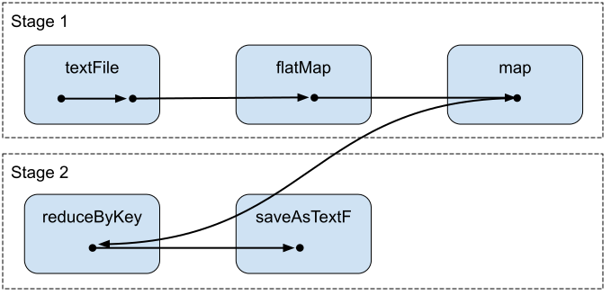
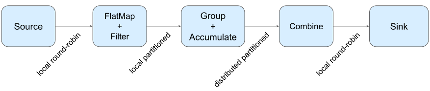

“How Jet compares to Spark” and “why should I choose Jet over Spark” are
arguably the most frequent questions I’ve been asked during the talks
and workshops. While it is hard to assess the product fit without
focusing on a concrete use-case, I’d still like to compare concepts and
architecture used under the hood of both frameworks.

Versions considered: [Hazelcast Jet 4.1](https://jet-start.sh/download)
and [Apache Spark 2.4.5](https://spark.apache.org/downloads.html).

## Computations Modeled as Graphs

Apache Spark and Hazelcast Jet (referred to as “frameworks”) are both
tools for clustered computing. They are applicable mostly for analytical
(OLAP) applications, including those that apply a series of processing
steps to many uniform data records (such as lines in a file, rows in a
table or records appended to a stream), as one example.

Both frameworks build on the principles of dataflow programming: a user
builds an application by chaining high-level coarse-grained operators
such as map, join or aggregate. The operators form a network that can be
modeled as a graph ([directed acyclic
graphs](https://en.wikipedia.org/wiki/Directed_acyclic_graph) or DAG to
be specific) where nodes represent steps in the computation and edges
represent data exchange.

The dataflow model has some important properties that both frameworks
use for scaling and fault-tolerance:

- Pipeline Parallelism: operators can work independently, in parallel.
- Data Parallelism: a single operator can run in multiple instances,
  each instance processing a particular data partition
- No Shared State: each operator instance manages its state exclusively.
  There is no shared state to coordinate access to or to replicate.
  Moreover, the state is only determined by the input data. As a result,
  the operator can be recovered by replaying the input data.

Spark and Jet differ in how they use and execute the DAG as explained in
the next section but fundamentally: no matter which API you use (RDDs,
Spark SQL or a Pipeline API of Jet), **the physical execution plan is a
DAG representing the dataflow**.

## Staged x Continuous Execution Mode

In Spark, the DAG nodes represent execution stages. A stage must be
fully completed before Spark starts the next one. In Jet, DAG represents
connected operators. Jet executes all DAG nodes concurrently.

Let’s use a textbook OLAP example to elaborate: the log analysis (a
real-world application of notorious word count). Data from the access
logs are aggregated over different grouping keys, such as counting the
web sessions over several web applications using shared session id.

This is the Spark and Jet code to load the data, pre-process (parse) and
aggregate it:

Spark RDD API (Java)

```java
sc.textFile("/path/to/input/")
    .flatMap(LineIterator::new)
    .mapToPair(s -> new Tuple2<>(s, 1L))
    .reduceByKey((Function2<Long, Long, Long>) (a, b) -> a + b)
    .saveAsTextFile("/path/to/output/");
```

Jet Pipeline API (Java)

```java
p.readFrom(Sources.files("/path/to/input/"))
    .map(LogLine::parse)
    .groupingKey(wholeItem())
    .aggregate(counting())
    .writeTo(Sinks.files("/path/to/output/"));
```

### Spark and Staged Execution

Spark splits the computation to non-overlapping stages. A reading stage
and a group-and-aggregate stage, in our case. During the reading stage,
Spark workers fetch data from disk files, parse it and cache it in the
cluster memory. Spark schedules more tasks if the source can be read in
parallel (e.g. data is partitioned). All reading stage tasks must be
finished before the first aggregating task is started.

This is the DAG representing execution stages (
[source](https://www.tutorialkart.com/apache-spark/dag-and-physical-execution-plan/)).



Staged execution was designed to support an iterative analytics use-case
where the results of one stage stay cached in a cluster memory to be
reused by a following step in the analysis. This makes Spark a popular
choice for ML research where a data scientist gradually evolves the
dataset with new experiments, evicting the data when their Spark session
is over. It is also a powerful debugging tool.

On the other hand, staged execution doesn’t perform well for
latency-sensitive use-cases, namely stream processing.

Streaming data is continuously incrementing. Staged execution is however
designed for finite datasets. Whole input must be read before Spark
starts subsequent steps. Spark Streaming works around this by batching
the input data, e.g. creating finite chunks from an infinite stream.
Buffering adds to the job latency as the data are waiting for the batch
to fill, staying idle.

The stages are planned and scheduled again and again for every batch.
The overhead of the planning process increases the latency further.

Another latency penalty comes if the data partitions are not balanced
evenly. If a single partition of data takes longer to read or process,
it would block the whole job from progressing since the next stage can’t
be started. Jet would be impacted by this scenario, too, but it can
still provide early results – in-complete, indicative results based on
already processed partitions.

### Jet and Continuous Execution

Jet executes all DAG nodes concurrently. The DAG is deployed to all
cluster nodes when the job is submitted and runs until a termination.
The instances of running DAG nodes, called Processors, then run in
parallel and continuously exchange data. For partitioned data sets, the
data partitions are evenly distributed among available processors (see
the
[docs](https://jet-start.sh/docs/architecture/distributed-computing)).

This is the DAG representing the execution plan for the log aggregation.
Jet would create multiple instances of each and route data among it
following the routing strategy ([source](https://jet-start.sh/docs/next/architecture/distributed-computing)):



A reading Processor keeps fetching data from the data source and sends
it to a downstream channel immediately. The channel routes data to the
respective aggregating processor, following the grouping key. The
aggregating processor is observing the input channel and updates the
aggregate with each input item. It’s an application concern to specify
when the aggregator emits the aggregate downstream – with every input
item, after a period of time, after the whole dataset has been processed
or based on a data-driven trigger.

The continuous execution model is a natural fit for streaming use-cases
that stress low latency. Jet Jobs can keep millisecond latencies on a
large scale.

Spark has introduced the continuous execution mode in 2.4. The mode is
still experimental and is limited to stateless operators (mapping,
filtering) so it wasn’t considered for this comparison.

## In-Memory Execution

Spark and Jet both rely on an in-memory execution. That means that *data
transfer* and *execution state* both use the cluster RAM.

### Data Transfer

In-memory data transfer means that the data between the consecutive DAG
nodes are exchanged using shared memory instead of a disk (shuffling the
data among cluster nodes still requires a network, of course).

Spark exchanges data between stages by saving the complete output of an
upstream stage in the memory of the worker to be used as an input of a
downstream stage. Jet uses in-memory queues to connect upstream and
downstream Processors.

That makes Spark more memory demanding as it caches the whole dataset
exchanged between two steps which can easily be hundreds of GB of data.
Spark workers are therefore able to spill data to disk not to run out of
memory. Jet processors run all in parallel and exchange data
continuously. The in-flight data are no more than a few thousand
records.

### Execution State

Execution state refers to the temporary data of the computation, such as
the value of an ongoing aggregation or join. Both Jet and Spark keep the
state data on heap by default.

Spark can however also place execution state off-heap and even spill it
to disk. It can, therefore, perform calculations that require a large
state such as joins or sorts on huge datasets. For Jet, the execution
state must fit to cluster memory.

## Dedicated x Shared Resources

Spark applications running in a cluster are isolated from each other.
Jet shares the cluster resources between applications (called Jobs). No
approach is “the right one”. It’s trading-off isolation and performance.

### Spark Assigns Dedicated Resources

For each application, Spark runs dedicated processes for both scheduling
and execution.

The processes are created with the resources (CPU, memory and disk)
allocated to the application upon startup and reserved during job
lifetime. After the Spark Application ends, the processes are terminated
and the resources are freed.

This design clearly favours isolation. A noisy application doesn’t
affect the neighbours using the same computer. It can, however, lead to
overprovisioning as an Application holds allocated resources even if it
doesn’t require it.

Spark was designed in the age of Hadoop – huge clusters of heterogeneous
machines running many workloads. Multi-tenancy was, therefore, a
first-level design concern.

### Jet Shares Resources

The Jet cluster is also formed by multiple member processes. Those
processes are started when the cluster starts and aren’t coupled with a
lifecycle of individual hosted Job.

Jobs share the cluster resources and run in a [cooperative
mode](https://jet-start.sh/docs/architecture/execution-engine). Each job
does a small amount of work and yields to the next one. Job is removed
from this round-robin after it finishes.

This design leads to efficient resource utilization. All jobs get a fair
amount of CPU time. If a job gets idle (e.g. waiting for more input
data), it simply backs off and Jet excludes it from the round-robin
rotation for a few milliseconds, giving busy Jobs more CPU to keep up.

Resource sharing is of course prone to noisy neighbours – a greedy job
can starve others. To prevent this, Jet recommends starting a cluster
per tenant or even per job, increasing the isolation to a Spark level.

### Shared Datasets

Another benefit of job sharing processes is exchanging data over the
shared memory.

A job can load and pre-process data, caching it in cluster memory (Jet
comes with distributed storage). The cached collection then becomes a
source for further processing jobs, leading to [significant performance
gains](https://hazelcast.com/resources/jet-0-4-vs-spark-flink-batch-benchmark/)
from reading the local memory instead of a remote data source. Another
use-case is shared reference data (such as lookup tables or parameters)
or queues connecting the output stream of one job to an input of another
one.

Spark applications run in isolated processes so they must use external
storage to exchange data.

## Conclusion

Jet and Spark are frameworks that use principles of dataflow programming
to run analytical computations on clusters of machines for scalability
and resiliency.

They differ in how they implement and execute the data flow. Jet’s
design favours streaming use-cases that benefit from the low-latency
continuous execution. Spark can spill data to disk and isolates jobs on
a process level. Therefore it’s a good fit for large, multi-tenant
clusters.

Other areas worth comparing are the cluster architecture and APIs. They
will be covered in the next part of the article.
