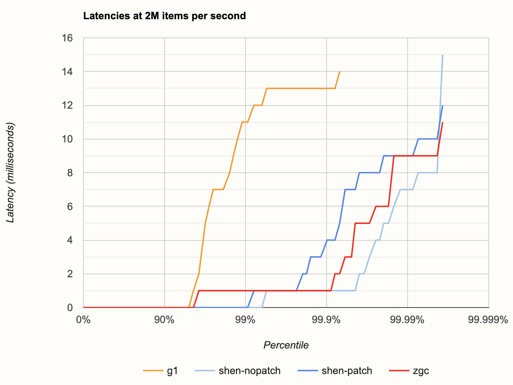
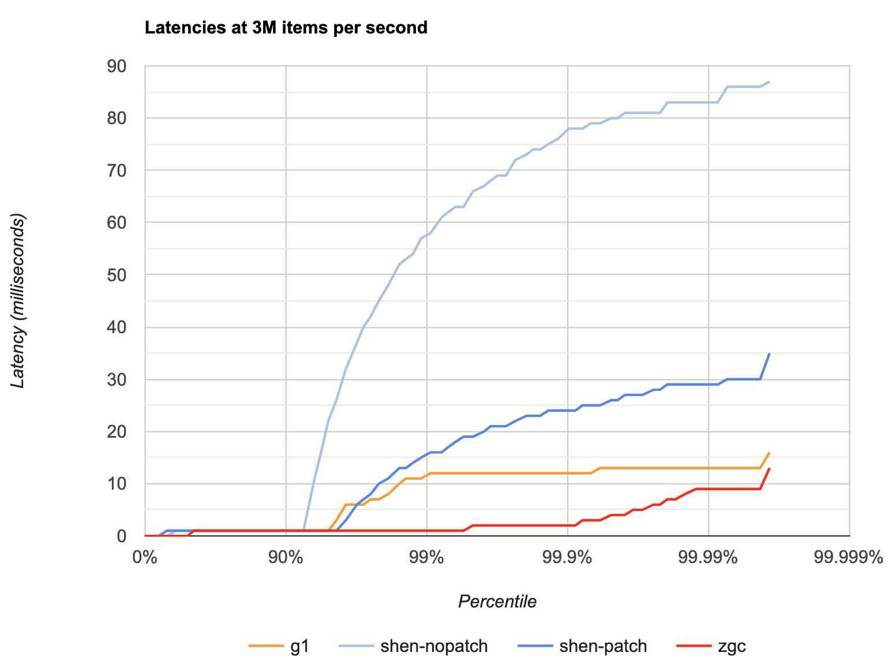
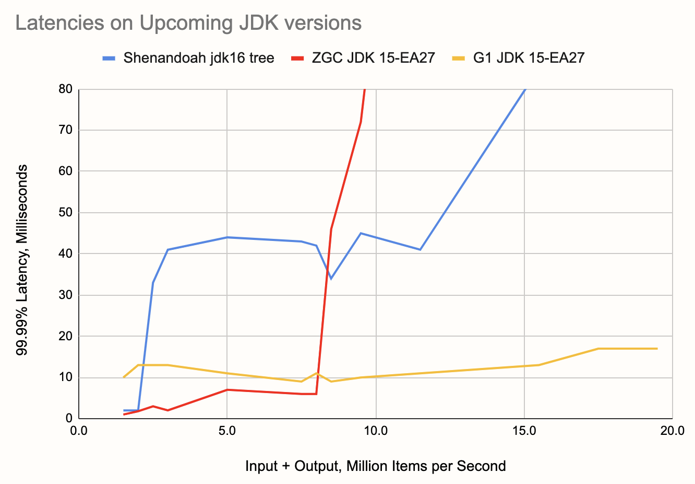

This post is a part of a series:

- [Part 1 (Intro and high-throughput streaming
  benchmark)](/blog/2020/06/09/jdk-gc-benchmarks-part1)
- [Part 2 (batch workload benchmark)](/blog/2020/06/09/jdk-gc-benchmarks-part2)
- Part 3 (you are here)
- [Part 4 (concurrent GC with green threads)](/blog/2020/08/05/gc-tuning-for-jet)
- [Part 5 (billion events per second)](/blog/2021/03/17/billion-events-per-second)

This is a followup on Part 1 of the blog post series we started earlier
this month, analyzing the performance of modern JVMs on workloads that
are relevant to the use case of real-time stream processing.

As a quick recap, in Part 1 we tested the basic functionality of
[Hazelcast Jet](https://github.com/hazelcast/hazelcast-jet) (sliding
window aggregation) on two types of workload: lightweight with a focus
on low latency, and heavyweight with a focus on the data pipeline
keeping up with high throughput and large aggregation state. For the
low-latency benchmarks we chose the JDK 14 as the most recent stable
version and three of its garbage collectors: Shenandoah, ZGC, and G1 GC.

Our finding that Shenandoah apparently fared worse than the other GCs
attracted some reactions, most notably from the Shenandoah team who
reproduced our finding, created an
[issue](https://bugs.openjdk.java.net/browse/JDK-8247358), came up with
a fix, and committed it to the jdk/jdk16 repository, all in the span of
a few days. The change pertains to the heuristics that decide how much
work the GC should do in the background in order to exactly match the
applications allocation rate. This component is called the *pacer*. It
was constantly detecting it's falling behind the application, triggering
a brief "panic mode" in order to catch up. The fix fine-tunes the
pacer's heuristics to make the background GC work more proactive.

Given this quick development, we wanted to test out the effects of the
fix, but also take the opportunity to zoom in on the low-latency
streaming case and make a more detailed analysis.

Here are our main conclusions:

1. ZGC is still the winner and the only GC whose 99.99th percentile
   latency stayed below 10 ms across almost all of our tested range
1. Shenandoah's pacer improvement showed a very strong effect, reducing
   the latency by a factor of three, but still staying well above 10 ms
   except in the very lowest part of our tested range
3. G1 kept its 99.99th percentile latency below 13 ms across a wide
   range of throughputs

## The JDK We Tested

Since this is all so fresh, we couldn't use an existing JDK release, not
even EA, to see the effects of the fix. JDK version 14.0.2 is slated to
be released on July 14. To nevertheless make progress, we took the
source code from the jdk14u tree, at the changeset number
[57869:e9d41bbaea38](http://hg.openjdk.java.net/jdk-updates/jdk14u/rev/e9d41bbaea38),
and applied the changeset number
[59746:29b4bb22b5e2](https://hg.openjdk.java.net/jdk/jdk/rev/29b4bb22b5e2)
from the main jdk tree on top of it. The jdk14u tree is where JDK 14.0.2
will be released from and the changeset 59746:29b4bb22b5e2 applies the
patch resolving the mentioned Shenandoah issue.

## The JVM Options

There are two HotSpot JVM options whose default values change
automatically when you use the ZGC so we had to decide which choice to
make when testing the other garbage collectors.

- `-XX:-UseBiasedLocking`: biased locking has for a while been under
  criticism that it causes higher latency spikes due to bias revocation
  that must be done within a GC safepoint. In the upcoming JDK version
  15, biased locking will be [disabled by default and
  deprecated](https://openjdk.java.net/jeps/374). Any low-latency Java
  application should have this disabled and we disabled it in all our
  measurements.

- `-XX:+UseNUMA`: Shenandoah and ZGC can query the NUMA layout of the
  host machine and optimize their memory layout accordingly. The only
  reason why Shenandoah doesn't do it by default is a general precaution
  against suddenly changing the behavior for upgrading users, but the
  precaution is no longer necessary. It will be [enabled by
  default](https://openjdk.java.net/jeps/163) in upcoming JDK versions,
  and we saw no harm in enabling it in all cases as well. **Late
  update**: G1 can also optimize for the NUMA layout, but we didn't use
  `UseNUMA` for it. However, we also checked the c5.4xlarge instance
  with `numactl` and it indicated that the entire machine was a single
  NUMA node anyway.

There is also a JVM feature that is simply incompatible with ZGC's
colored pointers: compressed object pointers. In other words, ZGC
applies `-XX:-UseCompressedOops` without the option to enable it.
A compressed pointer is just 32 bits long but handles heaps of up to
32 GB and it's usually beneficial to both memory usage and performance.
We left this option enabled for Shenandoah.

For the G1 collector, we also set `-XX:MaxGCPauseMillis=5`, same as in
the previous testing round, because the default of 200 milliseconds is
optimized for throughput and the G1 can give you much better latency
than that.

We performed all our tests on an EC2 c5.4xlarge instance. It has 16
vCPUs and 32 GB of RAM.

## The Data Pipeline

To get a more nuanced insight into the performance, we made some
improvements to the testing code. Whereas in the first iteration we just
reported the maximum latency, this time around we wanted to capture the
entire latency profile. To this end we had to increase the number of
reports per second the pipeline outputs. Initially we set it to 10 times
per second, a number which results in too few data points for the
latency chart. The pipeline in this round emits 100 reports per second.
The event rate and the length of the time window are the same: 1 million
events per second and 10 seconds, respectively. This results in 1,000
hashtables each holding 10,000 keys as the aggregation state. We tested
across a wide range of keyset sizes, starting from 5,000 up to 105,000.

Note that the size of the keyset, somewhat counterintuitively, does not
affect the size of the aggregation state. As long as the 10,000 input
events received during one time slice of 10 milliseconds all use
distinct keys, the state is fixed as described above. Only in the lowest
setting, 5,000, the state is half as large since every hashtable
contains just 5,000 keys.

What the keyset size does affect is allocation rate. The pipeline emits
the full keyset every 10 milliseconds. For example, with 50,000 keys
that's 5,000,000 result items per second. If we add to that the rate of
the input stream (a fixed million events per second), we get a value
that is a good proxy for the overall allocation rate. This is why we
chose combined input+output rate as the x-axis value in the charts that
we'll be showing below.

Here is the basic code of the pipeline, available on
[GitHub](https://github.com/mtopolnik/jet-gc-benchmark/blob/round-2/src/main/java/org/example/StreamingRound2.java):

```java
StreamStage<Long> source = p.readFrom(longSource(EVENTS_PER_SECOND))
                            .withNativeTimestamps(0)
                            .rebalance();
StreamStage<Tuple2<Long, Long>> latencies = source
        .groupingKey(n -> n % NUM_KEYS)
        .window(sliding(WIN_SIZE_MILLIS, SLIDING_STEP_MILLIS))
        .aggregate(counting())
        .filter(kwr -> kwr.getKey() % DIAGNOSTIC_KEYSET_DOWNSAMPLING_FACTOR == 0)
        .mapStateful(DetermineLatency::new, DetermineLatency::map);

latencies.filter(t2 -> t2.f0() < TOTAL_TIME_MILLIS)
         .map(t2 -> String.format("%d,%d", t2.f0(), t2.f1()))
         .writeTo(Sinks.files("/home/ec2-user/laten"));
latencies
      .mapStateful(RecordLatencyHistogram::new, RecordLatencyHistogram::map)
      .writeTo(Sinks.files("/home/ec2-user/bench"));
```

The main part, sliding window aggregation, remains the same, but the
following stages that process the results are new. We write the data to
two files: `laten`, containing all the raw latency data points, and
`bench`, containing an [HDR
Histogram](https://hdrhistogram.github.io/HdrHistogram/plotFiles.html)
of the latencies.

Another key difference is that, in the original post, we measured the
latency of *completing* to emit a result set, but here we measure the
latency of *starting* to emit it. Since we are changing the size of the
output, if we kept measuring the completion latency, we'd be introducing
a different amount of application-induced latency at each data point.

There's another, relatively minor technical point worth mentioning:
since we tested on a cloud server instance, we used Jet's client-server
mode, which means we separately start a Jet node and then deploy the
pipeline to it using Jet's command `jet submit`. The code available on
GitHub is the client code and the Jet server code was a build from the
Jet master branch before Jet 4.2 was released. We expect all the results
to be reproducible with the [Jet 4.2
release](https://github.com/hazelcast/hazelcast-jet/releases/download/v4.2/hazelcast-jet-4.2.tar.gz).

## What Exactly We Measured

We measured the latency as the timestamp at which the pipeline emits a
given result minus the timestamp to which the result pertains, giving us
end-to-end latency (the only kind the user actually cares about).

Keep especially in mind that latency does not equal a GC pause.
Normally, neither Shenandoah nor ZGC enter anything more than a
millisecond of GC pause, but their background work shares the limited
system capacity with the application. With G1 the equivalence is much
stronger and its 10-20 millisecond latencies are primarily the result of
GC pauses that long.

## The Measurements

To come up with the charts below, for each data point we let the
pipeline warm up for 20 seconds and then gathered the latencies for 4
minutes, collecting 24,000 samples.

Here is the latency histogram taken at 2 million items per second,
close to the bottom of our range:



Unpatched Shenandoah seems like the winner, except for the single
worst-case latency. With the patch applied, latency increases sooner but
more gently and doesn't have a strong peak. ZGC comes somewhere between,
but overall all three cases show pretty similar behavior. G1 is clearly
worse and its latency exceeds the 10 ms mark before even reaching the
99th percentile. Since our pipeline emits a new result set ever 10 ms,
we shall consider 10 ms as the cutoff point: everything above 10 ms
should be considered a failure for our use case.

Next, let's take a look at the latencies after increasing the throughput
a bit, to 3 million items per second:



Wow, what an unexpected difference! Now we can clearly see the pacer
improvement doing its thing, lowering the latency about threefold.
However, even with the improvement, Shenandoah unfortunately crosses the
10 ms mark pretty early, below the 99th percentile, and is worse than G1
at almost every percentile. ZGC and G1 score basically the same as
before.

Note also the very regular shape of the pale blue curve (unpatched
Shenandoah): this is a symptom of the way a single bad event trickles
down into the lower latency percentiles. For example, if one result is
late by 50 ms, that means it has already caused the next four results to
have at least the latencies of 40, 30, 20, and 10 ms, even if they would
be emitted instantaneously.

Next, let's zoom out to an overview of the entire range of throughputs
we benchmarked, taking the 99.99%ile as the reference point and showing
its dependence on throughput. To paint an intuitive picture, 99.99%
latency tells you that, in any span of 100 seconds you look at, you're
likely to find a latency spike at least that large. Here's the chart:


Here are some things to note:

1. ZGC stays below 10 ms over a large part of the range, up to 8 M items
   per second. This makes it not just the winner, but the only choice
   for the range from 2 million to 8 million items per second.
2. The G1 collector is unphased by the differences in throughput. While
   its latency is never under 10 milliseconds, it keeps its level over
   the entire tested range and more. Its latency even improves a bit
   with higher loads.
3. At 9.5 M items per second, ZGC shows a remarkable recovery.
   Sandwiched between the latencies of 92 and 209 milliseconds, at this
   exact throughput it achieves 10 ms latency! We of course thought it
   was a measurement error and repeated it for three times, but the
   result was consistent. Maybe there's a lesson in there for the ZGC
   engineers.

## A Sneak Peek into Upcoming Versions

As a preview into what's coming up in OpenJDK, we also took a look at
the [Early Access release 27 of JDK
15](https://download.java.net/java/early_access/jdk15/28/GPL/openjdk-15-ea+28_linux-x64_bin.tar.gz).
Shenandoah's pacer improvement is not applied in it, so to properly test
Shenandoah's prospects we used a build available at
[builds.shipilev.net/openjdk-jdk](https://builds.shipilev.net/openjdk-jdk/),
specifically one that reports its version as `build
16-testing+0-builds.shipilev.net-openjdk-jdk-b1282-20200611`. Out of
interest we also doubled our throughput range to capture more of the
behavior after the latency exceeds 10 milliseconds. Here's what we got:



We can see a nice incremental improvement for the ZGC: less than 5 ms
latencies at throughputs below 5 M/s. Shenandoah's curve is even a bit
worse at 2.5-3 M per second, but generally pretty similar. At higher
loads we can see ZGC's failure mode is quite a bit more severe than
Shenandoah's, although just how bad the latency gets doesn't affect the
bottom line of a scenario where everything above 10 ms is already a
failure.

The wider chart also gives better insight into the stability of G1,
keeping itself below 20 ms all the way up to 20 M items per second.

_If you enjoyed reading this post, check out Jet at
[GitHub](https://github.com/hazelcast/hazelcast-jet) and give us a
star!_
