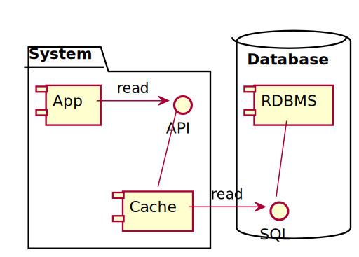

It has been said that there are two things hard in software development:
naming things and cache invalidation (while some add off-by-one errors
to the mix).
I believe that keeping the cache in sync with the source of truth might
count as a third one.
In this post, I'd like to tackle this issue, describe the ideal
situation -
1 cache, 1 datastore - describe the problem of having multiple components
that can write to the datastore, list all possible solutions, and
describe one elegant solution based on Change Data Capture and Jet.

## The ideal design

In a system, to improve performance, one of the first short-term
measures is to set up a cache.
It's a tradeoff between getting the data faster at the cost of the data
being not that fresh: one loads the data in-memory close to the
consumer, and presto, one gets an instant performance boost. In regard
to a database, this is akin to the following:



In this read-through design, when the app requires an item, the cache
first checks whether it has it.
If yes, it returns it.
If not, it fetches it from the underlying Relational Database Management
System, stores it, and returns it.
For a write, it stores it, and also calls the RDBMS to store it.

Note that using a cache-aside design instead of read-through would have
the same issue.
The only difference would be the fact that the app would be responsible
for the fetching/storing logic instead of the cache.

The RDBMS is the sole source of truth - as it should be. Since the cache
intercepts write statements to the RDBMS, it's a mirror of the data.

## Handling third-party database updates

This design works as expected as long as the database doesn't receive
updates from another source:


Now, the RDBMS is still the source of truth, but the cache is not aware
of changes made by other components.
Hence, it might (will) return data that it has stored, but that is stale
compared to what is the source of truth in the RDBMS.

There are multiple ways to cope with this issue.

### Cache invalidation

Since the cache only queries the RDBMS if it doesn't store the requested
item, let's remove items after a specific time.
This is a built-in feature in enterprise-grade caches such as Hazelcast
IMDG and it is known as the Time-To-Live.
When an item is stored, a TTL can be attached to it.
After that time has elapsed, the item is removed from the cache and it
will be fetched from the RDBMS again if needed.

This approach has a couple of downsides:

1. If an item is not updated in the RDBMS, but is evicted from the
  cache, then there's an extra query from the cache to the RDBMS when
  it's needed by the app. This is a net loss of resources.

2. If an item is updated in the RDBMS, but its TTL has not been reached
  yet, then the cache will return the stale data. This defeats the
  purpose.

With longer TTL, we avoid unnecessary round trips but return more stale
data.
With shorter TTL, we waste resources with lesser chances of stale data.

### Polling the RDBMS

Because the TTL doesn't seem to be the right approach, we could devise a
dedicated component that watches the RDBMS by regularly sending queries
to it and updating the cache accordingly.

Unfortunately, this strategy incurs the same issues as cache
invalidation:
the more frequent the queries, the more chances to catch changes, but
the more resources are wasted.
Worse, this also will put extra load on the RDBMS.

### RDBMS triggers

A common downside of the above approaches is the way they both poll the
database.
Polling happens with a specific frequency, while writes don't follow any
regular periodicity.
Thus, it's not possible to make the two match.

Instead of polling, it would make much more sense to be event-driven:

1. if no writes happen, there's no need to update the cache

2. if a write happens, then the relevant cache item should be updated
  accordingly

In RDBMS this event-driven approach is implemented via _triggers_.
Triggers are dedicated stored procedures that are launched in response
to specific events, such as an `INSERT` or an `UPDATE`.

That works pretty well when the acted-upon object is inside the database,
e.g. "when a record of table A is updated, then add a record to table
B".
For our use case where the acted-upon object is the cache which sits
outside the database, it's not as simple.
For example, MySQL allows you to [make an external system call from a
trigger](https://dev.mysql.com/doc/refman/8.0/en/faqs-triggers.html#faq-mysql-can-triggers-udf).
However, this approach is very implementation-dependent and makes the
overall design of the system much more fragile.
Also, only some RDBMS implement triggers. Even if they do, there's no
standard implementation.

## Change Data Capture

Wikipedia defines Change Data Capture (or CDC) as:

> [...] a set of software design patterns used to determine and track
> the data that has changed so that action can be taken using the
> changed data.
>
> CDC is an approach to data integration that is based on the
> identification, capture and delivery of the changes made to enterprise
> data sources.

In practice, CDC is a tool that allows to transform standard write
queries into events.
It implements it by "turning the database inside-out" (quote from Martin
Kleppmann).
This definition is because a database keeps a record of all changes in
an implementation-dependent append-only log.
Regularly, it uses it to manage its state. Some RDBMS also have other
usage, e.g. MySQL uses the log for replication across nodes.

For example, here's a sample for MySQL binlog:

```text
### UPDATE `test`.`t`
### WHERE
###   @1=1 /* INT meta=0 nullable=0 is_null=0 */
###   @2='apple' /* VARSTRING(20) meta=20 nullable=0 is_null=0 */
###   @3=NULL /* VARSTRING(20) meta=0 nullable=1 is_null=1 */
### SET
###   @1=1 /* INT meta=0 nullable=0 is_null=0 */
###   @2='pear' /* VARSTRING(20) meta=20 nullable=0 is_null=0 */
###   @3='2009:01:01' /* DATE meta=0 nullable=1 is_null=0 */
# at 569
#150112 21:40:14 server id 1  end_log_pos 617 CRC32 0xf134ad89
#Table_map: `test`.`t` mapped to number 251
# at 617
#150112 21:40:14 server id 1  end_log_pos 665 CRC32 0x87047106
#Delete_rows: table id 251 flags: STMT_END_F
```

A CDC component connects to this immutable log to extract change events.

One can view CDC as the opposite of Event Sourcing:
the latter captures state by aggregating events, while the former
extracts events "from the state".

## Debezium

CDC is quite recent and hasn't had time to mature.
As such, there's no universal standard, but specific tools.
In this section, we are going to have a look at
[Debezium](https://debezium.io/).
Debezium is an Open Source set of services for CDC provided by Red Hat.

Debezium is an umbrella term covering several components:

1. Debezium Connectors are specific bridges that read the append-only
   proprietary log for each supported database. For example, there’s a
   connector for MySQL, one for MongoDB, one for PostgreSQL, etc.

2. Each connector is also a Kafka Connect Source Connector:
   this allows to easily output CDC events to one’s Kafka cluster

3. Finally, the Debezium Engine is a JAR that allows Debezium to be
   embedded in one’s applications. Note that even in that case, Debezium
   produces Kafka Connect-specific content, which then needs to be
   handled and transformed in one’s application.

While Kafka is a great technology and probably also quite widespread
nowadays, data in Kafka needs to be persisted to disk.
The benefit of persistence is that data survive even in the event of the
cluster going down.
The tradeoff, however, is that the access time of disk-persisted data is
one (or 2) orders of magnitude slower than the access time of in-memory
data, depending on the underlying disk technology.

## Hazelcast Jet

[Hazelcast Jet](https://jet-start.sh/) is a distributed stream
processing framework built on Hazelcast and combines a cache with
fault-tolerant data processing.
It has sources and sinks to integrate with various file, messaging and
database systems (such as Amazon S3, Kafka, message brokers and
relational databases).

Jet also provides a Debezium module where it can process change events
directly from the database and write them to its distributed key-value
store.
This avoids having to write the intermediate messages to Kafka and then
read again to be written to a separate cache.

## Putting it all together

It’s (finally!) time to assemble all the previous bits together.
Here are the components and their responsibilities:

1. A MySQL database instance is where the data is stored.
   It’s accessed in read-only mode by the cache, and in write-only mode
   by some external component

2. A Jet instance reads events from MySQL through the Debezium connector,
   transforms them into cache-compatible key-value pairs, and updates
   the cache accordingly. Note that while Jet pipelines provide
   filtering capabilities, it’s also possible to filter items in the CDC
   connector to optimize the load of the pipeline

3. The app uses the cache, which is always up-to-date with the database,
   give or take the time it takes for the above to execute


Note that this architecture assumes one starts from a legacy state with
an existing app that uses caching, where a new component that could
update the database was set up later on.

If one starts from scratch, it’s possible to simplify the above diagram
(and associated code) as Jet embeds its own Hazelcast instance.
In that case instead of Jet being a client of a third-party Hazelcast
instance, Jet is the one to configure and start the instance.
Obviously, it also can then get/put data.

## Talk is cheap, show me the code

Sources for this post are available [on
GitHub](https://github.com/hazelcast-demos/evergreen-cache).

The repository is made of the following modules:

- `app` is a Spring Boot application using Spring Data JDBC to access a
  MySQL database. It abstracts away Hazelcast by using a Spring Cache
  layer

- `update` is a Spring Shell application.
  It allows to update the data inside the database, with the cache none
  the wiser

- `pipeline` is the Jet pipeline that listens to CDC events and updates
  the cache when data is updated

The pipeline definition is quite straightforward:

```java
pipeline.readFrom(source)                                       //1
        .withoutTimestamps()
        .map(r -> {
            Person person = r.value().toObject(Person.class);   //2
            return Util.entry(person.id, person);               //3
        })
        .writeTo(Sinks.remoteMap(                               //4
                "entities",                                     //5
                new CustomClientConfig(env.get("CACHE_HOST"))   //6
        ));
```

1. Get a stream of Jet `ChangeRecord`

2. Convert `ChangeRecord` to a regular `Person` POJO

3. Wrap `Person` objects into `Map.Entry`s keyed by ID

4. Create the sink to write to, a remote map

5. Name of the remote map

6. Client configuration so it can connect to the right host, cluster
  and instance

```java
public class CustomClientConfig extends ClientConfig {

  public CustomClientConfig(String cacheHost) {
    getNetworkConfig()
      .addAddress(cacheHost != null ? cacheHost : "localhost");
  }
}
```

To try the demo, a local Docker _daemon_ must be running.

1. To create the necessary Docker images, at the root of the project,
   run the build:

    ```bash
    mvn compile
    ```

2. At the root of the repo, run the compose file.
   This will start a MySQL instance, the app, the Jet pipeline job, as
   well as Hazelcast Management Center to get additional insight into
   the cluster state

    ```bash
    docker-compose up
    ```

3. Open a browser at <http://localhost:8080/>

4. Refresh the browser, and check the logs: there should be no
   interaction with the database, only with the cache

5. In the `update` module, set the database user and password and then
   execute the Maven Spring Boot plugin:

    ```bash
    export SPRING_DATASOURCE_USERNAME=root
    export SPRING_DATASOURCE_PASSWORD=root
    mvn spring-boot:run
    ```

    This will open an interactive shell to execute specific commands.
    The update command requires two arguments, the primary key of the
   `Person` entity to update, and the new value for the `firstName` column.
    The following command will update the `firstName` value of the
   entity with PK `1` with value `"Foo"`

    ```bash
    update 1 Foo
    ```

6. Refresh the browser again. The cache has been updated, the
   application doesn’t access the database, and still the value `Foo`
   should be shown for entity with PK `1`

## Conclusion

Caching is easy if the cache is the only component that writes to the
database.
As soon as other components update the database, no traditional strategy
to keep the data of the database and the cache in sync is satisfying.

The Hazelcast Jet streaming engine, using Debezium under the hood, is
able to leverage Change Data Capture over traditional RDBMS to achieve
an evergreen cache in a simple way.

## References

- [Introduction to Jet](https://jet-start.sh/docs/get-started/intro)

- [Change Data Capture from MySQL](https://jet-start.sh/docs/tutorials/cdc)

- [Event Sourcing vs. Change Data
  Capture](https://debezium.io/blog/2020/02/10/event-sourcing-vs-cdc/)

- [Identifying useful info from MySQL row-based binary
  logs](https://www.percona.com/blog/2015/01/20/identifying-useful-information-mysql-row-based-binary-logs/)

- [Demo source code](https://github.com/hazelcast-demos/evergreen-cache)
