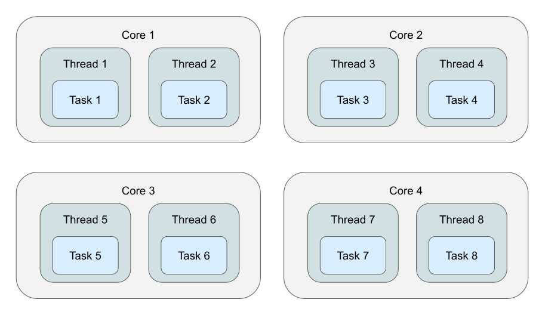
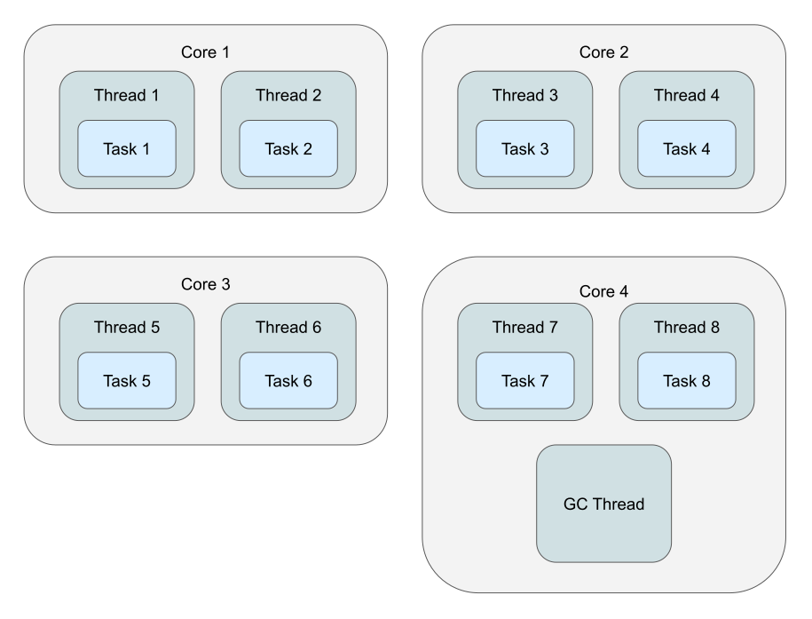
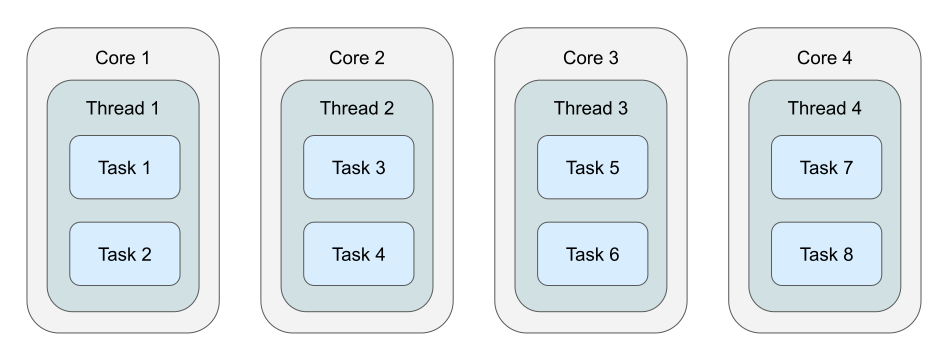
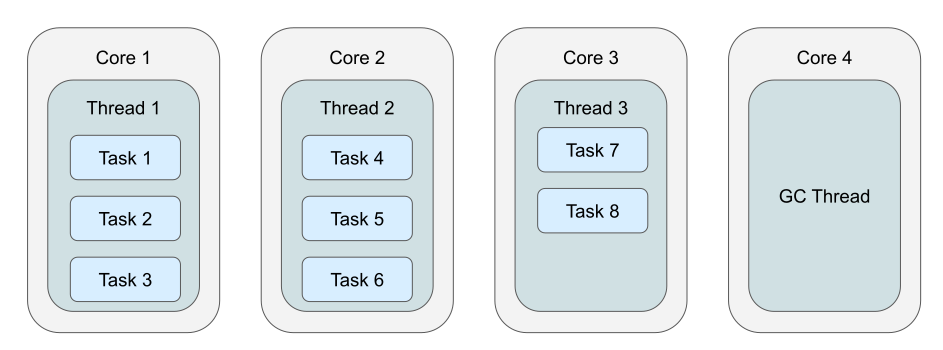
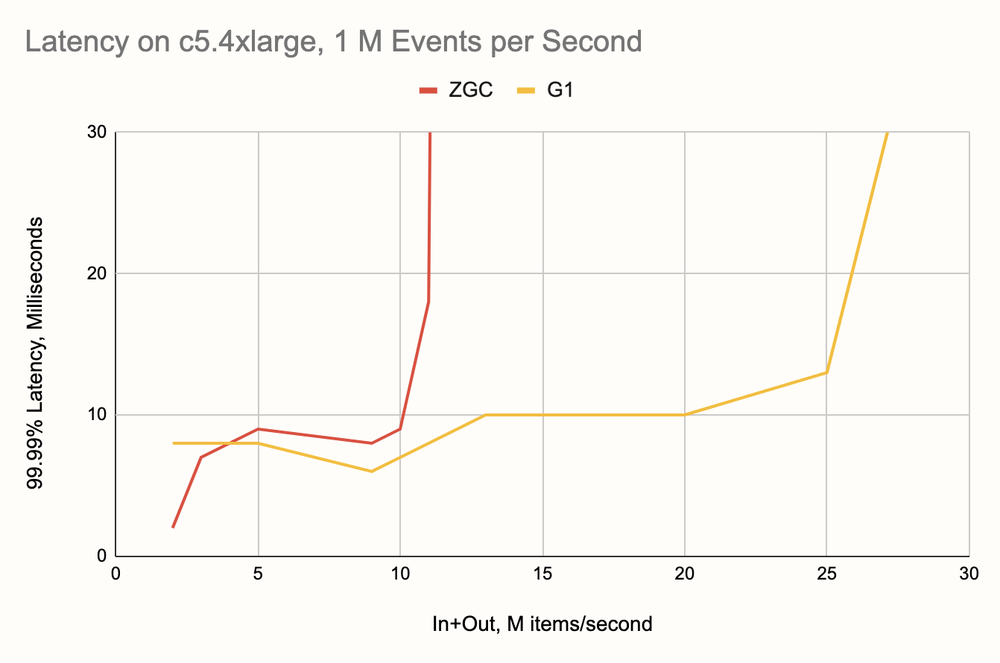
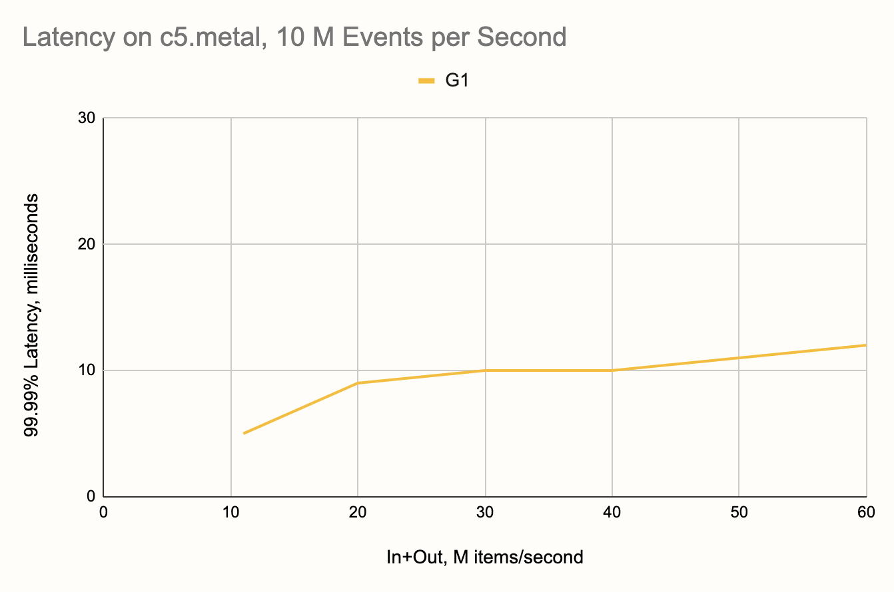

This post is a part of a series:

- [Part 1 (Intro and high-throughput streaming
  benchmark)](/blog/2020/06/09/jdk-gc-benchmarks-part1)
- [Part 2 (batch workload benchmark)](/blog/2020/06/09/jdk-gc-benchmarks-part2)
- [Part 3 (low-latency benchmark)](/blog/2020/06/23/jdk-gc-benchmarks-rematch)
- Part 4 (you are here)

In Part 3 we showed that a modern JVM running live stream aggregation
can achieve a 99.99% latency lower than 10 milliseconds. The focus of
that post was comparing the different GC options available for the JVM.
In order to maintain a level playing field, we kept to the default
settings as much possible.

In this round we wanted to look at the same problem from the opposite
angle: what can we do to help Hazelcast Jet achieve the best performance
available on a JVM? How much throughput can we get while staying within
the tight 10 ms bound for 99.99th percentile latency? We found our
opportunity in a distinct design feature of Jet: the Cooperative Thread
Pool.

## Native Threads with Concurrent GC

Let's go through an example with a streaming job running on a four-core
machine. In a typical execution engine design, every task (roughly
corresponding to a [DAG vertex](/docs/concepts/dag)) gets its own thread
to execute it:

There are eight threads and the OS is in charge of deciding how to
schedule them to run on the four available cores. The application has
no direct control over this and the cost of switching from one thread
to another on the same CPU core is around 2-10 microseconds.

This is how it will look when we add a concurrent GC thread into the
picture:

There's one more thread now, the concurrent GC thread, and it's
additionally interfering with the computation pipeline.

## Green Threads with Concurrent GC

In Hazelcast Jet, tasks are designed to be
[cooperative](/docs/architecture/execution-engine): every time you give
it a bunch of data to process, the task will run for a short while and
return. It doesn't have to process all the data in one go and the
execution engine will give it control again later with all the
still-pending data. This basic design is also present in the concepts of
*green threads* and *coroutines*. In Hazelcast Jet we call them
[*tasklets*](/docs/architecture/execution-engine#tasklet).

This design allows Jet to always use the same, fixed-size thread pool no
matter how many concurrent tasks it instantiates to run a data pipeline.
So, on the example of a four-core machine, it looks like this:

By default, Jet creates as many threads for itself as there are
available CPU cores, and inside each thread there are many tasklets.
Switching from one tasklet to the next is extremely cheap &mdash; it
boils down to one tasklet returning from its `call()` method, the
top-level loop taking the next tasklet from a list, and invoking its
`call()` method. If you wonder at this point what happens to blocking IO
calls, for example connecting to a JDBC data source, Jet does support a
backdoor where it creates a dedicated thread for such a tasklet. Threads
that block for IO aren't CPU-bound and usually their interference is
quite low, but in a low-latency applications you should avoid depending
on blocking APIs.

Now comes another advantage of this design: if we know there will also
be a concurrent GC thread, we can configure Jet to use one thread less:

There are still as many threads as CPU cores and the OS doesn't have to
do any context switching. We did give up one entire CPU core just for
GC, reducing the CPU capacity available to Jet, but we allowed
background GC to run truly concurrently to the Jet tasks. In low-latency
scenarios, *the application doesn't need 100% CPU, but it needs its
share of the CPU 100% of the time.*

We went to see if this setup really makes the difference we hope for,
and found it indeed had a drammatic impact on the latency with both
garbage collectors we tested (G1 and ZGC). The most important outcome
was that we were now able to push G1 below the 10 ms line. Since G1 is
stable across a wide range of throughputs, we immediately got it to
perform within 10 ms at *double the throughput than in the previous
round*.

## The Setup

Based on the expectations set by the previous benchmark, we focused on
the ZGC and G1 collectors and the latest pre-release of Java 15\. Our
setup stayed the same for the most part; we refreshed the code a bit and
now use the released version 4.2 of Hazelcast Jet with OpenJDK 15 EA33.

We also implemented a parallelized event source simulator. Its higher
throughput capacity allows it to catch up faster after a hiccup, helping
to reduce the latency a bit more. The processing pipeline itself is
identical to the previous round,
[here](https://github.com/mtopolnik/jet-gc-benchmark/blob/round-3/src/main/java/org/example/StreamingRound3.java)
is the complete source code.

We determined how many threads the given GC uses, set the size of the
Jet thread pool to 16
([c5.4xlarge](https://aws.amazon.com/ec2/instance-types/c5/) vCPUs)
minus that value and then did some trial-and-error runs to find the
optimum. G1 uses 3 threads, so we gave Jet 13\. ZGC uses just 2 threads,
but we found Jet to perform a bit better with 13 instead of the
theoretical 14 threads, so we used that. We also experimented with
changing the GC's automatic choice for the thread count, but didn't find
a setting that would beat the default.

Additionally, with G1 we saw that in certain cases, even with
`MaxGCPauseMillis=5` (same as in the previous post), the size of the new
generation would grow large enough for Minor GC pauses to impact
latency. Therefore we added `MaxNewSize` with one of `100m`, `150m` and
`200m`, depending on the chosen throughput. This was also determined
through trial and error, the results seemed to be the best when a minor
GC was occurring about 10-20 times per second.

Summarizing, these are the changes we made with respect to the setup in
the previous post:

1. Reduced Jet's cooperative thread pool size
2. Parallel event source where previously it was single-threaded
3. Used the `MaxNewSize` JVM parameter for G1
4. Updated Hazelcast Jet and JDK versions

## The Results

Comparing ZGC's results below with those in the [previous
round](/blog/2020/06/23/jdk-gc-benchmarks-rematch#a-sneak-peek-into-upcoming-versions),
we can see the latency stayed about the same where it was already good,
but the range of throughputs got extended from 8 to 10 M items/second,
a solid 25% improvement.

The effect on G1 is sort of dual to the above: while the G1 already had
great throughput but fell just short of making it below the 10 ms line,
in this round its latency improved across the board, up to 40% at
places. The best news: *the maximum throughput at which a single
Hazelcast Jet node maintains 99.99% latency within 10 ms now lies at 20
million items per second*, a 250% boost!

## Upgrading to 10 M Input Events per Second

Encouraged by this strong result, we dreamed up a scenario like this: we
have 100,000 sensors, each producing a 100 Hz measurement stream. Can a
single-node Hazelcast Jet handle this load and produce, say, the time
integral of the measured quantity from each sensor over a 1-second
window, at a 10 ms latency? This implies an order-of-magnitude leap in
the event rate, from 1 M to 10 M events per second, but also a reduction
in window length by the same factor, from ten seconds to one.

Nominally, the scenario results in the same combined input+output
throughput as well as about the same size of state that we already saw
work: 20 M items/second and 10 M stored map entries. It's the maximum
point where G1 was still inside 10 ms, but even at 25 M items/second it
still had pretty low latency. However, for reasons we haven't yet
identified, the input rate seems to have a stronger impact on GC, so
when we traded output for input, it turned out that G1 was nowhere near
handling it.

But, since we picked the c5.4xlarge instance type as a medium-level
option, for this "elite scenario" we considered the top-shelf EC2 box as
well: c5.metal. It commands 96 vCPUs and has some scary amount of RAM
that we won't need. On this hardware G1 decides to take 16 threads for
itself, so the natural choice would be 80 threads for Jet. However,
through trial and error we chased down the real optimum, which turned
out to be 64 threads. Here is what we got:

G1 comfortably makes it to the 20 M mark and then goes on all the way to
40 M items per second, gracefully degrading and reaching 60 M with just
12 ms. Beyond this point it was Jet who ran out of steam. The Jet
pipeline running at full speed just couldn't max out the G1! We repeated
the test with more threads given to Jet, 78, but that didn't make a
difference.

_If you enjoyed reading this post, check out Jet at
[GitHub](https://github.com/hazelcast/hazelcast-jet) and give us a
star!_
