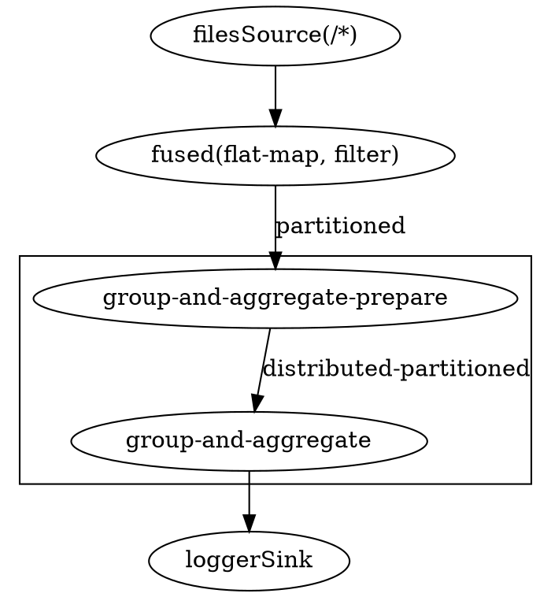

## Core DAG Planner

In the [Concepts: DAG](/docs/concepts/dag) section we used this pipeline
as an example:

```java
Pipeline p = Pipeline.create();
p.readFrom(textSource())
 .flatMap(line -> traverseArray(line.toLowerCase().split("\\W+")))
 .filter(word -> !word.isEmpty())
 .groupingKey(wholeItem())
 .aggregate(AggregateOperations.counting())
 .writeTo(someSink());
 ```

As you write this code, you form the Pipeline DAG and when you submit it
for the execution, the Jet `Planner` converts it to the DAG of the
Jet Core API:


We can see that Jet applied some simple graph transformations:

- joined consecutive stateless transforms into a single vertex
- implemented the group-and-aggregate transform as two vertices

In addition to this, the Core DAG introduces details on how to implement
the routing of the data among vertices:


There are two main types of edges:

- *round-robin:* a load-balancing edge that sends items to tasklets in a
  round-robin fashion. If a given queue is full, it tries the next one.
- *partitioned:* computes the partition key of every item, which
  uniquely determines the destination tasklet. Necessary for stateful
  keyed transformations like group-and-aggregate.

There are more details on partitioned edges in the [Concepts
section](/docs/concepts/dag#group-and-aggregate-transform-needs-data-partitioning).

This planning step happens on the client side, so what you actually
submit for execution to the cluster is not the Jet pipeline, but the
Core DAG. You also have the option to build the Core DAG directly, using
its API, but it mostly offers you a lot of ways to make mistakes with
little opportunity to improve on the automatic process.

When the job is starting inside Jet, it will print the DAG definition in
the DOT format, which you can visualize on a site like
[WebGraphviz](http://www.webgraphviz.com/). For example, our pipeline
comes out in DAG form like this:



## Execution Planner

On the server side Jet makes a detailed plan of execution, instantiating
tasklets and connecting them with high-performance concurrent queues:


In this picture the source and sink vertices have a local parallelism of
one and the inner vertices have local a parallelism of two. Jet has
reasonable default for the local parallelism depending on the work a
given vertex is doing. For computational vertices it matches the number
of available CPU cores and for IO-bound vertices it uses one or two.

Jet replicates this layout on every cluster node, connecting the
networking tasklets that implement a distributed edge:


## Cooperative Execution Engine

This is (ideally) how Jet would run our DAG on a 2-core machine:


There are just two threads, all the tasklets are cooperative and they
share the two threads. However, often the source and/or sink is forced
to use a blocking API and their tasklets must be marked as
*non-cooperative*. In that case execution would look like this:


## Backpressure

Every DAG vertex has a different processing capacity. There is always a
risk that the source vertex produces data at a higher speed than a given
vertex can process. If this happens, we need a mechanism that signals
back to the source to moderate its operation so that the whole pipeline
stays in balance and operates at the speed of the slowest vertex. We
call this mechanism *backpressure*.

Local communication between tasklets inside the same Jet node is easy:
we just use bounded queues and force the tasklets to back off as soon
as all their output queues are full.

Backpressure is trickier over a network link: instead of a shared memory
location you can use for reliable instant signaling, all we have are
messages sent over unreliable links that have significant latency.
Hazelcast Jet uses a design very similar to the TCP/IP adaptive receive
window: the sender must wait for an acknowledgment from the receiver
telling it how many more data items it can send. After processing item
N, the receiver sends a message that the sender can send up to item N +
RWIN.

The receiver sends the acknowledgment message ten times per second, so
as long as the receive window is large enough to hold the amount of data
processed within 100 milliseconds plus network link latency, the
receiver will always have data ready to be processed:


Jet calculates the size of the receive window based on the rate of data
flow through a given tasklet. It adaptively shrinks and expands it as
the flow changes. In stable state the window size is 300 milliseconds'
worth of data.
